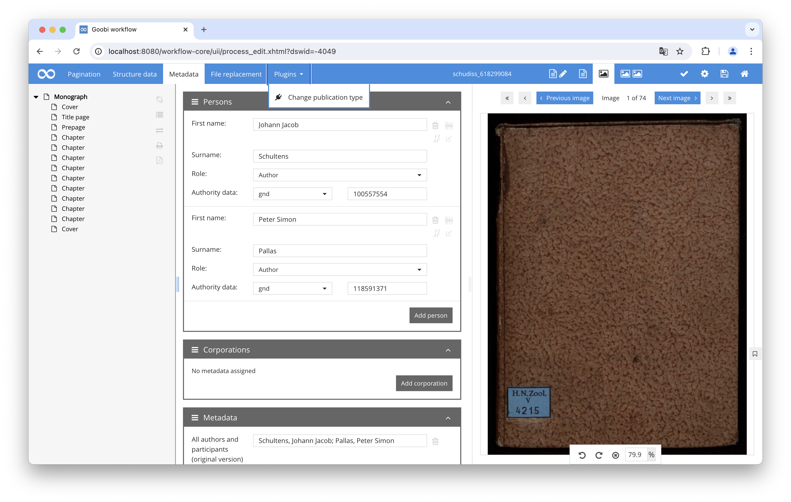
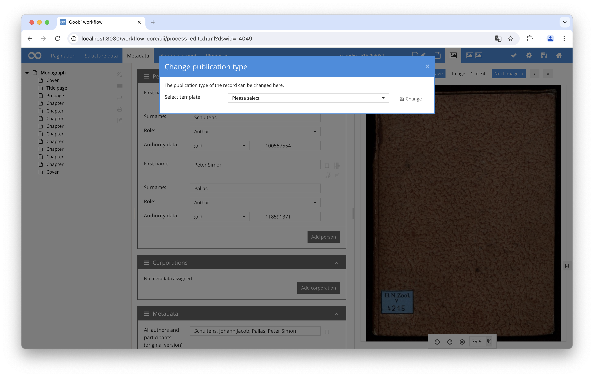

# Change Publication Type

## Overview

Name                     | Wert
-------------------------|-----------
Identifier               | intranda_metadata_changeType
Repository               | [https://github.com/intranda/goobi-plugin-metadata-change-type](https://github.com/intranda/goobi-plugin-metadata-change-type)
Licence              | GPL 2.0 or newer 
Last change    | 04.09.2024 10:07:12


## Introduction
This plugin allows the modification of the publication type within the metadata editor of Goobi workflow.

## Installation
To use the plugin, the following files must be installed:

```bash
/opt/digiverso/goobi/mete/metadata/plugin_intranda_metadataeditor_changeType.jar
/opt/digiverso/goobi/plugins/GUI/plugin_intranda_metadataeditor_changeType-GUI.jar
/opt/digiverso/goobi/config/plugin_intranda_metadata_changeType.xml
```

After installation, the functionality of the plugin is available within the REST API of Goobi workflow.

## Overview and functionality
Once the plugin is installed, a new function will appear in the metadata editor's menu, listing all installed and configured plugins. To use the plugin for changing the publication type, templates must first be created in the configured project. These templates need to be pre-populated with the desired metadata, and the process property for the label must be assigned. Once the templates are created, they will be available in a selection list.



When the user selects the plugin, a dialog window will open, listing the available templates for different publication types. The user can select the desired publication type and save the change.



When the publication type is switched, a backup of the existing metadata file is created first. Then, the metadata from the selected template is copied into the process. If the old record already contains pagination and page assignments, this data will also be transferred.

Finally, each configured metadata field is checked to see if it existed in the old record. If so, this metadata, including persons or groups, will be transferred to the new record. If a corresponding field with a default value already exists in the new record, it will be overwritten with the original data.

## Configuration
The plugin is configured in the file `plugin_intranda_metadata_changeType.xml` as shown here:

```xml
<config_plugin>
    <!-- Eine Sektion enthält einen Konfigurationsblock. -->
    <section>
        <!-- Das Element project ist wiederholbar und definiert, innerhalb welcher
            Projekte diese section genutzt werden kann. -->
        <project>Project_A</project>
        <project>Project_B</project>
        <project>Archive_Project</project>
        
        <!-- property name, in dem das anzuzeigende Label gespeichert ist -->
        <titleProperty>Title</titleProperty>
        
        <!-- Das Element templateProject ist wiederholbar und definiert diejenigen
            Projekte in Goobi workflow, aus denen Template-Vorgänge geladen und genutzt
            werden sollen. Per Konvention ist festgelegt, dass der Ursprungsregelsatz
            und Templateregelsatz identisch sein müssen, damit ein Vorgang in dem
            Makro-Modal angezeigt wird. -->
        <templateProject>Template_1</templateProject>
        <templateProject>Template_2</templateProject>
        
        <!-- list of metadata to copy into the new template -->
        <metadata>CatalogIDDigital</metadata>
        <metadata>DisplayLayout</metadata>
    </section>
</config_plugin>
```

The following table contains a summary of the parameters and their descriptions:

Parameter               | Explanation
------------------------|------------------------------------
| `<section>`             | is repeatable and thus allows different configurations for various projects. |
| `<project>`             | Specifies for which project(s) the current section applies. The field is repeatable to allow a common configuration for multiple projects. |
| `<titleProperty>`       | Contains the name of the process property where the label to be used is stored. |
| `<templateProject>`     | Name of the project from which the templates should be read. All processes from the project that have a label will be listed. |
| `<metadata>`            | List of metadata to be transferred from the original file to the new file. |