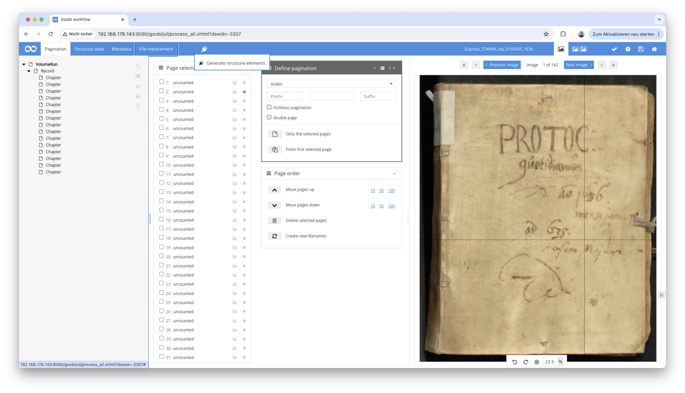
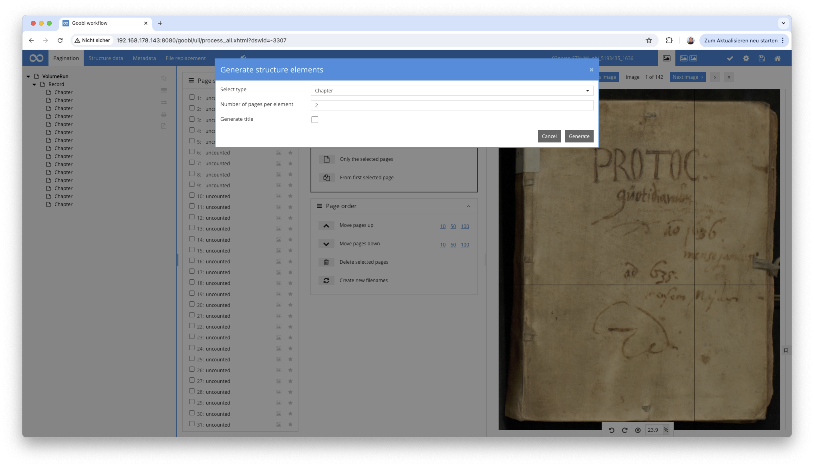

# Metadata extension for the creation of structural elements per image

## Overview

Name                     | Wert
-------------------------|-----------
Identifier               | intranda_metadata_createStructureElements
GitHub Repository        | https://github.com/intranda/goobi-plugin-metadata-create-structure-elements
Licence              | GPL 2.0 or newer 
Last change    | 13.07.2024 09:57:06


## Introduction
This documentation describes the installation, configuration and use of the plug-in for creating structural elements per image within the metadata editor.

## Installation
The following files must be installed in order to use the plug-in:

```bash
/opt/digiverso/goobi/plugins/metadata/plugin-metadataeditor-create-structure-elements-base.jar
/opt/digiverso/goobi/plugins/GUI/plugin-metadataeditor-create-structure-elements-gui.jar
/opt/digiverso/goobi/config/plugin_intranda_metadata_createStructureElements.xml
```


## Overview and functionality

This plug-in is a so-called `metadata editor plugin`. It can be selected in the metadata editor in the menu item for plug-ins under the name `Generate structure elements`.



When it is selected, a pop-up opens in which the desired type of structural elements to be generated can be selected. All structural elements that are permitted in the rule set for the publication type in question are automatically available here.

You can also define how many images should be assigned to the respective structure element before the next structure element is created and whether a title should be created for the structure element. If this option is activated, the file name without extension is entered as the title for each structure element, provided that the main title is permitted in the selected type.



The generation of the structure elements will overwrite all existing elements.

### Configuration
The plug-in is configured in the file `plugin_intranda_metadata_createStructureElements.xml` as shown here:

```xml
<config_plugin>
    <config>
        <!-- To which project does the current section apply? 
        The field can be repeated to summarize different projects. 
        In addition, * can be used for any project -->
        <project>*</project>

        <!-- To which document type does the current section apply? 
        The field can be repeated to summarize different types. 
        In addition, * can be used for any type -->
        <doctype>*</doctype>

        <!-- default structure type. The value is preselected in the UI. Leave it blank if no preselection is needed -->
        <defaultType>Chapter</defaultType>

        <!-- define the default number of images, leave it blank if no default value is needed -->
        <numberOfImagesPerElement>2</numberOfImagesPerElement>
    </config>
</config_plugin>

```

The configuration can be restricted to projects or to specific publication types. The fields `<project>` and `<doctype>` can be used for this purpose. In `<defaultType>` you can define which structural element should already be preselected in the list. If the element defined here does not exist in the list of the current publication type or is empty, no element is preselected.
In `<numberOfImagesPerElement>` a value for the number of images per structure element can also be preset. This must be a positive, whole number. Both values can be changed by the user in the interface.