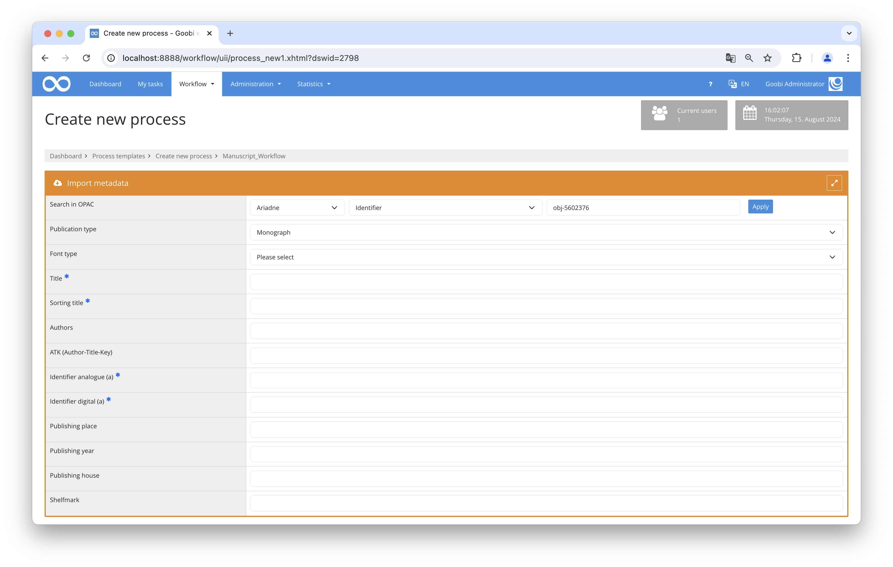

# Ariadne Import

## Overview

Name                     | Wert
-------------------------|-----------
Identifier               | Ariadne
Repository               | [https://github.com/intranda/goobi-plugin-opac-ariadne](https://github.com/intranda/goobi-plugin-opac-ariadne)
Licence              | GPL 2.0 or newer 
Last change    | 14.08.2024 18:40:13


## Introduction
This documentation describes the installation, configuration and use of the plugin. With the help of this plugin, data from the Mecklenburg-Vorpommern Ariadne archive portal can be retrieved and transferred to Goobi. The portal has an OAI interface through which the plugin obtains the data in a special EAD Goobi format.


## Installation
The plugin consists of two files:

```bash
plugin_intranda_opac_ariadne-base.jar
plugin_intranda_opac_ariadne.xml
```

The files must be installed readable for the user `tomcat` at the following paths:

```bash
/opt/digiverso/goobi/plugins/opac/plugin_intranda_opac_ariadne-base.jar
/opt/digiverso/goobi/config/plugin_intranda_opac_ariadne.xml
```


## Overview and functionality
A normal OPAC query can now be carried out in Goobi. To do this, the catalogue `Ariadne` must be selected and the desired identifier entered. Please note that the identifier needs a prefix `obj-`, e.g. `obj-5602376`.



## Configuration
In the file `goobi_opac.xml` the interface to the desired catalogue system must be made known. This is done by an entry that looks like this:

```xml
<catalogue title="Ariadne">
    <config description="Ariadne EAD" address="https://ariadne.example.com" port="80" database="2.1" iktlist="IKTLIST-GBV.xml" ucnf="XPNOFF=1" opacType="Ariadne"/>
</catalogue>
 ```

The mapping of the metadata takes place in the file `plugin_intranda_opac_ariadne.xml`.:

```xml
<config_plugin>

    <!-- url to the ariadne oai api -->
    <ariadneUrl>https://ariadne,example.com/?page_id=463&amp;verb=GetRecord&amp;metadataPrefix=goobi_ead&amp;identifier=ariadne-portal.uni-greifswald.de:</ariadneUrl>

    <!-- must match a title value in the doctype definition in goobi_opac.xml -->
    <doctype>file</doctype>

    <collection generate="true" prefix="prefix#other prefix#"/>

    <metadatalist>
        <!--
        ruleset: internal metadata name in prefs file
        xpath: xpath expression to evaluate
        element: element name to evaluate the xpath, possible values are c, did, parentC, parentDid, record
        doctype: logical or anchor
        xpathType: attribute or element (default)
        replace: regular expression to manipulate results
         -->

        <metadata ruleset="CatalogIDDigital" xpath="./@id" element="c" doctype="logical" xpathType="attribute" replace="\W"/>
        <metadata ruleset="TitleDocMain" xpath="./oai:unittitle" element="c" doctype="logical"/>
        <metadata ruleset="shelfmarksource" xpath="./oai:unitid[@type='Altsignatur' or not(@type)]" element="did" doctype="logical"/>
    </metadatalist>

</config_plugin>
```

In the field `<ariadneUrl>` the URL to the OAI interface is configured.

The field `<doctype>` contains the name of the structure element. The name used must be defined in the file `goobi_opac.xml`. If the collection is to be generated from the EAD document, then it can be configured in the `<collection>` element. To do this, the `generate` attribute must be set to `true`. Within `prefix` a fixed prefix can be set, which will be prefixed to the collection name. Alternatively, the collection can be defined like a normal metadata.

Metadata is defined within the `<metadatalist>`. There the repeatable `<metadata>` element is allowed. This can have the following attributes:

Element | Description
------------|-----------
`ruleset` | Name of the field in the ruleset
`xpath` | XPath expression with which the value can be found in the EAD document.
`element` | Name of the field in which the XPath expression is applied. Allowed are `c`, `did`, `parentC`, `parentDid` and `record`.
`doctype` | Defines where the value is entered, possible assignment is `logical` or `anchor`.
`xpathType` | Determines whether the value is in an attribute or element.
`replace` | Regular expression to manipulate the found value