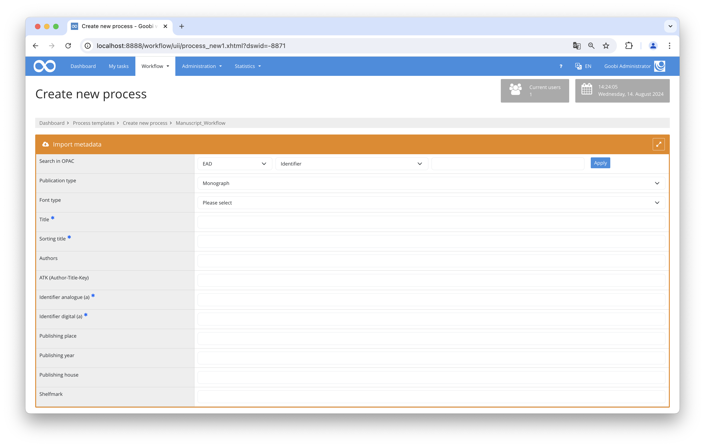

# EAD data transfer

## Overview

Name                     | Wert
-------------------------|-----------
Identifier               | intranda_opac_ead
Repository               | [https://github.com/intranda/goobi-plugin-opac-ead](https://github.com/intranda/goobi-plugin-opac-ead)
Licence              | GPL 2.0 or newer 
Last change    | 14.08.2024 18:41:40


## Introduction
This documentation describes the installation, configuration and use of an XML-based database to manage EAD files and integrate them into Goobi.

## Installation and configuration

### Preparation of the EAD memory
The concept of an EAD memory was chosen as the technical solution for the data transfer of EAD files. This is an XML database that can be repeatedly supplied with several updated EAD files and subsequently serves as a data source similar to a queryable catalog, which can be queried both by Goobi workflow and by the Goobi viewer in order to be able to query information about tectonics as well as detailed information about a data record.

The interposition of this EAD memory ensures that the EAD files can also be updated at any time and that the individual data records are always displayed with the current context, even if this has changed since the first data transfer.


### Installation of the XML database BaseX
BaseX is an XML database in which the EAD files can be managed, analyzed and queried. Java 1.8 is required to install BaseX.

First you have to download the database:

[http://basex.org/download/](http://basex.org/download/)

To install BaseX on a Linux system, first download the zip file and install it on the server. For example, this could be done in this path:

```bash
/opt/digiverso/basex
```

The Jetty configuration must then be adapted so that the application can only be accessed on localhost. To do this, make sure in the configuration file `/opt/digiverso/basex/webapp/WEB-INF/jetty.xml` that the `host` is set to `127.0.0.1`:

```xml
  <Set name="host">127.0.0.1</Set>
```

Then the Systemd Unit File is installed to this path:

```bash
/etc/systemd/system/basexhttp.service
```

This has the following structure:

```ruby
[Unit]
Description=BaseX HTTP server

[Service]
User=tomcat8
Group=tomcat8
ProtectSystem=full
ExecStart=/opt/digiverso/basex/bin/basexhttp
ExecStop=/opt/digiverso/basex/bin/basexhttp stop

[Install]
WantedBy=multi-user.target
```

The daemon must then be reloaded, the unit file activated and the database restarted:

```bash
systemctl daemon-reload
systemctl enable basexhttp.service
systemctl start basexhttp.service
```

To make the admin interface externally accessible, it can be configured in `Apache` with the following section, for example:

```swift
    redirect 301 /basex http://bastel.fritz.box/basex/
    <Location /basex/>
            Require ip 188.40.71.142
            ProxyPass http://localhost:8984/ retry=0
            ProxyPassReverse http://localhost:8984/
    </Location>
```

Afterwards the Apache module `proxy_http` must be activated and Apache must be restarted for the adjustments to take effect:

```xml
a2enmod proxy_http
systemctl restart apache2
```


### Set up database
The XML database can be accessed under the following URL after installation:

[http://localhost:8984/dba/login](http://localhost:8984/dba/login)

The access data is `admin`/`admin`. After the first login a new password should be assigned first. The menu entry `Users` must be opened for this. Here you can click on the account name and set the new password.

Then a new database for the EAD files can be created. For this purpose the menu entry `Databases` must be selected. Click `Create` to open the dialog. Here you have to assign a title for the database. All other settings can remain like this.


### Adding and deleting files
After the database has been created, EAD XML documents can now be added. The created database can be selected under `Databases`. This opens a window in which the files belonging to the database can be managed. New files can be selected and uploaded via the `Add` dialog. Here you can select an EAD file in the `Input` field. With `Add` the file is added and the overview page is loaded. Files can also be removed here. To do this, they must be marked with a checkbox and then deleted with `Delete`. Updating an EAD file is only possible by deleting and adding it again.


### Definition of the search query
In order to set up the query interface for Goobi, the database must be made aware of what a query looks like, what is to be done with it, and what the result should look like. BaseX offers several options for this. We chose [RESTXQ](http://docs.basex.org/wiki/RESTXQ) because it does not require authentication, unlike the [REST](http://docs.basex.org/wiki/REST) interface.

Therefore a new file `eadRequest.xq` must be created in the directory `/opt/digiverso/basex/webapp/`.

```graphql
(: XQuery file to return an ead record :)
module namespace page = 'http://basex.org/examples/web-page';
declare default element namespace "urn:isbn:1-931666-22-9";

declare
  %rest:path("/search/{$identifier}")
  %rest:single
  %rest:GET
function page:getRecord($identifier) {
    let $ead := db:open('CHANGEME')/ead[//c[@level="file"][@id=$identifier]]
    let $record :=$ead//c[@level="file"][@id=$identifier]
    let $header := $ead/eadheader
    return
        <ead>
            {$header}
            {for $c in $record/ancestor-or-self::c
            return
                <c level="{data($c/@level)}" id="{data($c/@id)}">
                    {$c/did}
                    {$c/accessrestrict}
                    {$c/otherfindaid}
                    {$c/odd}
                    {$c/scopecontent}
                    {$c/index}
                </c>
            }
        </ead>
};
```

This xquery module is executed when requests are sent via `GET` to `/search/{$identifier}`. If another `endpoint` is to be used, this can be adjusted in the `declare` area. When a request is made, the `page:getRecord` function is executed. In the first line of the function, the database name to be used must be defined. If the information has been split between several databases, several files must be used with this function. The variable `rest:path` must be uniquely defined.

Whether the configuration is correct can be tested with a query to the database:

[http://localhost:8984/search/A91x07542461156845020181205140345849](http://localhost:8984/search/A91x07542461156845020181205140345849)

Changes to the files or the databases can be made at any time during operation.


### Goobi connection
Once the database has been set up, it can be configured in Goobi. Since the metadata differs significantly from the bibliographic metadata of libraries, Goobi should use its own project and rule set. In addition, the OPAC plugin `goobi-plugin-opac-ead` must be installed.



### Configuration of the file goobi_opac.xml
The file `goobi_opac.xml` must be extended by two more entries. On the one hand, the document type to be used must be defined. This happens in the `doctypes` area:

```xml
<type isContainedWork="false" isMultiVolume="false" isPeriodical="false" rulesetType="SingleRecord" tifHeaderType="Record" title="Record">
    <label language="de">Akte</label>
    <label language="en">Record</label>
    <mapping>SingleRecord</mapping>
</type>
```

In this example, the file type (`SingleRecord` in the rule record) is used.

The data source must also be defined:

```xml
<catalogue title="EAD Import">
    <config address="http://localhost:8984/search/" database="hu-ead-example" description="EAD Import" iktlist="IKTLIST-GBV.xml"
            port="80" ucnf="UCNF=NFC&amp;XPNOFF=1" protocol="http://" opacType="ead" />
    <searchFields>
        <searchField  label="Identifier" value="8000" />
    </searchFields>
</catalogue>
```

The `title` attribute contains the name under which the data source can be selected in Goobi. The `config` element contains the URL to the previously defined REST interface in `address` and the name of the database in `database`.


### Configuration of the plugin within plugin_opac_ead.xml
This file is located in the `/opt/digiverso/goobi/config/` folder and contains the mapping of the EAD elements to Goobi metadata.

```xml
<?xml version="1.0" encoding="UTF-8"?>
<config_plugin>
    <namespaces>
        <namespace prefix="ead" uri="urn:isbn:1-931666-22-9" />
        <namespace prefix="oai" uri="http://www.openarchives.org/OAI/2.0/" />
    </namespaces>

    <documenttype isanchor="false">SingleRecord</documenttype>

<!--    
    <documenttype isanchor="true">VolumeRun</documenttype>
    <documenttype isanchor="false">Record</documenttype>
-->

    <mapping>
        <metadata name="TitleDocMain" xpath="//ead:c[@level='file']/ead:did/ead:unittitle" level="topstruct" xpathType="Element"/>
        <metadata name="CatalogIDDigital" xpath="//ead:c[@level='file']/@id" level="topstruct" xpathType="Attribute"/>
        <metadata name="CatalogIDSource" xpath="//ead:c[@level='file']/@id" level="topstruct" xpathType="Attribute"/>
        <metadata name="Dating" xpath="//ead:c[@level='file']/ead:did/ead:unitdate/@normal" level="topstruct" xpathType="Attribute"/>
        <metadata name="PublicationYear" xpath="//ead:c[@level='file']/ead:did/ead:unitdate" level="topstruct" xpathType="Element"/>
        <metadata name="shelfmarksource" xpath="//ead:c[@level='file']/ead:did/ead:unitid[@type='Signatur']" level="topstruct" xpathType="Element"/>
        <metadata name="AccessLicense" xpath="//ead:c[@level='file']/ead:accessrestrict/ead:p" level="topstruct" xpathType="Element"/>
        <metadata name="TitleDocSub1" xpath="//ead:c[@level='class']/ead:did/ead:unittitle" level="topstruct" xpathType="Element"/>
        <metadata name="Genre" xpath="//ead:c[@level='file']/ead:did/ead:physdesc/ead:genreform" level="topstruct" xpathType="Element"/>
        <metadata name="History" xpath="//ead:c[@level='collection']/ead:scopecontent[/ead:head/text() = 'Bestandsgeschichte']/ead:p" level="topstruct" xpathType="Element"/>
        <metadata name="Description" xpath="//ead:c[@level='collection']/ead:scopecontent[/ead:head/text() = 'Beschreibung']/ead:p" level="topstruct" xpathType="Element"/>
        <metadata name="SizeSourcePrint" xpath="//ead:c[@level='file']/ead:odd/ead:p" level="topstruct" xpathType="Element"/>
        <metadata name="Contains" xpath="//ead:c[@level='file']/ead:did/ead:abstract[@type='Enthält']" level="topstruct" xpathType="Element"/>
        <metadata name="singleDigCollection" xpath="concat(//ead:eadheader/ead:filedesc/ead:titlestmt/ead:titleproper\,'#'\, //ead:c[@level='collection']/ead:did/ead:unitid)" level="topstruct" xpathType="String"/>
    </mapping>
</config_plugin>
```

The available namespaces are defined in the upper area, followed by the structure type to be generated. The attribute `isanchor="true/false"` can be used to define whether a multi-volume object or an independent object is to be created. The metadata is then mapped in the `mapping` area. Since EAD does not distinguish between persons and other metadata, only normal metadata can be created here. Each `metadata` in `name` contains the metadata as defined in the rule set. In `level`, you specify where the metadata is to be created. Possible values are `physical`, `topstruct` and `anchor`.

In `xpath` is the [XPath](https://www.w3.org/TR/1999/REC-xpath-19991116/) expression that is applied to the record to determine the value of the metadata. The `xpathType` attribute describes the return value of the XPath expression. This can be either `Element`, `Attribute`, or `String`.


### Project configuration within the file goobi_projects.xml
The file `goobi_projects.xml` needs a new definition for the publication type and the new metadata.

```xml
<project name="EAD-Import">
    <createNewProcess>
        <itemlist>

            <!-- Title for Records -->
            <item docstruct="topstruct" from="prozess" isnotdoctype="multivolume" metadata="TitleDocMain" required="true" ughbinding="true"> Titel </item>
            <item docstruct="topstruct" from="prozess" isnotdoctype="multivolume" metadata="TitleDocSub1" required="false" ughbinding="true"> Weitere Titel</item>

            <!-- Identifer -->
            <item docstruct="topstruct" from="prozess" isdoctype="Record" metadata="CatalogIDDigital" required="true" ughbinding="true">Identifier</item>

            <!-- Sammlung -->
            <item docstruct="topstruct" from="prozess" isdoctype="Record" metadata="singleDigCollection" required="true" ughbinding="true">Sammlung</item>

            <item docstruct="topstruct" from="prozess" isdoctype="Record" metadata="Dating" ughbinding="true"> Datierung </item>
            <item docstruct="topstruct" from="prozess" isdoctype="Record" metadata="PublicationYear" ughbinding="true"> Erscheinungsjahr </item>
            <item from="prozess" isdoctype="Record" ughbinding="true" docstruct="topstruct" metadata="shelfmarksource"> Signatur </item>
            <item from="prozess" isdoctype="Record" ughbinding="true" docstruct="topstruct" metadata="AccessLicense"> Zugriffsbeschränkung </item>
            <item from="prozess" isdoctype="Record" ughbinding="true" docstruct="topstruct" metadata="Genre"> Genre </item>
            <item from="prozess" isdoctype="Record" ughbinding="true" docstruct="topstruct" metadata="History"> Bestandsgeschichte </item>
            <item from="prozess" isdoctype="Record" ughbinding="true" docstruct="topstruct" metadata="Description"> Beschreibung </item>
            <item from="prozess" isdoctype="Record" ughbinding="true" docstruct="topstruct" metadata="SizeSourcePrint"> Umfang </item>
            <processtitle isdoctype="Record">Identifier</processtitle>
            <hide>collections</hide>
        </itemlist>
        <opac use="true">
            <catalogue>EAD Import</catalogue>
        </opac>
        <templates use="true" />
        <defaultdoctype>Record</defaultdoctype>
        <metadatageneration use="true" />
    </createNewProcess>
    <tifheader>
        <Record>'|[[TYPE]]'+$Doctype+'|[[TITLE]]'+Title+'|[[AUTHORS]]'+Authors+'
            |[[YEAR]]'+Publishing year+'|[[PLACE]]'+Publishing place+'|[[FOLDER]]'+ATS+'_'+Identifier digital (a)+'|'
        </Record>
    </tifheader>
    <dmsImport />
    <validate/>
</project>
```

Once this configuration has been completed, a new data source is available within Goobi within the creation mask for processes. This can now be queried using identifiers in the same way as other data sources and catalogs.