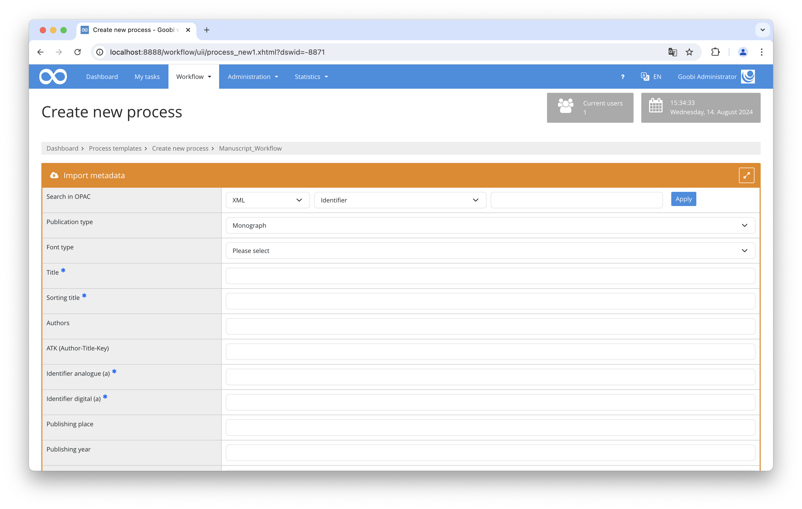

# Generic XML Import

## Overview

Name                     | Wert
-------------------------|-----------
Identifier               | intranda_opac_xml
Repository               | [https://github.com/intranda/goobi-plugin-opac-generic-xml](https://github.com/intranda/goobi-plugin-opac-generic-xml)
Licence              | GPL 2.0 or newer 
Last change    | 15.08.2024 06:23:25


## Introduction
This documentation describes the installation, configuration and use of the plugin. This plugin can be used to retrieve data from an external system and transfer it to Goobi. The catalog must have an API that can be used to deliver data records as XML.Details


## Installation
The plugin consists of two files:

```bash
plugin_intranda_opac_xml-base.jar
plugin_intranda_opac_xml.xml
```

The file `plugin_intranda_opac_xml-base.jar` contains the program logic and must be installed in the following directory, readable for the user `tomcat`:

```bash
/opt/digiverso/goobi/plugins/opac/
```

The file `plugin_intranda_opac_xml.xml` must also be readable by the user `tomcat` and be installed in the following directory:

```bash
/opt/digiverso/goobi/config/
```


## Overview and functionality
Once the plugin has been fully installed, it is available in the creation screen.



When an identifier is searched for in Goobi, a request is made to the configured URL or to the filesystem in the background:

```bash
https://example.com/opac?id={pv.id}
file:///import/hotfolder/{pv.id}.xml
```

If a valid record is found here, it is searched for the field in which the document type is to be found. If the query is not defined, the document type is read from the configuration file instead. The required structure element is then created with the determined type.

All XPath expressions that have been configured are then evaluated. If data is found with an expression, the corresponding metadata is generated. For persons, the system checks whether the value contains a comma. In this case, first and last names are separated by commas, otherwise the value is interpreted as last name.


## Configuration
The configuration is done in the following files, located in the directory `/opt/digiverso/goobi/config/`.

```bash
goobi_opac.xml
plugin_intranda_opac_xml.xml
```

In the file `goobi_opac.xml` the interface to the desired catalogue system must be made known. This is done by an entry that looks like this:

```xml
<catalogue title="EAD">
    <config description="EAD database" address="https://example.com/opac?id={pv.id}"
    port="443" database="x" iktlist="x" ucnf="x" opacType="intranda_opac_xml" />
    <searchFields>
        <searchField label="Identifier" value="12"/>
    </searchFields>
</catalogue>
```

The attribute `title` contains the name under which the catalog can be selected in the user interface, `address` the URL to the API endpoint and `opacType` the plugin to be used. In this case the entry must be `intranda_opac_xml`.

Only one search query can be configured. Therefore the other search options can be hidden. This happens within the block `<searchFields>`. In the configuration described above, only one identifier can be searched for.

The value of the `address`- attribute must contain the string {pv-id}, so that the plugin inserts the search value at the right place. E.g. to filter in a hotfolder based on the file name e.g. `/import/hotfolder/{pv.id}.xml`.

The plugin can also read files from the file system if needed. For example from a hotfolder where files are stored. To do this, the following must be observed. The string in `address` must begin with `file://` and the file must have a unique name that corresponds to the process title, for example.

The contents of the XML record are mapped to Goobi metadata in the `plugin_intranda_opac_xml.xml` file:

```xml
<config_plugin>
    <!-- define the list of namespaces. They are used to read the document and run xpath queries -->
    <namespaces>
        <namespace prefix="ead" uri="urn:isbn:1-931666-22-9" />
        <namespace prefix="oai" uri="http://www.openarchives.org/OAI/2.0/" />
    </namespaces>

    <docstructs>
        <!-- use the configured document type -->
        <!--
        <documenttype isanchor="false">Record</documenttype>
        <documenttype isanchor="true">VolumeRun</documenttype>
        -->
        <!-- or detect the document type in xml record -->
        <doctumenttypequery xpath="//ead:c/@level"  xpathType="Attribute" />
        <docstruct xmlName="Item" rulesetName="Item" />
        <docstruct xmlName="File" rulesetName="Item" />
        <docstruct xmlName="Book" rulesetName="Monograph" />
        <docstruct xmlName="Photo" rulesetName="Picture" />
        <docstruct xmlName="Periodica" rulesetName="Volume" anchorName="Periodical"/>
    </docstructs>

    <mapping>
            <element name="TitleDocMain" xpath="//ead:c[@level='file']/ead:did/ead:unittitle" level="topstruct" xpathType="Element"/>
            <element name="TitleDocMainShort" xpath="//ead:c[@level='file']/ead:did/ead:unittitle" level="topstruct" xpathType="Element"/>
            <element name="CatalogIDDigital" xpath="//ead:c[@level='file']/@id" level="topstruct" xpathType="Attribute"/>
            <element name="CatalogIDSource" xpath="//ead:c[@level='file']/@id" level="topstruct" xpathType="Attribute"/>
            <element name="PublicationRun" xpath="//ead:c[@level='file']/ead:did/ead:unitdate" level="topstruct" xpathType="Element"/>
            <element name="PublicationStart" xpath="substring-before(//ead:c[@level='file']/ead:did/ead:unitdate/@normal\, '/')" level="topstruct" xpathType="String"/>
            <element name="PublicationEnd" xpath="substring-after(//ead:c[@level='file']/ead:did/ead:unitdate/@normal\, '/')" level="topstruct" xpathType="String"/>
            <element name="ShelfmarkOld" xpath="//ead:c[@level='file']/ead:did/ead:unitid[@type='Altsignatur']" level="topstruct" xpathType="Element"/>
            <element name="shelfmarksource" xpath="concat('HU UA '\, //ead:c[@level='collection']/ead:did/ead:unitid\, ' Nr. '\, //ead:c[@level='file']/ead:did/ead:unitid)" level="topstruct" xpathType="String"/>
            <element name="SizeSourcePrint" xpath="//ead:c[@level='file']/ead:did/ead:physdesc/ead:extent" level="topstruct" xpathType="Element"/>
            <element name="OtherPerson" xpath="//ead:c[@level='file']/ead:odd/ead:p" level="topstruct" xpathType="Element"/>
            <element name="Information" xpath="//ead:c[@level='file']/ead:did/ead:abstract[@type='Enthält']" level="topstruct" xpathType="Element"/>
            <element name="Contains" xpath="//ead:c[@level='file']/ead:did/ead:abstract[@type='Darin']" level="topstruct" xpathType="Element"/>
            <element name="Provenience" xpath="//ead:c[@level='file']/ead:did/ead:origination" level="topstruct" xpathType="Element"/>
    </mapping>

</config_plugin>
```

The first step is to define the XML namespaces that are required to read the XML document. This is done in the `<namespaces>` area, which contains all the namespaces used in `<namespace>` elements. Each namespace is defined by the two attributes `prefix` and `uri`. If the XML can be read without namespaces, the area can remain empty or missing. The configuration shown here as an example refers to the conversion of EAD files obtained via an OAI interface.

The type to be used can be specified in the `<docstructs>` area. This is done by using `<documenttype>`. If the document type is to be configurable, there must be an element with the attribute `isanchor="false"`. If multi-volume works or journals are to be created, a second element `isanchor="true"` is required, in which the anchor type is defined.

Alternatively, the document type can also be read from the XML record. Then the element `<doctumenttypequery>` is used, in which an XPath expression is defined that describes which field is to be used. In addition, there are a number of `<docstruct>` elements that describe possible field contents. The attribute `xmlName` contains the value from the XML document, `rulesetName` contains the structure type to be created. If it is a multi-volume work, `anchorName` must also be specified with the name of the higher-level structure type.

The mapping is then configured for persons and metadata in the `<element>` area. Here is a list of `<element>` with the attributes `xpath`, level, `xpathType` and `name`. In `xpath` an XPath expression is configured, which describes in which part of the XML document the content is expected, in `name` the name of the metadata is defined, in which the content is to be written afterwards. The specification in `level` can be used to control whether the metadata for multi-volume works is to be written to the data record of the anchor or the volume. `xpathType` specifies the type of the result of the XPath query. This can be an `Element`, `Attribute` or `String`.

In the case of `String`, manipulations such as concat, substring can also be used. The possible functions are described here:[https://www.w3schools.com/xml/xsl_functions.asp](https://www.w3schools.com/xml/xsl_functions.asp)