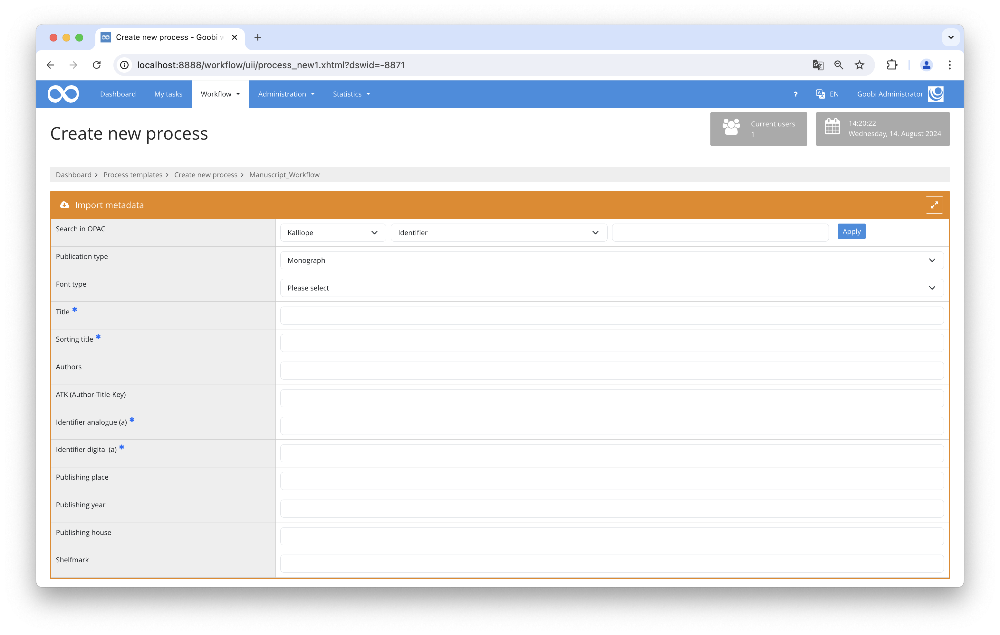

# Kalliope Import

## Overview

Name                     | Wert
-------------------------|-----------
Identifier               | goobi-plugin-opac-kalliope
Repository               | [https://github.com/intranda/goobi-plugin-opac-kalliope](https://github.com/intranda/goobi-plugin-opac-kalliope)
Licence              | GPL 2.0 or newer 
Last change    | 14.08.2024 18:45:15


## Introduction
This documentation describes the installation, configuration and use of the plugin. With the help of this plugin, data from the Kalliope database can be retrieved and transferred to Goobi. To transfer the data, the data from the Kalliope database is retrieved in MODS format and translated into Goobi's data format using a dedicated mapping file.


## Installation
The plugin consists of a Java jar file, a Goobi configuration file and a metadata mapping file:

```bash
plugin_intranda_opac_kalliope-base.jar
plugin_KalliopeOpacImport.xml
mods_map_kalliope.xml
```

These files must be installed readable for the user `tomcat` at the following paths:

```bash
/opt/digiverso/goobi/plugins/opac/plugin_intranda_opac_kalliope-base.jar
/opt/digiverso/goobi/config/plugin_KalliopeOpacImport.xml
/opt/digiverso/goobi/xslt/mods_map_kalliope.xml
```


## Overview and functionality
When searching for an identifier in Goobi, a request is made in the background to the URL configured in the file `goobi_opac.xml`.
After retrieving the record in MODS format, the mapping of the metadata is done according to the rules configured in the file `mods_map_kalliope.xml`.



## Configuration
The configuration file of the plug-in has the following structure:

```xml
<?xml version="1.0" encoding="UTF-8"?>
<config_plugin>
    <charset>utf-8</charset>
    <mapping>/opt/digiverso/goobi/xslt/mods_map_kalliope.xml</mapping>
    <defaultDocType>Monograph</defaultDocType>
    <defaultPicaType>Aa</defaultPicaType>
</config_plugin>
```

The option `<charset>` specifies the character set in which the data is delivered by the Kalliope interface. `<mapping>` designates the file path to the metadata mapping file. The fields `<defaultDocType>` and `<defaultPicaType>` specify the publication type to be used for the document.

In addition to the configuration file of the plugin, the Kalliope catalogue must be made known in the file `goobi_opac.xml`. This is done by an entry that looks like this:

```xml
<catalogue title="Kalliope">
    <config address="kalliope-verbund.info" database="sru" description="SRU-Schnittstelle des Kalliope Verbundes" port="80" opacType="Kalliope-SRU"/>
</catalogue>
```