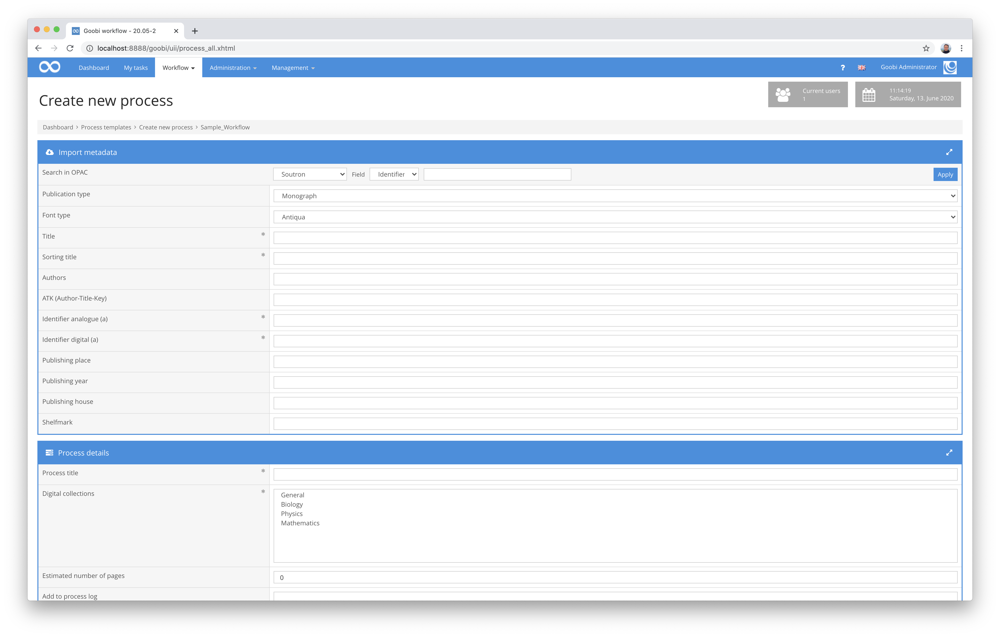

# Soutron Import

## Overview

Name                     | Wert
-------------------------|-----------
Identifier               | intranda_opac_soutron
Repository               | [https://github.com/intranda/goobi-plugin-opac-soutron](https://github.com/intranda/goobi-plugin-opac-soutron)
Licence              | GPL 2.0 or newer 
Last change    | 25.07.2024 12:01:54


## Introduction
This documentation describes the installation, configuration and use of the plugin. This plugin can be used to retrieve data from a Soutron system and transfer it to Goobi. Access to the Soutron catalogue must be guaranteed for this purpose.


## Installation
The plugin consists of two files:

```bash
plugin_intranda_opac_soutron-base.jar
plugin_intranda_opac_soutron.xml
```

The file `plugin_intranda_opac_soutron-base.jar` contains the program logic and must be installed readable for the user `tomcat` at the following path:

```bash
/opt/digiverso/goobi/plugins/opac/plugin_intranda_opac_soutron-base.jar
```

The file `plugin_intranda_opac_soutron.xml` must also be readable by the user `tomcat` and must be located under the following path:

```bash
/opt/digiverso/goobi/config/plugin_intranda_opac_soutron.xml
```


## Overview and functionality
When you search for an identifier in Goobi, a request is sent to the configured URL in the background:

```bash
https://example.com/Library/WebServices/SoutronAPI.svc/GetCatalogue?id=[VALUE]
```



If a valid record is found, the record is searched for the field `/soutron/catalogs_view/ct/cat/rt/@name`. The value is compared with the configured `<docstructs>` list. If there is a match, the required structure element is created.

The configured XPath expressions configured for `<metadata>` and `<person>` are then evaluated.

The expressions apply to the element `/soutron/catalogs_view/ct/`. If data is found with an expression, the corresponding specified metadata is generated. For persons, the system checks whether the value contains a comma. If this is the case, first name and surname are separated by a comma, otherwise the value is interpreted as a surname.


## Configuration
The configuration of the plugin is done in the following files located in the directory `/opt/digiverso/goobi/config/`.

```bash
goobi_opac.xml
plugin_intranda_opac_soutron.xml
```

In the file `goobi_opac.xml` the interface to the desired catalog system must be made known. This is done with an entry that looks like the following:

```xml
<catalogue title="Soutron">
    <config description="Soutron Library System"
      address="https://example.com/Library/WebServices/SoutronAPI.svc/GetCatalogue"
      port="443" database="x" iktlist="x" ucnf="x" opacType="plugin_intranda_opac_soutron" />
    <searchFields>
        <searchField label="Identifier" value="12"/>
    </searchFields>
</catalogue>
```

The attribute `title` contains the name under which the catalog can be selected in the user interface, `address` the URL to the GetCatalogue endpoint and `opacType` the plugin to be used. In this case the entry must be `plugin_intranda_opac_soutron`.

Only a search for an identifier is possible, so the other search options can be hidden. This is done within the `<searchFields>` block.

The contents of the Soutron record are mapped to the metadata in Goobi in the `plugin_intranda_opac_soutron.xml` file:

```xml
<config_plugin>
    <docstructs>
        <docstruct soutron="Item" ruleset="Item" />
        <docstruct soutron="File" ruleset="Item" />
        <docstruct soutron="Book" ruleset="Monograph" />
        <docstruct soutron="Photo" ruleset="Picture" />
    </docstructs>

    <metadata>
        <element xpath="./cat/fs/f[@name='Title']/vs/v[@seq='1']/text()" metadata="TitleDocMain" />
        <element xpath="./cat/fs/f[@name='ISBN']/vs/v/text()" metadata="ISBN" />
        <element xpath="./cat/fs/f[@name='Notes']/vs/v/text()" metadata="Note" />
        <element xpath="./cat/fs/f[@name='Publisher']/vs/v/text()" metadata="PublisherName" />
        <element xpath="./cat/fs/f[@name='Language']/vs/v/text()" metadata="DocLanguage" />
        <element xpath="./cat/fs/f[@name='Subjects']/vs/v/text()" metadata="Subject" />
        <element xpath="./cat/fs/f[@name='Abstract']/vs/v/text()" metadata="Abstract" />
        <element xpath="./cat/fs/f[@name='Date of Publication']/vs/v/text()" metadata="PublicationYear" />
        <element xpath="./cat/fs/f[@name='Place of Publication']/vs/v/text()" metadata="PlaceOfPublication" />
    </metadata>

    <person>
        <element xpath="./cat/fs/f[@name='Author']/vs/v/text()" metadata="Author" />
        <element xpath="./cat/fs/f[@name='Photographer']/vs/v/text()" metadata="Photographer" />
        <element xpath="./cat/fs/f[@name='Translator']/vs/v/text()" metadata="Translator" />
    </person>

</config_plugin>
```

In the area `<docstructs>` the mapping of the individual document types is defined. For each value that can occur in soutron, a `<docstruct>` must exist. In the attribute `soutron` the name that is contained in the soutron record is entered, in `ruleset` the corresponding structure element from the ruleset is entered.

Then the mapping for persons and metadata is configured in `<metadata>` and `<person>`. Here there is a list of `<element>` with the two attributes `xpath` and `metadata`. In `xpath` an XPath expression is configured, which describes in which part of the XML document the content is expected. In `metadata` the name of the metadata is defined, in which the content should be written afterwards.