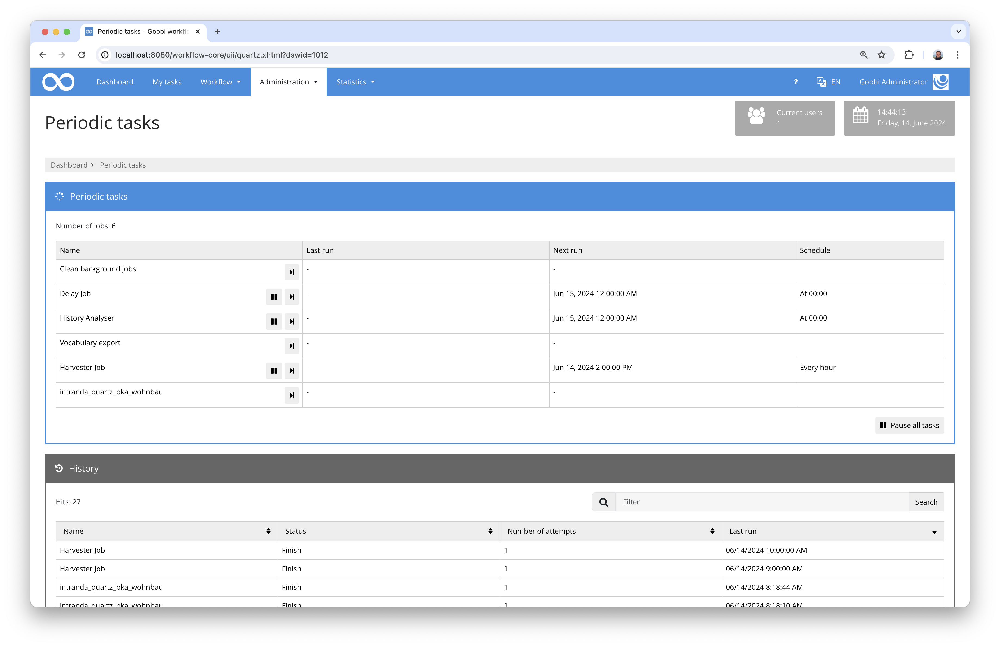

# Data import for the Austrian Housing Promotion Fund

## Overview

Name                     | Wert
-------------------------|-----------
Identifier               | intranda_quartz_bka_wohnbau
Repository               | [https://github.com/intranda/goobi-plugin-quartz-bka-wohnbau](https://github.com/intranda/goobi-plugin-quartz-bka-wohnbau)
Licence              | GPL 2.0 or newer 
Last change    | 18.07.2024 10:58:17


## Introduction
This documentation describes the installation, configuration and use of the time-controlled plugin for importing housing subsidy files in Austria into Goobi workflow. The metadata is taken from a provided JSON file and the associated PDF files are extracted. The files are provided via an S3 memory in several deliveries, each of which is taken into account within the METS files.

## Installation
To be able to use the plugin, the following files must be installed:

```bash
/opt/digiverso/goobi/plugins/GUI/plugin-quartz-bka-wohnbau-job.jar
/opt/digiverso/goobi/config/plugin_intranda_quartz_bka_wohnbau.xml
```

After installation, the plugin is available under the menu item `Administration` - `Periodic tasks`.



## Overview and functionality
This plugin is a so-called `Quartz plugin` for repeated automatic execution. With each call, the plugin assumes that configured `Collections` within an S3 bucket contain directories. Each directory corresponds to a `delivery` for an existing `file`. The following example corresponds to the "second delivery" for the file `ST-1431`.

```bash
/BWSF/ST-1431_02
```

Such a delivery contains several data:
    - a `json file` with metadata
    - one or more `PDF files` and `full text files` for each `document` of a `delivery
  
When the plugin is executed, all existing 'deliveries' are run through and a check is made to see whether they have already been imported into Goobi. If they have not yet been imported, the file is created as a new process if it does not already exist. The process is created on the basis of the configured 'production template' and within the configured 'project'. All metadata is transferred from the json file to the METS file as defined in the configuration file. 

A new structural element is created for the respective delivery within the existing or newly created file, to which the metadata of the delivery is then assigned. Within the 'delivery', a 'document' is then created for each PDF file provided, to which the document metadata is assigned. Each 'document' is converted from the supplied PDF file into image files and the full texts are extracted in ALTO format. The image files imported are given a prefix to indicate the delivery number and a suffix for the respective page number within the PDF file from which they originate.

The image file is saved within the `master` directory of the process. The full text files are stored in the `alto` directory in the `ocr` folder. The `json file` is saved within the `import` directory.


## Configuration
The configuration covers two areas. On the one hand, the function of the plugin is defined in its configuration file. On the other hand, a central Goobi configuration is used for time control, which defines when this plugin should be started regularly in order to run automatically.

### Configuration of the plugin
The plugin is configured in the file `plugin_intranda_quartz_bka_wohnbau.xml` as shown here:

```xml
<config>

	<!-- collections to import, can exist multiple times -->
	<collection>
	
		<!-- name of the collection -->
		<name>BWSF</name>
	
		<!-- Goobi Project to assign -->
		<project>Archive_Project</project>
	
		<!-- process template (workflow) to use for the process creation -->
		<template>Sample_Workflow</template>
	
		<!-- Endpoint for the S3 server with URL and port -->
		<s3endpoint>http://127.0.0.1:9000</s3endpoint>
	
		<!-- User for the S3 access -->
		<s3user>goobi</s3user>
		
		<!-- Password for the S3 access -->
		<s3password>goobigoobi</s3password>

		<!-- Bucket name to use as sourcee -->
		<s3bucket>bwsf</s3bucket>
		
		<!-- Prefix (folder) to use where the content is located, can be empty -->
		<s3prefix></s3prefix>
		
	</collection>

	<!-- second collections to import -->
	<collection>
		<name>WWF</name>
		<project>Manuscript_Project</project>
		<template>Sample_Workflow</template>
		<s3endpoint>http://127.0.0.1:9000</s3endpoint>
		<s3user>goobi</s3user>
		<s3password>goobigoobi</s3password>
		<s3bucket>wwf</s3bucket>
		<s3prefix></s3prefix>
	</collection>
	
	
	<!-- mapping for the individual metadata fields from JSON to ruleset fields -->
	<mapping>
	
		<!-- per record -->
		<recordType>BkaFile</recordType>
		<identifier>CatalogIDDigital</identifier>
		<collection>singleDigCollection</collection>
		<title>TitleDocMain</title>
		<fondname>BkaFondname</fondname>
	    <bundesland>BkaBundesland</bundesland>
	    <geschaeftszahl>BkaGeschaeftszahl</geschaeftszahl>
	    <bezugszahlen>BkaBezugszahlen</bezugszahlen>
	    <anmerkungRecord>BkaAnmerkung</anmerkungRecord>
	    <grundbuchKg>BkaGrundbuchKg</grundbuchKg>
	    <grundbuchEz>BkaGrundbuchEz</grundbuchEz>
	    <adresseGemeindKZ>BkaAdresseGemeindKZ</adresseGemeindKZ>
	    <adresseGemeindename>BkaAdresseGemeindeName</adresseGemeindename>
	    <adresseEz>BkaAdresseEz</adresseEz>
	    <adresseOrt>BkaAdresseOrt</adresseOrt>
	    <adressePlz>BkaAdressePlz</adressePlz>
	    <adresseHauptAdresse>BkaAdresseHauptadresse</adresseHauptAdresse>
	    <adresseIdentAdressen>BkaAdresseIdentAdressen</adresseIdentAdressen>
	    <adresseStrasse>BkaAdresseStrasse</adresseStrasse>
	    <adresseTuer>BkaAdresseTuer</adresseTuer>
	    <adresseStiege>BkaAdresseStiege</adresseStiege>
	    <adresseHistorischeAdresse>BkaAdresseHistorischeAdresse</adresseHistorischeAdresse>
	    <adresseAnmerkung>BkaAdresseAnmerkung</adresseAnmerkung>
	    <detailsAnmerkungen>BkaDetailsAnmerkungen</detailsAnmerkungen>
	    <detailsAuffaelligkeiten>BkaDetailsAuffaelligkeiten</detailsAuffaelligkeiten>
	    <detailsDarlehensNehmer>BkaDetailsDarlehensnehmer</detailsDarlehensNehmer>
	    <detailsDarlehensSchuld>BkaDetailsDarlehensschuld</detailsDarlehensSchuld>
	    <detailsRueckzahlung>BkaDetailsRueckzahlung</detailsRueckzahlung>
	    <detailsBksAnmerkung>BkaDetailsBksAnmerkung</detailsBksAnmerkung>
    		
		<!-- per delivery -->
		<deliveryType>BkaDelivery</deliveryType>
		<deliveryNumber>BkaDeliveryNumber</deliveryNumber>
	    <deliveryDate>BkaDeliveryDate</deliveryDate>    
		    
		<!-- per document -->
		<documentType>BkaDocument</documentType>
		<scanId>BkaFileScanId</scanId>
	    <fuehrendAkt>BkaFileFuehrendAkt</fuehrendAkt>
	    <dokumentArt>BkaFileDokumentArt</dokumentArt>
	    <ordnungszahl>BkaFileOrdnungszahl</ordnungszahl>
	    <ordnungszahlMappe>BkaFileOrdnungszahlMappe</ordnungszahlMappe>
	    <filename>BkaFileFilename</filename>
	    <foldername>BkaFileFoldername</foldername>
	    <filesize>BkaFileFilesize</filesize>
	    <md5>BkaFileMd5</md5>
	    <mimetype>BkaFileMimetype</mimetype>
	
	</mapping>
	
	<!-- Select the command line tool which should be used to create the images. Either 'ghostscript' or 'pdftoppm'. -->
	<imageGenerator>pdftoppm</imageGenerator>						
	
	<!-- A parameter to add to the generator call. Repeatable -->
	<imageGeneratorParameter>-cropbox</imageGeneratorParameter>
</config>
```


### Configuration of the time control
The plugin can be repeated automatically or executed manually. Manual execution is possible by calling it within the menu item `Administration` - `Regular tasks`. Automatic execution, on the other hand, must take place within the configuration file `goobi_config.properties`. To do this, the configuration must look like this if the plugin is to be executed once every hour:

```properties
intranda_quartz_bka_wohnbau=0 0 */1 * * ?
```

As an example, some further configurations for a different execution time are listed here (cron syntax):

```properties
# Ausführung alle 5 Minuten
intranda_quartz_exportEadFile=0 */5 * * * ?

# Ausführung jede Stunde
harvesterJob=0 0 */1 * * ? 

# Ausführung täglich um Mitternacht 
dailyDelayJob=0 0 0 * * ? 
```