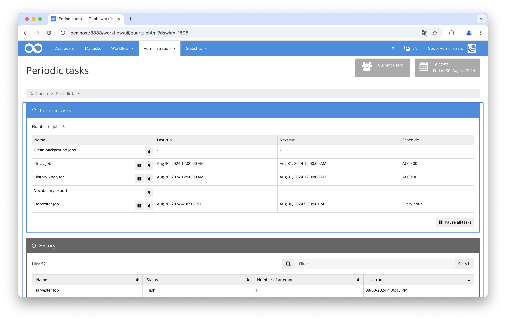

# HERIS Vocabulary Update

## Overview

Name                     | Wert
-------------------------|-----------
Identifier               | intranda_quartz_heris
Repository               | [https://github.com/intranda/goobi-plugin-quartz-heris](https://github.com/intranda/goobi-plugin-quartz-heris)
Licence              | GPL 2.0 or newer 
Last change    | 04.09.2024 09:40:43


## Introduction
This documentation describes the installation, configuration, and usage of the plugin for the automatic, regular update of the HERIS vocabulary.

## Installation
A prerequisite is Goobi version 23.03 or newer. Additionally, the following two files must be installed:

```bash
/opt/digiverso/goobi/config/plugin_intranda_quartz_heris.xml
/opt/digiverso/goobi/lib/plugin_intranda_quartz_heris.jar
```

After installation, the functionality of the plugin is available within the REST API of Goobi workflow.

## Overview and functionality
The import occurs regularly at the times specified in the `goobi_config.properties` file. Alternatively, the import can also be manually triggered at any time. To do this, an administrator can open the `Scheduled Tasks` section and execute the HERIS Import once.



When the plugin is executed, it connects to the SFTP server and searches for a JSON file. If multiple files exist, the file with the latest timestamp is used. The file is downloaded, opened, and the JSON array is split into individual objects. For each object, the identifier is searched and compared with existing records. If the identifier already exists in a record, the record is updated; otherwise, a new record is created.

Subsequently, the configured fields are iterated over, and the individual values are imported.

Finally, the downloaded file is deleted by the Goobi system. No data is changed on the SFTP system.

## Configuration
The plugin is configured in the file `plugin_intranda_quartz_heris.xml` as shown here:

```xml
<config>
    <!-- Folder in which the heris export file is expected to be stored -->
    <herisFolder>/tmp/download</herisFolder>

    <!-- sftp credentials for username + password authentication -->
    <sftp>
        <username>username</username>
        <password>password</password>
        <hostname>localhost</hostname>
        <knownHosts>~/.ssh/known_hosts</knownHosts>
        <sftpFolder>/path/to/remote/folder/</sftpFolder>
    </sftp>
    
    
    <!-- sftp credentials for username + public/private key authentication -->
    <!-- 
    <sftp>
        <username>username</username>
        <keyfile>/path/to/private/key</keyfile>
        <hostname>localhost</hostname>
        <knownHosts>~/.ssh/known_hosts</knownHosts>
        <sftpFolder>/path/to/remote/folder/</sftpFolder>
    </sftp> 
     -->
     
      <!-- sftp credentials for password protected public/private key authentication -->
    <!-- 
    <sftp>
        <username>username</username>
        <keyfile>/path/to/private/key</keyfile>
        <password>password</password>
        <hostname>localhost</hostname>
        <knownHosts>~/.ssh/known_hosts</knownHosts>
        <sftpFolder>/path/to/remote/folder/</sftpFolder>
    </sftp> 
     -->   
     
    <vocabulary name="HERIS">
        <field fieldName="herisid" jsonPath="$.['HERIS-ID']" identifier="true" />
        <field fieldName="objektid" jsonPath="$.['Alte Objekt-ID']" />
        <field fieldName="title" jsonPath="$.['Katalogtitel']" />
        <field fieldName="type" jsonPath="$.['Typ']" />
        <field fieldName="mainCategoryA" jsonPath="$.['Hauptkategorie grob']" />
        <field fieldName="mainCategoryB" jsonPath="$.['Hauptkategorie mittel']" />
        <field fieldName="mainCategoryC" jsonPath="$.['Hauptkategorie fein']" />
        <field fieldName="subCategory" jsonPath="$.['Nebenkategorie grob']" />
        <field fieldName="nonExisting" jsonPath="$.['somethingElse']" />
    </vocabulary>
</config>

```

The following table contains a summary of the parameters and their descriptions:

Parameter               | Explanation
------------------------|------------------------------------
| `<username>`          | The username for SFTP access.                             |
| `<password>`          | The password for SFTP access.                             |
| `<hostname>`          | The hostname of the SFTP server.                          |
| `known_hosts`         | File with the server's fingerprint, required for authentication. |
| `sftpFolder`          | Path to the JSON file on the SFTP server (use `.` if stored in the home directory). |
| `<herisFolder>`       | Local folder where the JSON file is downloaded.           |
| `<vocabulary>`        | Name of the vocabulary to be updated.                     |
| `fieldName`           | Name of the field in the vocabulary to be overwritten.    |
| `jsonPath`            | JSONPath expression for extracting the field from the JSON file. |
| `identifier`          | Identifier field for matching with the vocabulary.        |

To ensure the update is automatically executed, the execution time must be configured in the `goobi_config.properties` file. This is done by specifying the cron syntax for when it should run. For a daily execution at midnight, the following can be used:


```toml
intranda_quartz_herisJob=0 0 0 * * ?
```