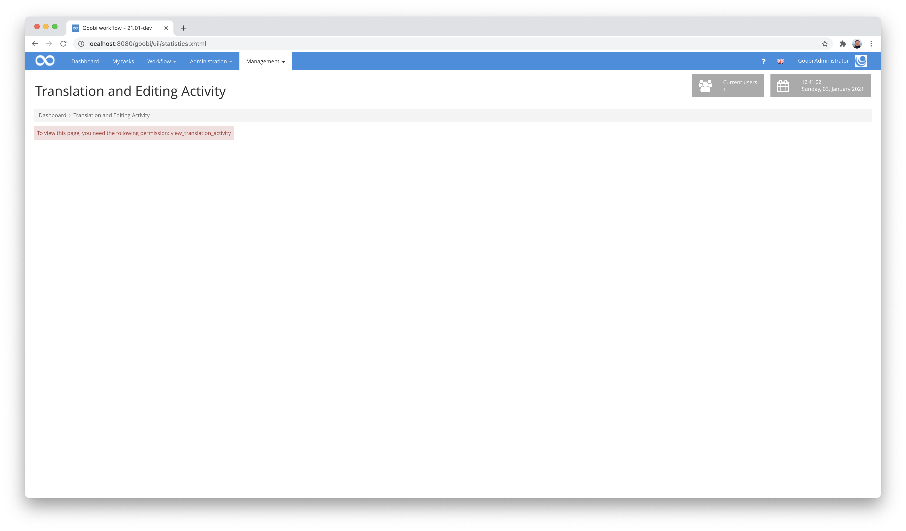
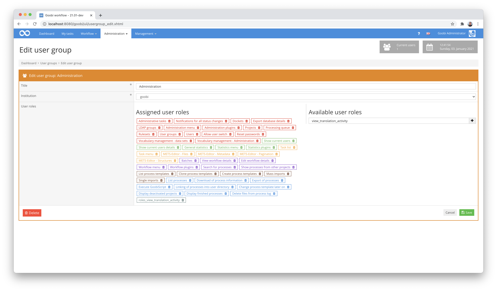
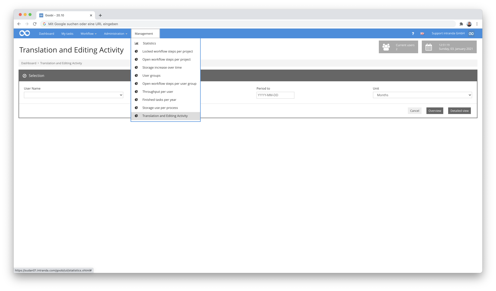
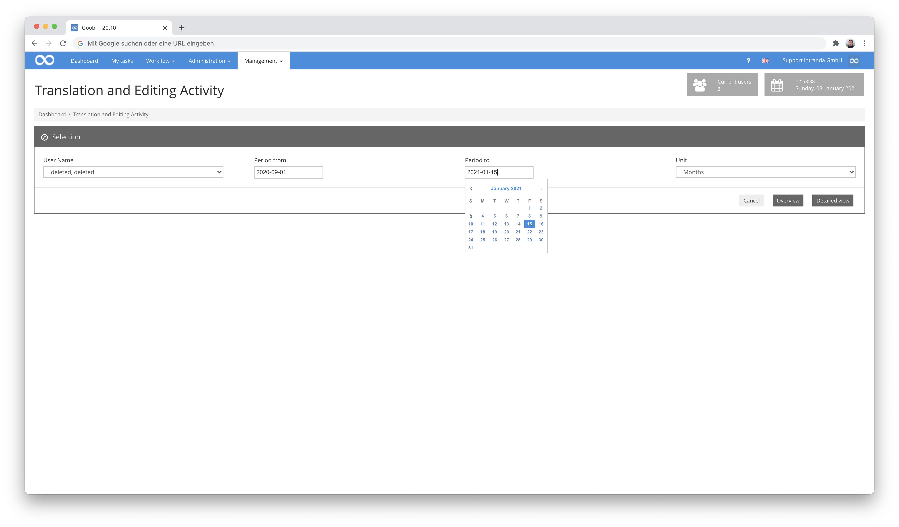
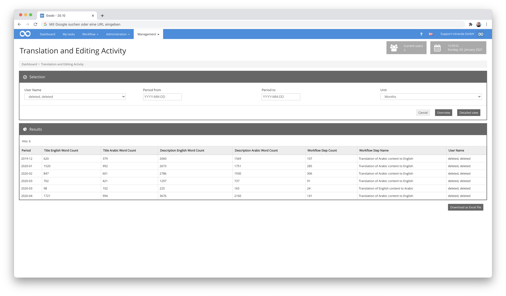

# Sudan Memory Translations

## Overview

Name                     | Wert
-------------------------|-----------
Identifier               | intranda_statistics_sudan_memory_activity_by_user
Repository               | [https://github.com/intranda/goobi-plugin-statistics-sudan-memory](https://github.com/intranda/goobi-plugin-statistics-sudan-memory)
Licence              | GPL 2.0 or newer 
Last change    | 25.07.2024 13:57:17


## Introduction
This statistics plugin enables statistical recording of the activity of translators and editors who edit specific metadata fields within the METS file. In particular, the translation work in the metadata fields `Title (Arabic)`, `Title (English)`, `Description (English)` and `Description (Arabic)` is taken into account.


## Installation
To install the plugin, the following two files must be installed:

```bash
/opt/digiverso/goobi/plugins/statistics/plugin_intranda_statistics_sudan-base.jar
/opt/digiverso/goobi/plugins/GUI/plugin_intranda_statistics_sudan-gui.jar
```

In addition, the following function must be created within the database:

```sql
DROP FUNCTION IF EXISTS wordcount;

    DELIMITER $$
    CREATE FUNCTION wordcount(str TEXT CHARSET utf8mb4)
            RETURNS INT
            DETERMINISTIC
            SQL SECURITY INVOKER
            NO SQL
       BEGIN
         DECLARE wordCnt, idx, maxIdx INT DEFAULT 0;
         DECLARE currChar, prevChar BOOL DEFAULT 0;
         SET maxIdx=char_length(str);
         WHILE idx < maxIdx DO
             SET currChar=SUBSTRING(str, idx, 1) RLIKE '[[:alnum:]]';
             IF NOT prevChar AND currChar THEN
                 SET wordCnt=wordCnt+1;
             END IF;
             SET prevChar=currChar;
             SET idx=idx+1;
         END WHILE;
         RETURN wordCnt;
       END
     $$
     DELIMITER ;
```

A UTF8-encoded text can be passed to this function. The text is checked character by character. If the current character is an alnumeric character (letters, numbers, full stop, comma, letters with diacritics, brackets) but the previous character is not (nothing, space, newline, tab), a new word starts at this point and the word counter is incremented. At the end, the word counter is returned.


## Overview and functionality
To use this plugin, the user must have the correct role authorisation.



Therefore, please assign the role `view_translation_activity` to the group.



Afterwards, the menu item `Translation and Editing Activity` can be selected in the section `Management`.



In order to limit the period of the evaluation, the two fields `Period from` and `Period to` can be used for the start date and end date. A date in the form `YYYY-MM-DD` can be entered here. Both entries are optional. If the start date is not filled in, the date on which the first step was completed applies. If the end date is missing, the current date is used.



In the `Unit` field, you define the time periods in which the evaluation is to be summarised. Here you can choose from the values `days`, `months`, `quarters` or `years`.

After specifying the required information, two different evaluations can be generated by this plugin:


### Evaluation: Overview
The evaluation `Overview` lists for each period within the start and end date which user has processed how many work steps `Translation of Arabic content to English` or `Translation of English content to Arabic`. It also shows how many words were entered in the fields `Title (Arabic)`, `Title (English)`, `Description (English)` and `Description (Arabic)` in these steps.


### Evaluation: Detailed View
The `Detailed View` lists each workflow step `Translation of Arabic content to English` or `Translation of English content to Arabic` that was completed within the specified start and end date. For each step, the user, the associated process, and the content and number of words from the four fields `Title (Arabic)`, `Title (English)`, `Description (English)` and `Description (Arabic)` are also displayed.



The two evaluations can also be downloaded as Excel files.


## Further technical information
The following are some SQL statements that may be useful for working with the data in the context of this plugin.

SQL query via a general overview:

```sql
    SELECT
    DATE_FORMAT(s.BearbeitungsEnde, '%Y-%m') AS plugin_statistics_sudan_timeRange,
    WORDCOUNT(GROUP_CONCAT(m1.value SEPARATOR ' ')) AS plugin_statistics_sudan_titleCount,
    WORDCOUNT(GROUP_CONCAT(m2.value SEPARATOR ' ')) AS plugin_statistics_sudan_titlearabicCount,
    WORDCOUNT(GROUP_CONCAT(m3.value SEPARATOR ' ')) AS plugin_statistics_sudan_descriptionCount,
    WORDCOUNT(GROUP_CONCAT(m4.value SEPARATOR ' ')) AS plugin_statistics_sudan_descriptionarabicCount,
    COUNT(s.Titel) AS plugin_statistics_sudan_workflowTitleCount,
    CONCAT(u.Nachname, ', ', u.Vorname) AS plugin_statistics_sudan_userName
    FROM
    metadata m1
        JOIN
    metadata m2 ON m1.processid = m2.processid
        JOIN
    metadata m3 ON m1.processid = m3.processid
        JOIN
    metadata m4 ON m1.processid = m4.processid
        JOIN
    schritte s ON m1.processid = s.ProzesseID
        LEFT JOIN
    benutzer u ON s.BearbeitungsBenutzerID = u.BenutzerID
    WHERE
    m1.name = 'TitleDocMain'
        AND m2.name = 'TitleDocMainArabic'
        AND m3.name = 'ContentDescription'
        AND m4.name = 'ContentDescriptionArabic'
        AND s.typMetadaten = TRUE
        AND s.Bearbeitungsstatus = 3
        AND s.titel like '%ranslat%'
        AND s.BearbeitungsEnde BETWEEN '2019-01-01' AND '2020-12-31'
    GROUP BY plugin_statistics_sudan_timeRange, plugin_statistics_sudan_userName;
```

SQL query for a detailed report:

```sql
    SELECT
    m1.processid,
    m1.value AS plugin_statistics_sudan_title,
    WORDCOUNT(m1.value) AS plugin_statistics_sudan_titleCount,
    m2.value AS plugin_statistics_sudan_titlearabic,
    WORDCOUNT(m2.value) AS plugin_statistics_sudan_titlearabicCount,
    m3.value AS plugin_statistics_sudan_description,
    WORDCOUNT(m3.value) AS plugin_statistics_sudan_descriptionCount,
    m4.value AS plugin_statistics_sudan_descriptionarabic,
    WORDCOUNT(m4.value) AS plugin_statistics_sudan_descriptionarabicCount,
    s.Titel AS plugin_statistics_sudan_workflowTitle,
    p.Titel AS plugin_statistics_sudan_processTitle,
    CONCAT(u.Nachname, ', ', u.Vorname) AS plugin_statistics_sudan_userName
    FROM
    metadata m1
        JOIN
    metadata m2 ON m1.processid = m2.processid
        JOIN
    metadata m3 ON m1.processid = m3.processid
        JOIN
    metadata m4 ON m1.processid = m4.processid
        JOIN
    schritte s ON m1.processid = s.ProzesseID
        LEFT JOIN
    prozesse p ON s.ProzesseID = p.ProzesseID
        LEFT JOIN
    benutzer u ON s.BearbeitungsBenutzerID = u.BenutzerID
    WHERE
    m1.name = 'TitleDocMain'
        AND m2.name = 'TitleDocMainArabic'
        AND m3.name = 'ContentDescription'
        AND m4.name = 'ContentDescriptionArabic'
        AND s.typMetadaten = TRUE
        AND s.titel like '%ranslat%'
        AND s.Bearbeitungsstatus = 3
        AND s.BearbeitungsEnde BETWEEN '2019-01-01' AND '2020-12-31';
```