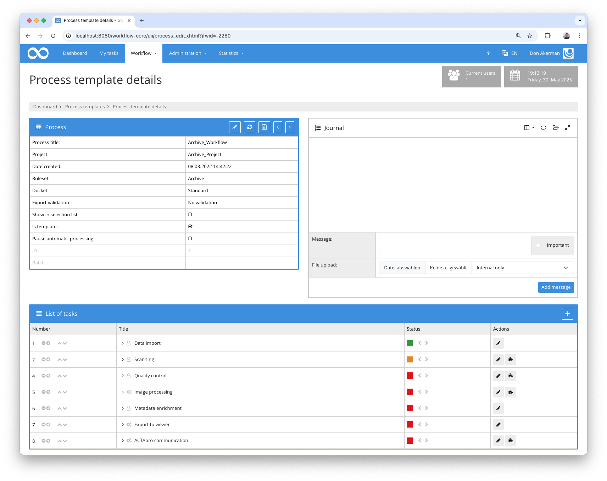
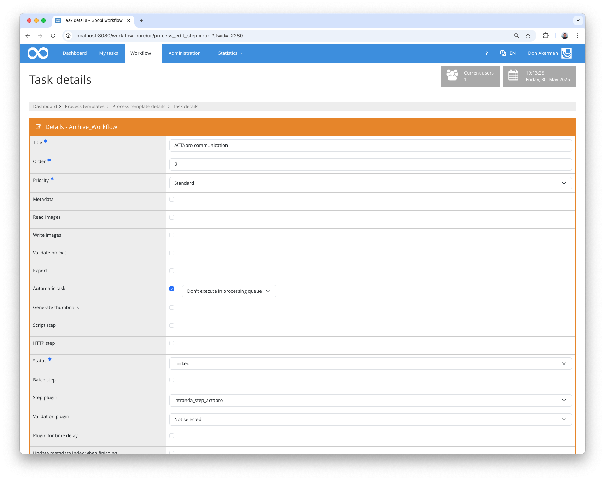

# Enriching ACTApro documents

## Overview

Name                     | Wert
-------------------------|-----------
Identifier               | intranda_step_actapro
Repository               | [https://github.com/intranda/goobi-plugin-step-actapro](https://github.com/intranda/goobi-plugin-step-actapro)
Licence              | GPL 2.0 or newer 
Last change    | 30.05.2025 19:22:44


## Introduction

This plugin is used to send information to ACTApro. Any data can be added to an existing node within ACTApro.


## Installation
In order to use the plugin, the following files must be installed:

```bash
/opt/digiverso/goobi/plugins/step/plugin-step-actapro-base.jar
/opt/digiverso/goobi/config/plugin_intranda_step_actapro.xml
```

The `intranda_administration_actapro_sync` administration plugin must also be installed and configured.

Once the plugin has been installed, it can be selected within the workflow for the respective work steps and thus executed automatically. A workflow could look like the following example:



To use the plugin, it must be selected in a workflow step:




## Overview and functionality

When the plugin is executed, the metadata is read first and the field containing the ID of the ACTApro data record is searched for.

The configured mandatory fields are then checked. Here you can validate whether metadata or properties exist. 

If the preconditions have been met, the ACTApro data record is retrieved via REST API and enriched with the configured data.
The enriched document is sent back to the ACTApro API last.

If the ACTApro ID, the configured mandatory fields are missing or the ACTApro data record is not found, the plugin fails with an error message in the journal.


## Configuration
The plugin is configured in the file `plugin_intranda_step_actapro.xml` as shown here:

```xml
<config_plugin>
    <!--
        order of configuration is:
          1.) project name and step name matches
          2.) step name matches and project is *
          3.) project name matches and step name is *
          4.) project name and step name are *
    -->

    <config>
        <!-- which projects to use for (can be more then one, otherwise use *) -->
        <project>*</project>
        <step>*</step>

        <actaProIdFieldName>RecordID</actaProIdFieldName>

        <!-- required metadata/property that must exist in order to proceed -->
        <requiredField type="metadata">CatalogIDDigital</requiredField>
        <requiredField type="property">DocType</requiredField>

        
        <!-- define which field to update/add-->
        <!-- type defines the type field in the actapro document -->
        <!-- if it is a sub field of a superordinated field, in can be configured in groupType -->
        <!-- value: the value to write. can be a static text or anything from the VariableReplacer -->
        
        <!--  
        two types of fields can be generated. You can generate something like this:  
         "fields": [
              {
                "type": "some type",
                "value": "http://example.com/viewer/piresolver?id=12345"
               }
               ]
       -->
       <field type="some type" value="http://example.com/viewer/piresolver?id=$(meta.CatalogIDDigital)" />
       
       <!-- or create a structure like this: -->
        <!--
         "fields": [
               {
                    "type": "main type",
                    "fields": [
                      {
                        "type": "sub type",
                        "value": "http://example.com/viewer/piresolver?id=12345"
                      }
                    ]
                  }
               ]       
       -->           
        <field type="sub type" groupType="main type" value="http://example.com/viewer/piresolver?id=$(meta.CatalogIDDigital)" />


    </config>

</config_plugin>
```

### General parameters 
The `<config>` block can occur repeatedly for different projects or work steps in order to be able to perform different actions within different workflows. The other parameters within this configuration file have the following meanings: 

| Parameter | Explanation | 
| :-------- | :---------- | 
| `project` | This parameter defines which project the current block `<config>` should apply to. The name of the project is used here. This parameter can occur several times per `<config>` block. | 
| `step` | This parameter controls which work steps the `<config>` block should apply to. The name of the work step is used here. This parameter can occur several times per `<config>` block. | 


### Further parameters 
In addition to these general parameters, the following parameters are available for further configuration: 


Parameter               | Explanation
------------------------|------------------------------------
`actaProIdFieldName`    | Contains the name of the metadata containing the ACTApro ID
`requiredField`         | Contains a list of all mandatory fields. The `type` attribute can be used to specify whether it is a property (`property`) or a metadata (`metadata`). 
`field`                 | Contains a field definition that is to be overwritten or added in the ACTApro document. The `value` attribute contains the value to be written. The VariableReplacer can be accessed here. The field name is in `type`. If it is a subordinate field of another field, the main field can be specified in `groupType`.