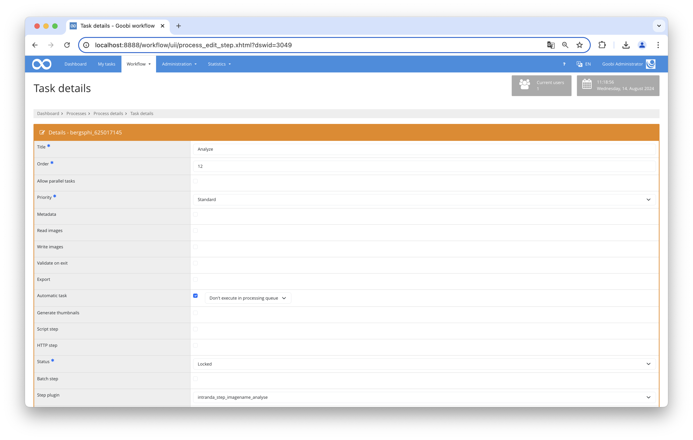

# Automatic pagination based on file names

## Overview

Name                     | Wert
-------------------------|-----------
Identifier               | intranda_step_imagename_analyse
Repository               | [https://github.com/intranda/goobi-plugin-step-analysis-imagename](https://github.com/intranda/goobi-plugin-step-analysis-imagename)
Licence              | GPL 2.0 or newer 
Last change    | 15.08.2024 06:28:53


## Introduction
This documentation describes the installation, configuration and use of the plugin. This plugin can be used to automatically prepare METS-files, create a basic structure and set a pagination.


## Installation
The plugin consists of two files:

```bash
plugin_intranda_step-imagename-analyse-base.jar
plugin_intranda_step_imagename_analyse.xml
```

The file `plugin_intranda_step-imagename-analyse-base.jar` contains the program logic and must be installed to the `tomcat` user readable in the following directory:

```bash
/opt/digiverso/goobi/plugins/step/
```

The file `plugin_intranda_step_imagename_analyse.xml` must also be readable by the `tomcat` user and installed into the following directory:

```bash
/opt/digiverso/goobi/config/
```


## Overview and functionality
Once the plugin has been installed and configured, it can be used by Goobi within a single step.

To do this, the `intranda_step_imagename_analyse` plugin must be selected within the desired task. In addition, the `Automatic task` checkbox must be set.



The way the plugin works within the correctly configured workflow looks like this:

* If the plugin was called within the workflow, it opens the METS file and first checks whether a pagination already exists.
* If this is the case, based on the configured value in `skipWhenDataExists` the step is either completed without further changes or the existing pagination and structuring is removed from the METS file.
* Then the files are read from the master folder and sorted alphanumerically.
* For each file it is now checked whether it corresponds to the configured regular expression.
* If this is the case, a new page is created. The physical order corresponds to the sorting in the file system, the logical page number is taken from the first group of the regular expression.
* If the regular expression does not apply, the system then runs through the list of configured items and checks whether the file name ends with the expression followed by an optional number and an optional recto-verso specification (r or v). If this is the case, the configured structural element is created and the page is assigned to this element. By specifying a count, new structural elements of the same type can be defined. If two or more files have no count or the same count, they are assigned to the same structural element.
* If neither the regular expression nor the list of structural elements apply to the file names, a page with the logical sorting "uncounted" is created and an entry is written in the process log.


## Configuration
The configuration file `plugin_intranda_step_imagename_analyse.xml` used to configure the plugin and must have the following structure:

```xml
<?xml version="1.0" encoding="UTF-8"?>
<config>
    <skipWhenDataExists>false</skipWhenDataExists>

    <paginationRegex>.*_(\d+\w?[rv]\w?)\.\w+</paginationRegex>

    <structureList>
        <item filepart="ER" docstruct="RearCover" />
        <item filepart="SV" docstruct="FrontSection" />
        <item filepart="VD" docstruct="FrontCover" />
        <item filepart="HD" docstruct="BackCover" />
        <item filepart="VS" docstruct="Endsheet" />
        <item filepart="NS" docstruct="Postscript" />
        <item filepart="FR" docstruct="Fragment" />
        <item filepart="Fragm" docstruct="Fragment" />
    </structureList>
</config>
```

The element `skipWhenDataExists` defines how the plugin behaves if a pagination already exists. With the value `true` the execution is skipped, with `false` the existing structure and pagination is removed and a new one is created.

The element `paginationRegex` contains a regular expression which tries to extract the logical page number from the filename. The value from the first group is copied to the METS file.

If the regular expression was not successful, the system then checks whether the file name describes a special structure such as `Cover`, `Titlepage` or `Contents`. This structure is defined within `structureList`. A (partial) string, which must occur in the file name, is defined within the item element in the `filepart` attribute. In the `docstruct` attribute, the structural element is defined that is to be created in this case.


## Samples
The following examples are based on the configuration defined above:

| Filename | Output |
| :--- | :--- |
| BxSem-A02_010v.tif | Page 010v |
| BxSem-A02_146r.tif | Page 146r |
| BxSem-A02_NSr.tif | first page of the Postscript structural element |
| BxSem-A02_NSv.tif | second page of the Postscript structural element |
| BxSem-B04_Farbkarte_Einband.jpg | not configured, therefore no assignment possible, is taken over as "uncounted" |
| BxSem-A22_VS1r.jpg | first end sheet, first page |
| BxSem-A22_VS1v.jpg | first end sheet, second page |
| BxSem-A22_VS2.jpg | second end sheet |
| BxSem-B08_SV.jpg | single picture of the FrontSection |