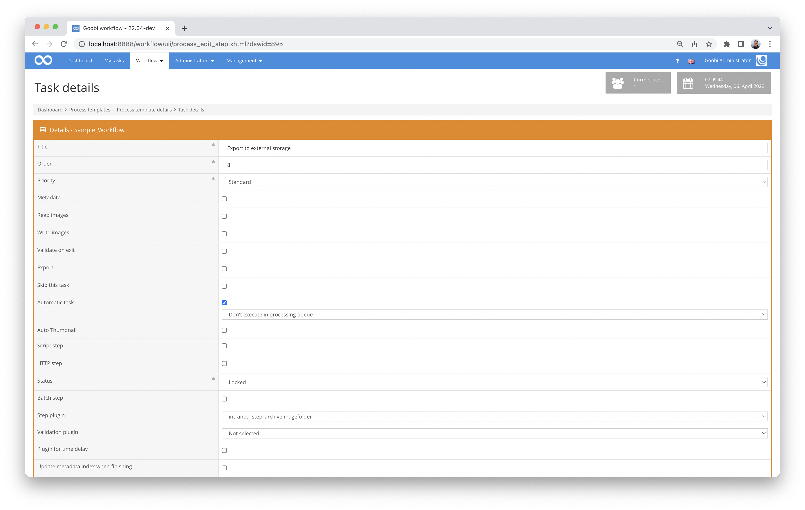

# Archiving image folders

## Overview

Name                     | Wert
-------------------------|-----------
Identifier               | intranda_step_archiveimagefolder
Repository               | [https://github.com/intranda/goobi-plugin-step-archive-image-folder](https://github.com/intranda/goobi-plugin-step-archive-image-folder)
Licence              | GPL 2.0 or newer 
Last change    | 25.07.2024 12:01:20


## Introduction
This step plugin for Goobi workflow copies image folders to an external storage connected via sftp (ssh) and creates a file that causes Goobi workflow to display a warning in the task. The warning is displayed in the task details and in the metadata editor.


## Installation
The plugin consists of the following file:

```bash
goobi_plugin_step_archiveimagefolder-base.jar
```

This file must be installed in the correct directory so that it is available at the following path after installation:

```bash
/opt/digiverso/goobi/plugins/step/plugin_intranda_step_archiveimagefolder-base.jar
```

In addition, there is a configuration file that must be located in the following place:

```bash
/opt/digiverso/goobi/config/plugin_intranda_step_archiveimagefolder.xml
```


## Overview and functionality
To put the plugin into operation, it must be activated for one or more desired automatic tasks in the workflow. This is done as shown in the following screenshot by selecting the plugin `intranda_step_archiveimagefolder` from the list of installed plugins.



The plugin copies the files from the configured folder to the SSH server, writes an XML file with the info where the files are located to the operation folder and then (if so configured) deletes the images on the Goobi storage and closes the step.

The images can be restored afterwards with the plugin `goobi-plugin-administration-restorearchivedimagefolder`.


## Configuration
The configuration of the plugin is done via the configuration file `plugin_intranda_step_archiveimagefolder.xml` and can be adjusted during operation. The following is an example configuration file:

```xml
<?xml version="1.0" encoding="UTF-8"?>
<config_plugin>
        <!--
        order of configuration is:
          1.) project name and step name matches
          2.) step name matches and project is *
          3.) project name matches and step name is *
          4.) project name and step name are *
	-->

    <config>
        <!-- which projects to use for (can be more then one, otherwise use *) -->
        <project>*</project>
        <step>*</step>

        <!-- the folder to archive -->
        <folder>master</folder>
        <!-- delete local files after copying and close step -->
        <deleteAndCloseAfterCopy>false</deleteAndCloseAfterCopy>
        <method>
            <name>SSH</name>
            <host>bandspeicher.intranda.com</host>
            <user>intranda</user>
        </method>
    </config>

</config_plugin>
```

For authentication on the ssh server, public keys are searched for in the usual places (`$USER_HOME/.ssh`). Other authentication methods such as username/password are not yet provided.  
The setting `<deleteAndCloseAfterCopy>false</deleteAndCloseAfterCopy>` is intended for the case that the files on the SSH server are first stored in a buffer and then written to a tape. In this case, the step can remain open and be closed by a callback of the tape storage system. The callback has not yet been implemented for any tape storage, but can be mapped using the standard Goobi workflow REST API.