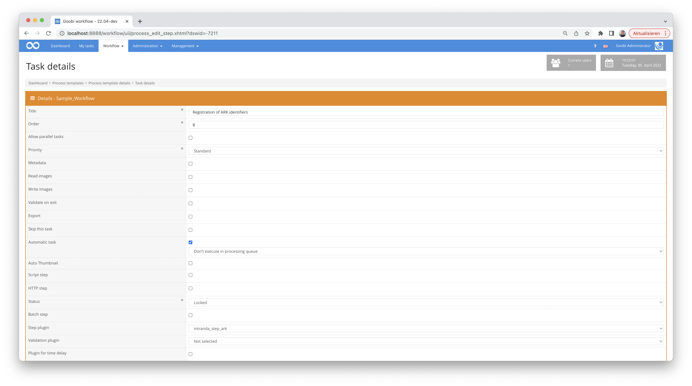

# Generating Archival Resource Keys (ARK)

## Overview

Name                     | Wert
-------------------------|-----------
Identifier               | intranda_step_ark
Repository               | [https://github.com/intranda/goobi-plugin-step-ark](https://github.com/intranda/goobi-plugin-step-ark)
Licence              | GPL 2.0 or newer 
Last change    | 25.07.2024 12:01:12


## Einführung
This documentation describes the installation, configuration and use of the Step Plugin for the generation of ARK identifiers in Goobi workflow.

**ATTENTION:** This update can only be used to a very limited extent from 01.01.2024. ARCs were generated in the plugin via the Rest API of [arketype.ch](https://arketype.ch), a service of the Geneva University of Applied Sciences, which will be shut down in the course of 2024. Arketype is a fork of [EZID](https://github.com/CDLUC3/ezid) and could theoretically be used with it. However, the operation of a local ARK service using the [ARK services](https://gitlab.com/zhbluzern/zentralgut-ark-service) of the Lucerne Central Library for [ZentralGut](https://zentralgut.ch) is recommended. This Python script generates local identifiers, registers them in the global resolver and enters them into the processes in Goobi Workflow. 


## Installation
The plugin consists of the following file:

```bash
plugin_intranda_step_ark-base.jar
```

This file must be installed in the correct directory so that it is available at the following path after installation:

```bash
/opt/digiverso/goobi/plugins/step/plugin_intranda_step_ark-base.jar
```

In addition, there is a configuration file that must be located in the following place:

```bash
/opt/digiverso/goobi/config/plugin_intranda_step_ark.xml
```


## Overview and functionality
The plugin is usually executed fully automatically within the workflow. It first determines whether an Archival Resource Key (ARK) already exists. If there is no ARK yet, a new ARK is registered. If an ARK already exists in the metadata, it attempts to update the metadata of the ARK.

This plugin is integrated into the workflow in such a way that it is executed automatically. Manual interaction with the plugin is not necessary. For use within a workflow step, it should be configured as shown in the screenshot below.




## Configuration
The configuration of the plugin is done via the configuration file `plugin_intranda_step_ark.xml` and can be adjusted during operation. The following is an example configuration file:

```xml
<?xml version="1.0" encoding="UTF-8"?>
<config_plugin>
	<!-- order of configuration is:
    1.) project name and step name matches
    2.) step name matches and project is *
    3.) project name matches and step name is *
    4.) project name and step name are *
  -->

	<config>
		<!-- which projects to use for (can be more then one, otherwise use *) -->
		<project>*</project>
		<step>*</step>

		<!-- URI of the ARK API, must use https -->
		<uri>https://www.arketype.ch/</uri>

		<!-- Name Assigning Number Authority -->
		<naan>99999</naan>

		<!-- name of the API user -->
		<apiUser>apiUser</apiUser>

		<!-- password of the API user -->
		<apiPassword></apiPassword>

		<!-- shoulder on which new ARKs shall be minted -->
		<shoulder>fgt</shoulder>

		<!-- Datacite Metadata fields -->

		<!-- metadata field datacite.creator -->
		<metadataCreator>{meta.CreatorsAllOrigin}</metadataCreator>

		<!-- metadata field datacite.title -->
		<metadataTitle>{meta.TitleDocMain}</metadataTitle>

		<!-- metadata field datacite.publisher -->
		<metadataPublisher>{meta.PublisherName}</metadataPublisher>

		<!-- metadata field datacite.publicationyear -->
		<metadataPublicationYear>{meta.PublicationYear}</metadataPublicationYear>

		<!-- metadata field datacite.resourcetype can only contain following values:
			Audiovisual, Collection, Dataset, Event, Image ,InteractiveResource, Model,
			PhysicalObject, Service, Software, Sound, Text, Workflow, Other. For more
			information consult the API-documentation https://www.arketype.ch/doc/api -->
		<metadataResourceType>Text</metadataResourceType>

		<!--target url ark will forward to -->
		<publicationUrl>https://viewer.example.org/image/{meta.CatalogIDDigital}</publicationUrl>

		<!--metadatatype in METS-File -->
		<metadataType>ARK</metadataType>

	</config>
</config_plugin>
```

| Parameter | Explanation |
| :--- | :--- |
| `project` | This parameter determines for which project the current block `<config>` should apply. The name of the project is used here. This parameter can occur several times per `<config>` block. |
| `step` | This parameter controls for which workflow steps the block `<config>` should apply. The name of the workflow step is used here. This parameter can occur several times per `<config>` block. |
| `uri` | The URL of the API must be stored in this parameter. As a rule, the standard entry `https://www.arketype.ch` can be used.  |
| `naan` | NAAN is an acronym for Name Assigning Number Authority. It is a unique identifier to which the account is assigned. |
| `apiUser` |  Name of the API user |
| `apiPassword` | Password of the API user |
| `shoulder` | Name of the sub-namespace in which the new ARKs are to be created. |
| `metadataCreator` | Corresponds to the `datacite.creator` field and should name the persons who created the data. Usually the default value `{meta.CreatorsAllOrigin}` can be kept.  |
| `metadataTitle` | Corresponds to the `datacite.title` field and should contain the name by which the publication is known. As a rule, the default value `{meta.TitleDocMain}` can be retained. |
| `metadataPublisher` | Corresponds to the `datacite.publisher` field. As a rule, the default value `{meta.PublisherName}` can be retained. |
| `metadataResourceType` | Corresponds to the `datacite.publicationyear` field. As a rule, the default value `{meta.PublicationYear}` can be retained. |
| `metadataResourceType`   | Corresponds to the `datacite.resourcetype` field. Only the values `Audiovisual`, `Collection`, `Dataset`, `Event`, `Image`, `InteractiveResource`, `Model`, `PhysicalObject`, `Service`, `Software`, `Sound`, `Text`, `Workflow`, and `Other` are allowed. In addition, specific subtypes can be specified. An example would be Image/`Photo`. The subtype, i.e. the part after the `/`, is not subject to any restriction.|
| `publicationUrl`   | URL under which the digitised work will be available in the future. As a rule, the publication URL will follow a pattern, e.g. `https://viewer.example.org/{meta.CatalogIDDigital}`. In this case, it is assumed that the works will be published in the future under a URL containing the metadate 'identifier'. |
| `metadataType`  | Specifies the metadata type under which the URN is to be recorded. The default should not be changed here.  |