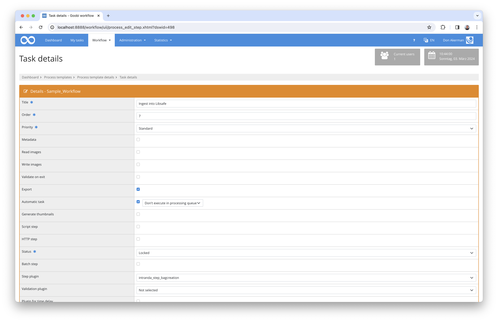

# Libsafe Integration

## Overview

Name                     | Wert
-------------------------|-----------
Identifier               | intranda_step_bagcreation,intranda_step_bagsubmission
Repository               | [https://github.com/intranda/goobi-plugin-step-bag-creation](https://github.com/intranda/goobi-plugin-step-bag-creation)
Licence              | GPL 2.0 or newer 
Last change    | 25.07.2024 11:50:00


## Introduction
This documentation describes the installation, configuration and use of the plugin for ingesting into the Libsafe long-term archiving system.

Using this plugin for Goobi, the metadata objects available in Goobi and additional descriptive documents can be combined into an [E-ARK](https://www.eark-project.com/)-[BagIt](https://datatracker.ietf.org/doc/html/rfc8493) and transferred to the Libsafe server.


## Installation
The following files must be installed in order to use Libsafe Ingest:

```bash
/opt/digiverso/goobi/plugins/step/plugin_intranda_step_bagcreation-base.jar
/opt/digiverso/goobi/plugins/config/plugin_intranda_step_bagcreation.xml
```

Two new steps must be added to the workflow. Firstly, an automatic step that creates the E-ARK-based `BagIt Submission Information Package (SIP)`, where `intranda_step_bagcreation` must be selected as the plugin. A second automatic step is then required to handle the actual data delivery. The `intranda_step_bagsubmission` plugin is required for this.


## Overview and functionality
This plugin is integrated into the workflow so that it is executed automatically. Manual interaction with the plugin is not necessary. To use it within a workflow step, it should be configured as shown in the screenshot below.




The Long-term archiving consists of several sub-steps:


### Folder structure
Firstly, the file and folder structure required for the SIP is created.

A `metadata` folder and a `representations` folder are created within a root folder. Within the `metadata` folder there are the subfolders `descriptive` and `other` to store MODS files and other formats such as the DFG viewer extensions. Within `representations` there are subfolders for different formats, each containing a subfolder `data` in which the files are located.


### Metadata
Each format has a METS file in which the files are listed in the `data` folder. Each format is described in its own METS file, each of which contains a `fileGroup` and a `structMap`.

The metadata is described in MODS. There is a separate file for each structural element in the `descriptive` folder. This file contains all metadata for which an export mapping has been defined in the rule set. As there may also be metadata that should not be exported in the regular export but must also be archived during long-term archiving, there is the option of defining additional export parameters in the configuration file that are only used for the Libsafe export.

Technical or administrative metadata is stored in the `other` folder. A METS file is then created in the root folder, which refers to the other created METS, MODS and AMD.


### SIP creation
The prepared data is now summarised in a `SIP BagIt`. For this purpose, all files are provided with a checksum and listed in the file `manifest-sha256.txt`. `bagit.txt` contains information about the bag version and the encoding and `bag-info.txt` contains information about the creator of the bag, the size, payload and the creation date, as well as some information about the transmission of the ingest status back to Goobi.

Finally, the `tagmanifest-sha256.txt` file is created. This contains the names and checksums of the 3 files mentioned above.


### Tar generation
The previously prepared folders and files are combined into a tar file and saved in the process folder.


### Data delivery
Data is delivered via SFTP upload. For this purpose, the previously created SIP file is uploaded to the remote server. Alternatively, the data can be exported to a local directory on the server or a network share. The file name corresponds to the bag name and the suffix `_bag.tar`.


### Feedback to Goobi
The status message back to Goobi is sent via Rest API calls. There are various endpoints for providing the individual pieces of information. The Rest API can handle XML or JSON. To do this, the `Accept` header must be set for GET requests and `Content-Type` must be set to `application/xml` or `application/json` for other requests. If this is not specified, the default JSON is used.

Authentication can be carried out in 2 ways. The necessary methods can be enabled in `goobi_rest.xml` for an IP address, in which case the requests from this one server work, or an API token can be generated. Individual methods can then be authorised for this API token without IP address restrictions. Authentication then takes place via the HTTP header `Authorisation: Basic <TOKEN>`.

The `processid` is required for all requests. This information is transmitted in two places. Firstly, it is part of the metadata and can be found in the MODS file in the field `<mods:identifier type="GOOBI">`, alternatively it is transmitted in the field `Process-ID` in `bag-info.txt`.


### Transmission of the Libsafe ID
To make the generated Libsafe ID known in Goobi, a `POST` request must be sent to `/process/<process id>/metadata`.

```bash
curl -H Authorization: Basic <TOKEN> -H 'Content-Type: application/json' -X POST <GOOBI URL>/api/process/<PROCESSID>/metadata -d '{"name":"LibsafeID","value":"<LIBSAFE ID>","metadataLevel":"topstruct"}'
```


### Success/error message
A message in the process journal can be created via a `POST` request to `/process/<process id>/journal`.

```bash
curl -H Authorization: Basic <TOKEN> -H 'Content-Type: application/json' -X POST <GOOBI URL>/api/process/<PROCESSID>/journal -d '{"userName": "<USERNAME>", "type": "<TYPE>", "message": "<MESSAGE>"}'
```

The variables `USERNAME` and `MESSAGE` can contain any text, `TYPE` must be a value from the list `error`, `warn`, `info` or `debug`.


### Status change
To complete the ingest process in Goobi, the ID of the step to be closed must be known. This ID can be determined via the Rest API by making a `GET` request after all steps of the process.

```bash
curl -H Authorization: Basic <TOKEN> -H 'Accept: application/json'  <GOOBI URL>/api/process/<PROCESSID>/steps
```

The correct step and its ID can be found from the response using either `steptitle` or `status`. A `PUT` request can then finalise the step:


```bash
curl -H Authorization: Basic <TOKEN> -H 'Content-Type: application/json' -X PUT <GOOBI URL>/api/process/<PROCESSID>/step/<STEPID>/close
```


## Configuration
The plugin is configured in the file `plugin_intranda_step_bagcreation.xml`, which is explained here:

```xml
<config_plugin>
    <!--
        order of configuration is:
          1.) project name and step name matches
          2.) step name matches and project is *
          3.) project name matches and step name is *
          4.) project name and step name are *
	-->

    <config>
        <!-- which projects to use for (can be more then one, otherwise use *) -->
        <project>*</project>
        <step>*</step>
```

The `<config>` area can be repeated as often as required and therefore allows different metadata configurations or ingest to different destinations for different projects.

The sub-elements `<project>` and `<step>` are used to check whether the current block should be used for the current step. The system first checks whether there is an entry that contains both the project name and the step name. If this is not the case, the system searches for an entry for any projects marked with `*` and the step name used. If no entry is found for this either, a search is carried out for the project name and any steps, otherwise the default block is used, in which both `<project>` and `<step>` contain `*`.


```xml
        <filegroups>
            <group folder="master" fileGrpName="Representations/master" prefix="data/" suffix="iso" mimeType="application/octet-stream" useOriginalFileExtension="true" />
            <group folder="xml" fileGrpName="Representations/ocr-alto" prefix="data/" suffix="xml" mimeType="text/xml" />
            <group folder="txt" fileGrpName="Representations/ocr-txt" prefix="data/" suffix="txt" mimeType="text/plain" />
            <group folder="pdf" fileGrpName="Representations/pdf" prefix="data/" suffix="pdf" mimeType="application/pdf" />
            <group folder="docuPdf" fileGrpName="Documentation/pdf" prefix="data/" suffix="pdf" mimeType="application/pdf" />
            <group folder="docuMsg" fileGrpName="Documentation/msg" prefix="data/" suffix="msg" mimeType="application/vnd.ms-outlook" />
        </filegroups>
```

The various `<mets:fileGrp>` elements are defined here. Each `filegroup` corresponds to a file format that is taken into account during delivery. Each defined element contains the attributes `folder`, `fileGrpName`, `prefix`, `suffix` and `mimeType`, as well as `useOriginalFileExtension`. 

The folder to be used is specified in `folder`. First, a check is made to see whether the folder exists and contains files. If this is the case, a folder is created in the SIP folder structure that corresponds to the `fileGrpName`. This specification is also used as `USE` within the METS file. 
The individual `<mets:file>` specifications within the `fileGroup` are composed of `prefix`, the actual file name and `suffix`:

```xml
<mets:fileSec>
    <mets:fileGrp USE="{fileGrpName}">
    </mets:fileGrp>
</mets:fileSec> 

<mets:file MIMETYPE="{mimeType}">
    <mets:FLocat xlink:href="{prefix}{FILENAME}.{suffix}" />
</mets:file>
```

Optionally, `useOriginalFileExtension="true"` can be used to specify that `file Extension` and `MIMETYPE` are automatically determined individually for each file. This works both for files directly in the specified folder and for files in subfolders.

The individual parameters, which are also known from the project configuration, are then configured. As different entries may be required here than in the regular export to the Goobi viewer, different entries can be made here:

```xml
        <metsParameter>
            <userAgent>WU Wien</userAgent>
            <rightsOwner>WU Wien</rightsOwner>
            <rightsOwnerLogo>http://example.com/logo.png</rightsOwnerLogo>
            <rightsOwnerSiteURL>http://example.com</rightsOwnerSiteURL>
            <rightsOwnerContact>user@example.com</rightsOwnerContact>
            <metsRightsLicense>CC0</metsRightsLicense>
            <metsRightsSponsor>DFG</metsRightsSponsor>
            <metsRightsSponsorLogo>http://example.com/logo.png</metsRightsSponsorLogo>
            <metsRightsSponsorSiteURL>http://example.com</metsRightsSponsorSiteURL>
            <digiprovPresentation>http://example.com/opac?id=$(meta.CatalogIDDigital)</digiprovPresentation>
            <digiprovPresentationAnchor>http://example.com/opac?id=$(meta.topstruct.CatalogIDDigital)</digiprovPresentationAnchor>
            <digiprovReference>http://example.com//viewer/ppnresolver?id=$(meta.CatalogIDDigital)</digiprovReference>
            <digiprovReferenceAnchor>http://example.com//viewer/ppnresolver?id=$(meta.topstruct.CatalogIDDigital)</digiprovReferenceAnchor>
            <iiifUrl>http://example.com//viewer/iiif</iiifUrl>
            <sruUrl>http://example.com//viewer/sru</sruUrl>
        </metsParameter>
```

The individual parameters and their function are described in the [Goobi workflow manual](https://docs.goobi.io/goobi-workflow-de/admin/4/4.2).

The `<submissionParameter>` section contains information about the owner of the data, which is written to `bag-info.txt`.

```xml
        <submissionParameter>
            <organizationName>Source-Organization</organizationName>
            <organizationAddress>Organization-Address</organizationAddress>
            <organizationIdentifier>ISIL:AT-UBWW</organizationIdentifier>
            <contactName>Contact-Name</contactName>
            <contactEmail>Contact-Email</contactEmail>
            <softwareName>Goobi</softwareName>
        </submissionParameter>

        <submissionParameter>
            <organizationName>Source-Organization</organizationName>
            <organizationAddress>Organization-Address</organizationAddress>
            <organizationIdentifier>ISIL</organizationIdentifier>
            <contactName>Contact-Name</contactName>
            <contactEmail>Contact-Email</contactEmail>
            <softwareName>Goobi</softwareName>
        </submissionParameter>
```

In addition to these fields, the `bag-info.txt` file also contains a range of other information, such as creation date, size of the set and Oxum, which do not need to be configured as these are determined automatically.

The `<additionalMetadata>` section is used to extend the rule set. A mapping can be added here for metadata, corporate bodies, persons or groups for which no export mapping is provided in the rule set because this information should not be published in the regular export to the Goobi viewer.

The syntax is identical to the MODS mapping in the rule set.

```xml
        <additionalMetadata>
            <Metadata>
                <InternalName>HiddenMetadata</InternalName>
                <WriteXPath>./mods:mods/mods:extension/#intranda:something</WriteXPath>
            </Metadata>

            <Group>
                <InternalName>Documentation</InternalName>
                <WriteXPath>./mods:mods/mods:relatedItem[@type='references']</WriteXPath>
                <Metadata>
                    <InternalName>TitleDocMain</InternalName>
                    <WriteXPath>./mods:titleInfo/#mods:title</WriteXPath>
                </Metadata>
                <Metadata>
                    <InternalName>DateOfOrigin</InternalName>
                    <WriteXPath>./mods:originInfo[1]/#mods:dateCreated</WriteXPath>
                </Metadata> 
                <Person>
                    <InternalName>Author</InternalName>
                    <WriteXPath>./#mods:name[@type='personal'][mods:role/mods:roleTerm="aut"[@authority='marcrelator'][@type='code']]</WriteXPath>
                    <FirstnameXPath>./mods:namePart[@type='given']</FirstnameXPath>
                    <LastnameXPath>./mods:namePart[@type='family']</LastnameXPath>
                    <DisplayNameXPath>./mods:displayForm</DisplayNameXPath>
                    <IdentifierXPath>../mods:name[@authority='gbv'][@ID='']</IdentifierXPath>
                </Person>
            </Group>            
        </additionalMetadata>
```

The last step is to configure the access data for the SFTP transfer.

```xml
        <sftp>
            <username>username</username>
            <password>password</password>
            <keyfile>~/.ssh/keyname</keyfile>
            <hostname>127.0.0.1</hostname>
            <port>22</port>
            <remoteFolder>/tmp</remoteFolder>
            <knownHostsFile>~/.ssh/known_hosts</knownHostsFile>
        </sftp>
```

Authentication can be carried out using either a username and password or a private/public key. To authenticate using a password, the `<keyfile>` field remains empty. Otherwise, the key configured there is used.

`<hostname>` and `<port>` describe the access to the remote server. A target folder on the server can be specified using `<remoteFolder>` if the upload is not to take place in the root directory. `<knownHostsFile>` contains the path to a known_hosts file, which must contain a fingerprint of the host. 


```xml
    </config>
</config_plugin>
```