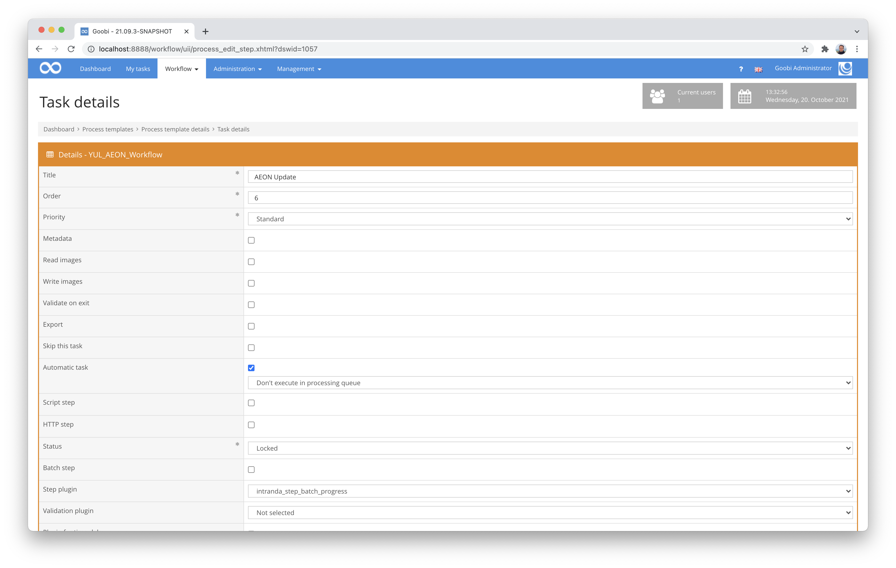

# Batch Progress Plugin

## Overview

Name                     | Wert
-------------------------|-----------
Identifier               | intranda_step_batch_progress
Repository               | [https://github.com/intranda/goobi-plugin-step-batch-progress](https://github.com/intranda/goobi-plugin-step-batch-progress)
Licence              | GPL 2.0 or newer 
Last change    | 25.07.2024 12:01:04


## Introduction
This step plugin for Goobi workflow allows multiple Goobi processes that belong to a batch but have different progress in their workflows to all wait for each other at a defined workflow step. Only when the last associated process reaches the defined workflow step does a call to a specified REST URL take place, so that all processes can then continue with their respective next workflow steps.

The initial purpose of this plugin is to call AEON REST URLs to log the progress of Goobi workflows. Other uses for this plugin are possible, but may require customisation of the plugin.


## Installation
The plugin consists in total of the following files to be installed:

```bash
plugin_intranda_step_batch_progress-base.jar
plugin_intranda_step_batch_progress-gui.jar
plugin_intranda_step_batch_progress.xml
```

These files must be installed in the correct directories so that they are available under the following paths after installation:

```bash
/opt/digiverso/goobi/plugins/step/plugin_intranda_step_batch_progress-base.jar
/opt/digiverso/goobi/config/plugin_intranda_step_batch_progress.xml
```


## Overview and functionality
To put the plugin into operation, it must be activated for one or more desired tasks in the workflow. This is done as shown in the following screenshot by selecting the plugin `intranda_step_batch_progress` from the list of installed plugins.



Since this plugin should usually be executed automatically, the workflow step should be configured as `automatic`.

Once the plugin has been fully installed and set up, it is usually run automatically within the workflow, so there is no manual interaction with the user. Instead, calling the plugin through the workflow in the background does the following: 

First, it is checked whether the process belongs to a batch. If this is not the case, the workflow step is closed and the further workflow is started.

Otherwise, it is checked whether the current workflow step has already been reached in all processes of the batch (the status must not be `Locked`). If this is not yet the case, the step remains in the status `In Work`.

However, if all other processes in the batch have reached the workflow step or there is only the current process in the batch, a new status is set in AEON if this has been activated with the parameter `updateQueue`. To do this, a search is made in the properties of the process for the `transaction identifier` property with which the processes were initially created. This record is then called up in AEON to set the configured `queueName` as the new status.

The current workflow step in all processes of the batch is then closed and the rest of the workflow continues.


## Configuration
The plugin is configured via the configuration file `plugin_intranda_step_batch_progress.xml` and can be adapted during operation. The following is an example configuration file:

```xml
<config_plugin>
    <global>
        <aeon>
            <url>https://example.com</url>
            <username>user</username>
            <password>pw</password>
        </aeon>
        <!-- must match field title of field <field aeon="transactionNumber"> in aeon config -->
        <property>Transaction Identifier</property>
    </global>
    <!--
        order of configuration is:
        1.) project name and step name matches
        2.) step name matches and project is *
        3.) project name matches and step name is *
        4.) project name and step name are *
    -->
    <config>
        <!-- which projects to use for (can be more then one, otherwise use *) -->
        <project>*</project>
        <step>*</step>
        <!-- define if a queue in AEON shall be updated, which would then 
          use the following parameter for the queue name -->
        <updateQueue>true</updateQueue>
        <!-- name of the AEON queue/status to be updated if this is activated
             Examples:
        
             4     Submitted by Staff
             8     Awaiting Order Processing
             10    In Item Retrieval
             111   Order Finished
             1142  DIVY-Item Checked Out to Staff
             1158  Arrived at DRMS
         -->
        <queueName>Order Finished</queueName>
    </config>
</config_plugin>
```

Various parameters can be configured within the configuration file. The file is divided into two areas. In the `<global>` area, generally valid information such as the access data to AEON is managed. The following parameters are available here:

Parameter           |  Description
------------------- | ----------------------------------------------------- 
`url`               | Enter the URL for the API of AEON here.
`apiKey`            | A key can be specified here that is to be used instead of the login and password.
`username`          | Define the user name to be used here.
`password`          | Enter the password for accessing the API here.

In addition, there is the second area `<config>`, in which different specifications can be made for individual workflow steps. Here it can be specified for individual projects and steps into which queue the data set is to be written. 

The block `<config>` can be repeated for different projects or workflow steps in order to be able to carry out different actions within different workflows and also to be able to set a different status in AEON for different steps. The other parameters within this configuration file have the following meanings:

Parameter           |  Description
------------------- | ----------------------------------------------------- 
`project`           | This parameter determines for which project the current block `<config>` should apply. The name of the project is used here. This parameter can occur several times per `<config>` block.
`step`              | This parameter controls which workflow steps the `<config>` block should apply to. The name of the workflow step is used here. This parameter can occur several times per `<config>` block.
`<updateQueue>`     | Here you can define whether an update of a queue in AEON should take place or not. If the parameter is missing, `false` is assumed.
`<queueName>`       | Name of the Aeon Queue to be updated