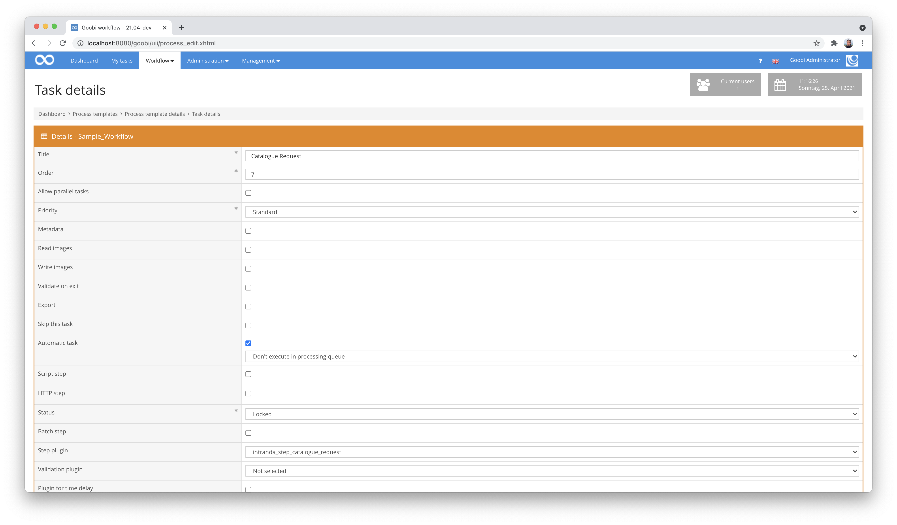

# Catalogue Request

## Overview

Name                     | Wert
-------------------------|-----------
Identifier               | intranda_step_catalogue_request
Repository               | [https://github.com/intranda/goobi-plugin-step-catalogue-request](https://github.com/intranda/goobi-plugin-step-catalogue-request)
Licence              | GPL 2.0 or newer 
Last change    | 25.07.2024 12:00:56


## Introduction
This documentation describes the installation, configuration and use of the Step plugin for the catalogue query to update records in Goobi workflow.


## Installation
The plugin consists of the following file:

```bash
plugin_intranda_step_catalogue_request-base.jar
```

This file must be installed in the correct directory so that it is available at the following path after installation:

```bash
/opt/digiverso/goobi/plugins/step/plugin_intranda_step_catalogue_request-base.jar
```

In addition, there is a configuration file that must be located in the following place:

```bash
/opt/digiverso/goobi/config/plugin_intranda_step_catalogue_request.xml
```

## Overview and functionality
The plugin is usually executed fully automatically within the workflow. It first determines whether there is a block in the configuration file that has been configured for the current workflow with regard to the project name and work step. If this is the case, the other parameters are evaluated and the catalogue query is executed with the field content of the METS file specified within the configuration file as identifier.

This plugin is integrated into the workflow in such a way that it is executed automatically. Manual interaction with the plugin is not necessary. For use within a workflow step, it should be configured as shown in the screenshot below.




## Configuration
The plugin is configured via the configuration file `plugin_intranda_step_catalogue_request.xml` and can be adapted during operation. The following is an example configuration file:

```xml
<?xml version="1.0" encoding="UTF-8"?>
<config_plugin>

    <config>

        <!-- which projects to use for (can be more then one, otherwise use *) -->
        <project>*</project>
        <step>*</step>

        <!-- which catalogue to use ('GBV', 'Wiener', 'CBL Adlib' ...), can use variable replacer compatible value as well, e.g. '$(meta.Catalogue)' -->
        <catalogue>Wiener</catalogue>

        <!-- which field to use for the catalogue request (typically '12' for identifier, sometimes '1007' for barcodes, and 
          which identifier to use for the catalogue request (use standard variable replacer compatible value here, e.g. '$(meta.CatalogIDDigital)') -->
        <catalogueField fieldName="12" fieldValue="$(meta.CatalogIDDigital)" />

        <!-- define if existing structure subelements shall be kept (true), otherwise a complete new mets file is created and overwrites the existing one (false) -->
        <mergeRecords>true</mergeRecords>

        <!-- define here if the catalogue request shall simply be skipped in case of missing catalogue plugin or missing catalogue identifier; if set to true the plugin will respond with an error status in case of missing information -->
        <ignoreMissingData>false</ignoreMissingData>

        <!-- define here if the catalogue request shall be skipped in case of request issues (e.g. wrong record identifier or network issues) -->
        <ignoreRequestIssues>false</ignoreRequestIssues>

        <!-- define if children are analysed as well. If a sub element contains an identifier, the metadata will get imported as well -->
        <analyseSubElements>false</analyseSubElements>

        <!-- if records shall be merged: which existing fields shall not be replace with new values? (use the metadatatypes from ruleset) -->
        <skipField>TitleDocMain</skipField>
        <skipField>CatalogIDDigital</skipField>
        <skipField>DocLanguage</skipField>
        <skipField>_urn</skipField>
        <skipField>_representative</skipField>
    </config>

</config_plugin>
```

| Parameter | Explanation |
| :--- | :--- |
| `project` | This parameter determines for which project the current block `<config>` should apply. The name of the project is used here. This parameter can occur several times per `<config>` block. |
| `step` | This parameter controls for which workflow steps the block `<config>` should apply. The name of the workflow step is used here. This parameter can occur several times per `<config>` block. |
| `catalogue` | Here it is possible to define which catalogue is to be used for querying new data. This is the name of a catalogue as defined within the global Goobi catalogue configuration within `goobi_opac.xml`. |
| `catalogueField` | This determines which field is to be used for the catalogue identifier query. |
| `catalogueIdentifier` | Definition of the metadata from the METS file that is to be used for the catalogue query. Usually this is the identifier that was also used for the initial catalogue query and is usually stored within the metadata `${meta.CatalogIDDigital}`. |
| `mergeRecords` | If the value `true` is set, the existing METS file is updated with the current data from the catalogue. Any additional metadata can be excluded for the update. Also, the logical and physical structure tree within the METS file remains unchanged.If the value is set to `false`, then the existing METS file is completely replaced by a new METS file generated using the catalogue query. |
| `ignoreMissingData` | This parameter can be used to define whether the workflow step of the plugin should continue in the case of missing catalogue data or switch to an error status. |
| `ignoreRequestIssues` | Here you can define how the plugin should behave in the event of a query error, for example in the event of network problems. In this way, it can be defined that the workflow should be interrupted or nevertheless continued. |
| `analyseSubElements` | This parameter can be used to define whether metadata for structural elements already existing within the METS files should also be queried by the catalogue. For this, the specified metadata for the identifier to be queried must be available for each sub-element. |
| `skipField` | Several metadata fields can be defined here that are not to be changed by a catalogue query under any circumstances. This is particularly useful for those fields that do not come from a catalogue query and were therefore previously recorded in addition to the catalogue data. Typical examples of such fields include `singleDigCollection`,`accesscondition` and `pathimagefiles`. Please note that this parameter only applies when the value for `mergeRecords` is set to `true`. |