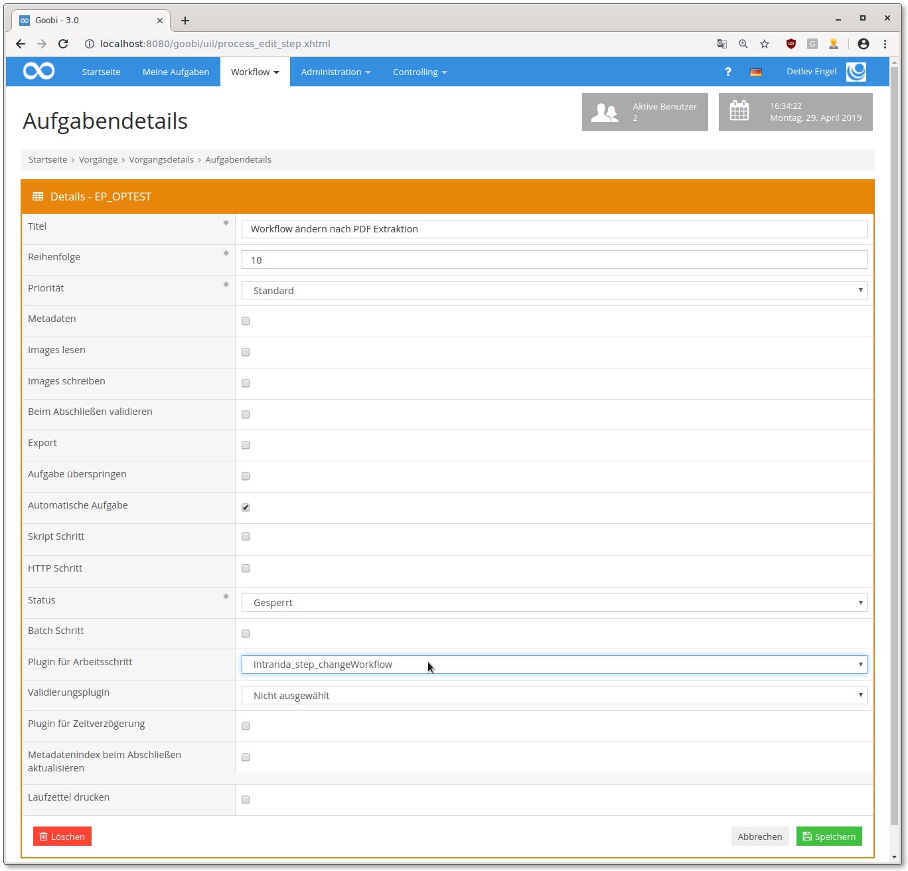

# Changing the workflow based on process properties

## Overview

Name                     | Wert
-------------------------|-----------
Identifier               | intranda_step_changeWorkflow
Repository               | [https://github.com/intranda/goobi-plugin-step-change-workflow](https://github.com/intranda/goobi-plugin-step-change-workflow)
Licence              | GPL 2.0 or newer 
Last change    | 02.05.2025 11:22:07


## Introduction
This documentation describes the installation, configuration and use of a plugin for automatically changing workflows at runtime. The plugin can open, close or deactivate (depending on configuration) steps. User groups can be assigned and production templates can also be completely exchanged. The decision as to what exactly should happen in each case is made on the basis of process properties.


## Installation
To use the plugin, it must be copied to the following location:

```bash
/opt/digiverso/goobi/plugins/step/plugin_intranda_step_changeWorkflow-base.jar
```

The configuration of the plugin is expected under the following path:

```bash
/opt/digiverso/goobi/config/plugin_intranda_step_changeWorkflow.xml
```


## Overview and functionality
After the plugin has been installed and configured, it can be configured in the user interface in a workflow step. Make sure that the name of the step is the same as in the configuration file. In addition, a check mark should be set for `Automatic task`.




## Configuration
The plugin is configured in the file `plugin_intranda_step_changeWorkflow.xml` as shown here:

```xml
<config_plugin>
    <!--
    	order of configuration is: 
	    1.) project name and step name matches 
	    2.) step name matches and project is * 
	    3.) project name matches and step name is * 
	    4.) project name and step name are * 
    -->

	<config>
		<!-- which projects to use for (can be more then one, otherwise use *) -->
		<project>Register</project>
		<step>Check</step>

		<!-- multiple changes can be done within one configuration rule; simply add another 'change' element with other properties here -->
		<change>
			<!-- name of the property or metadata to check: please take care to use the syntax of the Variable replacer here -->
			<propertyName>{process.TemplateID}</propertyName>
			<!-- expected value (can be blank too) -->
			<propertyValue>183</propertyValue>
			<!-- condition for value comparing, can be 'is' or 'not' or 'missing' or 'available' -->
			<propertyCondition>is</propertyCondition>
			<!-- list of steps to open, if property value matches -->
			<steps type="open">
				<title>Box preparation</title>
			</steps>
			<!-- list of steps to deactivate -->
			<steps type="deactivate">
				<title>Image QA</title>
			</steps>
			<!-- list of steps to close -->
			<steps type="close">
				<title>Automatic LayoutWizzard Cropping</title>
				<title>LayoutWizzard: Manual confirmation</title>
			</steps>
			<!-- list of steps to lock -->
			<steps type="lock">
				<title>Automatic export to Islandora</title>
			</steps>
			<!-- list of automatic steps to run -->
			<steps type="run">
				<title>Create derivates</title>
			</steps>

			<usergroups step="Image QA">
				<usergroup>Administration</usergroup>
				<usergroup>AutomaticTasks</usergroup>
			</usergroups>
			
			<!-- write a message into the journal (aka process log) -->
			<log type="info">My info message</log>
			<log type="error">My error message</log>
			<log type="user">My user message</log>
			
			<!-- If any title under priority is configured with a *, then this priority value will be applied to all steps of this process. -->
			<!-- If more than two titles are configured with *, then the first match in the order of values 0, 1, 2, 3, 10 will be used. -->
			<!-- list of steps of priority 0 (standard) -->
			<priority value="0">
				<title>Some standard step</title>
			</priority>
			
			<!-- list of steps of priority 1 (priority) -->
			<priority value="1">
				<title>Step of priority</title>
			</priority>
			
			<!-- list of steps of priority 2 (high priority) -->
			<priority value="2">
				<title>Step of high priority</title>
			</priority>
			
			<!-- list of steps of priority 3 (highest priority) -->
			<priority value="3">
				<title>Step of highest priority</title>
				<title>another step of highest priority</title>
			</priority>
			
			<!-- list of steps of priority 10 (correction) -->
			<priority value="10">
				<title></title>
			</priority>
			
			<!-- list of properties to be changed or deleted -->
			<properties>
				<property name="My property" value="My value" />
				<property name="My boolean property" value="true" />
				<property name="My property to be deleted" delete="true" />
			</properties>
			
		</change>
	</config>

	<config>
		<!-- which projects to use for (can be more then one, otherwise use *) -->
		<project>*</project>
		<step>*</step>

		<!-- multiple changes can be done within one configuration rule; simply add another 'change' element with other properties here -->
		<change>
			<!-- name of the property or metadata to check: please take care to use the syntax of the Variable replacer here -->
			<propertyName>{process.upload to digitool}</propertyName>
			<!-- expected value (can be blank too) -->
			<propertyValue>No</propertyValue>
			<!-- condition for value comparing, can be 'is' or 'not' -->
			<propertyCondition>is</propertyCondition>
			<!-- list of steps to open, if property value matches -->
			<steps type="open">
				<title>Create derivates</title>
				<title>Jpeg 2000 generation and validation</title>
			</steps>
			<!-- list of steps to deactivate -->
			<steps type="deactivate">
				<title>Rename files</title>
			</steps>
			<!-- list of steps to close -->
			<steps type="close">
				<title>Upload raw tiffs to uploaddirectory Socrates</title>
				<title>Automatic pagination</title>
			</steps>
			<!-- list of steps to lock -->
			<steps type="lock">
				<title>Create METS file</title>
				<title>Ingest into DigiTool</title>
			</steps>
			<!-- list of automatic steps to run -->
			<steps type="run">
				<title>Create derivates</title>
			</steps>
			
		</change>
	</config>

	<!-- change process template -->
	<config>
		<!-- which projects to use for (can be more then one, otherwise use *) -->
		<project>Archive_Project</project>
		<step>Check process template change</step>

		<!-- multiple changes can be done within one configuration rule; simply add another 'change' element with other properties here -->
		<change>
			<!-- name of the property or metadata to check: please take care to use the syntax of the Variable replacer here -->
			<propertyName>{process.TemplateID}</propertyName>
			<!-- expected value (can be blank too) -->
			<propertyValue>309919</propertyValue>
			<!-- condition for value comparing, can be 'is' or 'not' or 'missing' or 'available' -->
			<propertyCondition>is</propertyCondition>
			<!-- Name of the new process template -->
 			<workflow>Manuscript workflow</workflow>
			<project></project>
		</change>
	</config>


    <config>
        <project>Duplication_Test</project>
        <step>ChangeWorkflowTest</step>
        <change type="checkDuplicates">
            <metadata>SharedThesisId</metadata>
            <workflow>MassImportTest</workflow>
        </change>
    </config>

    <!-- check whether a master anchor data record exists for the current identifier -->
    <config>
        <project>*</project>
        <step>master anchor check</step>

        <change type="search">
            <!-- exists: true if at least one process matches the search query -->
            <!-- not exists: true if no process matches the search query -->
            <condition>exists</condition>
            <!-- search query, can include the usual variables -->
            <query>(prozesse.ProzesseID in (select distinct processid from metadata where name = 'InternalNote' and value = 'AnchorMaster')) AND (prozesse.ProzesseID in (select distinct processid from metadata where name = 'CatalogIDDigital' and value = '{meta.topstruct.CatalogIDDigital}'))</query>


            <!-- Name of the new process template -->
            <workflow>Manuscript workflow</workflow>
        </change>
    </config>
</config_plugin>
```

### General parameters 
The `<config>` block can occur repeatedly for different projects or work steps in order to be able to perform different actions within different workflows. The other parameters within this configuration file have the following meanings: 

| Parameter | Explanation | 
| :-------- | :---------- | 
| `project` | This parameter defines which project the current block `<config>` should apply to. The name of the project is used here. This parameter can occur several times per `<config>` block. | 
| `step` | This parameter controls which work steps the `<config>` block should apply to. The name of the work step is used here. This parameter can occur several times per `<config>` block. | 


### Further parameters 
In addition to these general parameters, the following parameters are available for further configuration: 


In each `<change>` element it is then configured which process property is checked (`<propertyName>`) and which value is expected (`<propertyValue>`). Please note that the specification for defining which property is to be used for checking a value must be specified with the syntax for the so-called variable replacer. Accordingly, when defining the field to be checked, the specification must be as in the following examples:

```xml
<propertyName>{process.ABC}</propertyName>
<propertyName>{{meta.ABC}}</propertyName>
<propertyName>{meta.topstruct.ABC}</propertyName>
<propertyName>{meta.firstchild.ABC}</propertyName>
<propertyName>{db_meta.ABC}</propertyName>
```

Further explanations about the use of variables can be found here:

[https://docs.goobi.io/goobi-workflow/en/manager/07_variables](https://docs.goobi.io/goobi-workflow/en/manager/07_variables)

If a property and the value to be checked have been named, the condition that must be fulfilled in order to apply the plugin is evaluated.

```xml
<!-- name of the property or metadata to check: please take care to use the syntax of the Variable replacer here -->
<propertyName>{process.TemplateID}</propertyName>
<!-- expected value (can be blank too) -->
<propertyValue>183</propertyValue>
<!-- condition for value comparing, can be 'is' or 'not' or 'missing' or 'available' -->
<propertyCondition>is</propertyCondition>
```

The check always assumes that the property to be checked only exists once and would use the first property found with the name for the check if there are several properties with the same name. The value is then checked using the specified `propertyCondition`.:

| Parameter value | Explanation |
| :--- | :--- |
| `is`  | The content of the property corresponds exactly to the configured value. |
| `not` | The content of the property does not correspond exactly to the configured value. |
| `missing` | The property is not available. |
| `available` | A property with this name exists, regardless of its content. |

After defining how the properties are to be evaluated, the action to be performed is determined. The following possibilities exist here:


### Changing the status of workflow steps.
Depending on existing properties, the status of defined steps within the workflow can be changed automatically. Workflow steps can be opened `type="open"`, deactivated `type="deactivate"`, closed `type="close"` or locked `type="lock"`.

```xml
<steps type="open">
    <title>Create derivates</title>
    <title>Jpeg 2000 generation and validation</title>
</steps>
<steps type="deactivate">
    <title>Rename files</title>
</steps>
<steps type="close">
    <title>Upload raw tiffs to uploaddirectory Socrates</title>
    <title>Automatic pagination</title>
</steps>
<steps type="lock">
    <title>Create METS file</title>
    <title>Ingest into DigiTool</title>
</steps>
```

| Parameter | Explanation |
| :--- | :--- |
| `type` | Determine which status the workflow steps are to receive. |
| `title` | Define here the name of the workflow steps that are to be set to the desired status. |


### Changing the priority of workflow steps.
Depending on existing properties, the priority of defined steps within the workflow can be changed automatically. Possible choices for priority are Standard `value="0"`, Priority `value="1"`, High priority `value="2"`, Highest priority `value="3"` or Correction `value="10"`. If any `title` is configured with `*`, then its priority value will be applied to all steps of this process. If more than two `title`s are configured with `*`, then only the value of the first one in the order 0, 1, 2, 3, 10 will be used.

```xml
<priority value="0">
    <title>Some standard step</title>
</priority>

<priority value="1">
    <title>Step of priority</title>
</priority>

<priority value="2">
    <title>Step of high priority</title>
</priority>

<priority value="3">
    <title>Step of highest priority</title>
    <title>another step of highest priority</title>
</priority>

<priority value="10">
    <title></title>
</priority>
```

| Parameter | Explanation |
| :--- | :--- |
| `value` | Determine which priority the workflow steps are to receive. |
| `title` | Define here the name of the workflow steps that are to be set to the desired priority. Use `*` if the value should be applied to all steps of this process. |


### Changing the responsibility of user groups for workflow steps
Depending on existing properties, the responsible user groups can be defined for several workflow steps. The configuration is done as shown here:

```xml
<usergroups step="Image QA">
    <usergroup>Administration</usergroup>
    <usergroup>AutomaticTasks</usergroup>
</usergroups>
```

| Parameter | Explanation |
| :--- | :--- |
| `step` | Determine for which workflow step you want to enter the user groups. |
| `usergroup` | Define here the name of the user group that is to be entered as responsible for the configured step. |


### Changing the process template on which the process is based
With a configuration like the following example, the process template can be exchanged while the workflow is running. Depending on existing properties, a workflow can thus be replaced by another workflow during execution. Workflow steps that are also present in the new workflow are automatically set to the correct status.

```xml
 <workflow>Manuscript workflow</workflow>
```

| Parameter | Explanation |
| :--- | :--- |
| `workflow` | Define here the name of the process template to be used for the process. |