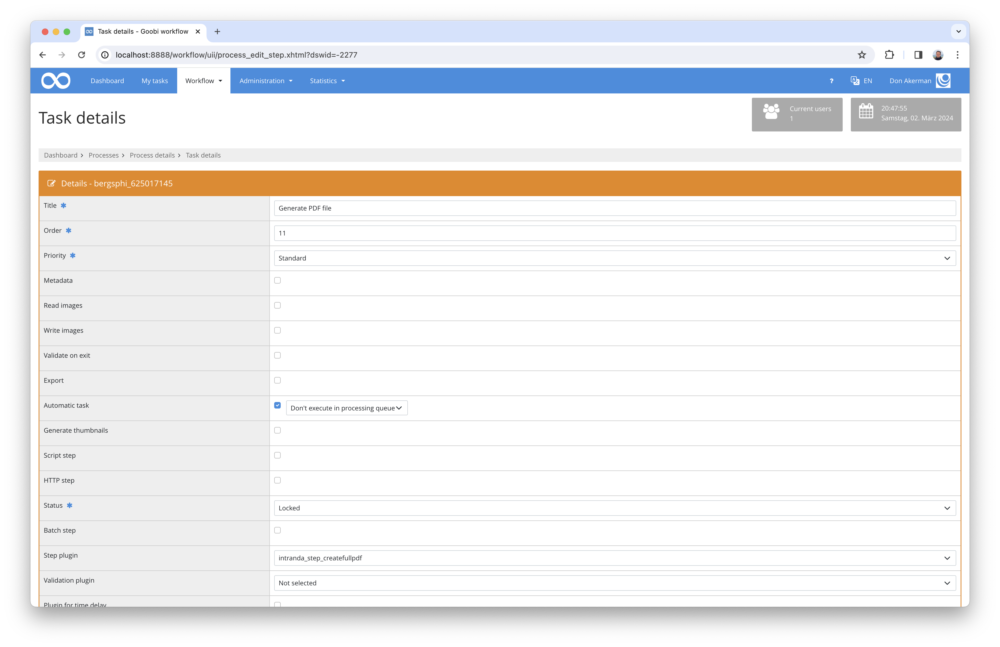

# Generation of PDF files

## Overview

Name                     | Wert
-------------------------|-----------
Identifier               | intranda_step_createfullpdf
Repository               | [https://github.com/intranda/goobi-plugin-step-create-full-pdf](https://github.com/intranda/goobi-plugin-step-create-full-pdf)
Licence              | GPL 2.0 or newer 
Last change    | 21.03.2025 15:24:58


## Introduction
This documentation describes how to install and configure this plugin to create PDF files out of images.


## Installation 
To use the plugin, it must be copied to the following location:

```bash
/opt/digiverso/goobi/plugins/step/plugin_intranda_step_createfullpdf-base.jar
```

The configuration of the plugin is expected under the following path:

```bash
/opt/digiverso/goobi/config/plugin_intranda_step_createfullpdf.xml
```

## Overview and functionality
Once the plugin has been installed correctly, it can be configured in the user interface for use within the workflow for the desired work step. To do this, the value `intranda_step_createfullpdf` must be selected as the plugin and the filling should be set as automatic.




## Configuration
The plugin is configured in the file `plugin_intranda_step_createfullpdf.xml` as shown here:

```xml
<?xml version="1.0" encoding="UTF-8"?>
<config_plugin>
    <!-- order of configuration is: 
         1.) project name and step name matches 
         2.) step name matches and project is * 
         3.) project name matches and step name is * 
         4.) project name and step name are * 
    -->
    <config>
        <!-- which projects to use for (can be more then one, otherwise use *) -->
        <project>*</project>

        <!-- which stepss to use for (can be more then one, otherwise use *) -->
        <step>*</step>

         <!-- Choose the source images folder that shall be used for PDF generation. Possible values are 'media' and 'master' -->
        <imagesFolder>media</imagesFolder>

   		<!-- single page pdf files shall be generated and kept (@enabled) -->
		<singlePagePdf enabled="false" /> 

        <!-- Full PDF file is generated and kept (@enabled) 
        	- @mode controls if PDF shall be generated based on METS file ('mets') or based on singlePagePdfs ('singlepages')
        	- @pdfConfigVariant sets up which config variant in contentServerConfig.xml should be used. If not set, then use default. -->
        <fullPdf enabled="true" mode="mets" pdfConfigVariant="pdfa"/>

        <!-- If set, then this ABSOLUTE path will be used to export the results. 
        	If no path is defined the PDF will be stored in the ocr/pdf-folder of the process -->
        <exportPath>/opt/digiverso/goobi/tmp</exportPath>
    </config>

</config_plugin>

```

### General parameters 
The `<config>` block can occur repeatedly for different projects or work steps in order to be able to perform different actions within different workflows. The other parameters within this configuration file have the following meanings: 

| Parameter | Explanation | 
| :-------- | :---------- | 
| `project` | This parameter defines which project the current block `<config>` should apply to. The name of the project is used here. This parameter can occur several times per `<config>` block. | 
| `step` | This parameter controls which work steps the `<config>` block should apply to. The name of the work step is used here. This parameter can occur several times per `<config>` block. | 


### Further parameters 
In addition to these general parameters, the following parameters are available for further configuration: 


| Value | Description |
| :--- | :--- |
| `imageFolder` | This parameter expects the name of the image folder. Possible values are `media` and `master`, anything else will be regarded as `media`. |
| `singlePagePdf` | The `enabled` attribute of this parameter determines whether single-page PDFs are to be generated. |
| `fullPdf` | The `enabled` attribute of this parameter determines whether a complete PDF is to be generated. The `mode` attribute controls how this PDF is to be generated. The value ‘mets’ is available for this in order to generate the PDF based on the METS file. Alternatively, the value ‘singlepages’ can be used to generate the overall PDF from the previously created single-page PDFs. The single-page PDFs are only generated temporarily if they have not already been activated within the configuration. The `pdfConfigVariant` attribute, on the other hand, is optional and determines which configuration variant is to be used. If it is not set, `default` is used. |
| `exportPath` | This optional parameter can be used to specify a path for exporting the PDF files. If it is used, an absolute path is expected. If it is not specified, the PDF files are created within the `ocr` directory of the process. |