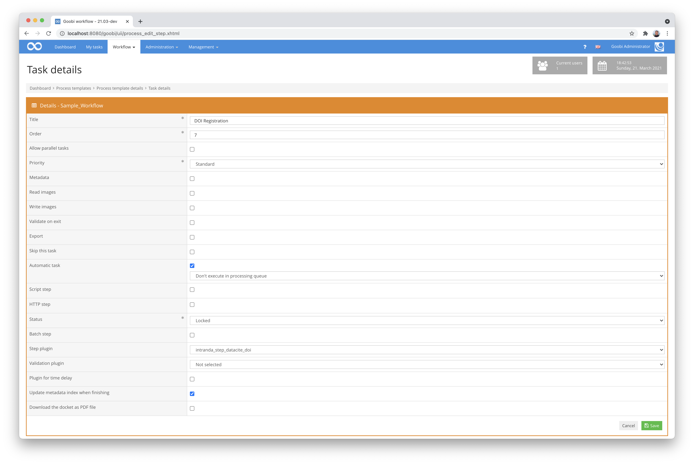

# Plugin for registering DOI via the DataCite API

## Overview

Name                     | Wert
-------------------------|-----------
Identifier               | intranda_step_datacite_doi
Repository               | [https://github.com/intranda/goobi-plugin-step-datacite-doi](https://github.com/intranda/goobi-plugin-step-datacite-doi)
Licence              | GPL 2.0 or newer 
Last change    | 25.07.2024 11:46:41


## Introduction
This documentation describes the installation, configuration and use of the plugin for registering DOIs.

**ATTENTION:** There is a newer plugin for this functionality that allows a higher degree of freedom for DOI registration by means of XSL transformation. Documentation of the new plugin can be found here: https://docs.goobi.io/goobi-workflow-plugins-en/step/intranda_step_doi


## Installation
The plugin consists of these files:

```bash
plugin_intranda_step_datacite_doi-base.jar
plugin_intranda_step_datacite_doi.xml
plugin_intranda_step_datacite_mapping.xml
```

The file `plugin_intranda_step_datacite_doi-base.jar` contains the program logic. it needs to be installed at this path:

```bash
/opt/digiverso/goobi/plugins/step/plugin_intranda_step_datacite_doi-base.jar
```

The file `plugin_intranda_step_datacite_mapping.xml` is the mapping file, defining how local metadata should be translated to the form required for the DOI registration. It needs to be installed at this path:

```bash
/opt/digiverso/goobi/config/plugin_intranda_step_datacite_mapping.xml
```

The file `plugin_intranda_step_datacite_doi.xml` is the main configuration file for the plugin. It needs to be installed at this path:

```bash
/opt/digiverso/goobi/config/plugin_intranda_step_datacite_doi.xml
```


## Overview and functionality
To put the plugin into operation, it must be activated for one or more desired tasks in the workflow. This is done as shown in the following screenshot by selecting the plugin `intranda_step_datacite_doi` from the list of installed plugins.



Since this plugin should usually be executed automatically, the workflow step should be configured as automatic in the workflow. Since the plugin writes the DOI to the metadata file of the operation, the checkbox for 'Update metadata index when finishing' should also be activated.

The programme examines the metadata fields of the METS/MODS file from the Goobi operation. If a `<typeForDOI>` is specified, then it goes through every structure element of that type in the file. If not, it takes the top structure item. From this it creates the data for a DOI, using the mapping file to translate it. Then it registers the DOI using DataCite's MDS API, specifying the DOI by `<base>` along with any `<prefix>` and `<name>` and the ID of the document (its `CatalogIDDigital`) plus an incremented counter if more than one DOI was created for the given document. The record is given a registered URL defined by `<url>` followed by the DOI. The generated DOI is stored in the METS/MODS file under the metadata specified in `<doiMetadata>`. For example, if the value for `<typeForDOI>` is `Article`, then each article in the METS/MODS file will have a DOI stored in the metadata under `<doiMetadata>` for each article.


## Configuration

### Main configuration
The configuration is done via the configuration file `plugin_intranda_step_datacite_doi.xml` and can be adapted during operation. It is structured as follows:

```xml
<config_plugin>
	<!-- order of configuration is:
      1.) project name and step name matches
      2.) step name matches and project is *
      3.) project name matches and step name is *
      4.) project name and step name are *
  -->

	<config>
		<!-- which projects to use for (can be more then one, otherwise use *) -->
		<project>*</project>
		<step>*</step>

    <!-- authentication and main information -->
    <!-- For testing: for deployment, remove "test" -->
    <serviceAddress>https://mds.test.datacite.org/</serviceAddress>

		<!-- authentication and main information -->
		<base>10.123456789</base>
		<url>https://viewer.example.org/resolver?field=MD_PI_DOI&identifier=</url>
    <username></username>
		<password></password>

		<!-- configuration for Handles -->
		<prefix>go</prefix>
		<name>goobi</name>
		<separator>-</separator>
		<doiMetadata>DOI</doiMetadata>

		<!-- configuration for DOIs -->
		<doiMapping>/opt/digiverso/goobi/config/plugin_intranda_step_datacite_mapping.xml</doiMapping>

    <!-- Type of DocStruct which should be given DOIs -->
    <typeForDOI>Article</typeForDOI>

	</config>

</config_plugin>
```

The block `<config>` can occur repeatedly for different projects or workflow steps in order to be able to perform different actions within different workflows. The other parameters within this configuration file have the following meanings:

| Value | Description |
| :--- | :--- |
| `project` | This parameter determines for which project the current block `<config>` is to apply. The name of the project is used here. This parameter can occur several times per `<config>` block. |
| `step` | This parameter controls for which workflow steps the block `<config>` should apply. The name of the workflow step is used here. This parameter can occur several times per `<config>` block. |
| `serviceAddress` | This parameter defines the URL for the Datacite service. In the example above, it is the test server. |
| `base` | This parameter defines the DOI base for the institution, which has been registered with Datacite. |
| `url` | The url parameter defines the prefix accorded to each DOI link. A DOI "10.80831/goobi-1", for example, will here be given the hyperlink "[https://viewer.goobi.io/idresolver?doi=10.80831/goobi-1](https://viewer.goobi.io/idresolver?doi=10.80831/goobi-1)" |
| `username` | This is the username that is used for the DataCite registration. |
| `password` | This is the password that is used for the DataCite registration. |
| `prefix` | This is the prefix that may be given to the DOI before the name and ID of the document. |
| `name` | This is the name that may be given to the DOI before the ID number of the document. |
| `separator` | Define here a separator that shall be used between the different parts of the DOI. |
| `doiMetadata` | This parameter specifies under which metadata name the DOI is to be saved in the METS-MODS file. Default is `DOI`. |
| `doiMapping` | In this parameter the path to the mapping file for the DOI registration is defined. |
| `typeForDOI` | With this parameter the DocStruct type can be defined which will be given DOIs. If this is empty or missing, the top DocStruct element only will be given a DOI. If the parameter contains the name of a sub-DocStruct, then these will be given DOIs. |


### Configuration inside of the Mapping file
The mapping configuration file looks something like this:

```xml
<?xml version="1.0" encoding="UTF-8"?>
<Mapping>
  <!-- Mandatory fields: -->
  <map>
      <field>title</field>
      <metadata>TitleDocMain</metadata>
      <altMetadata>TitleDocMainShort</altMetadata>
      <altMetadata>Title</altMetadata>
      <default>unkn</default>
  </map>

  <map>
      <field>creators</field>
      <metadata>Author</metadata>
      <altMetadata>Composer</altMetadata>
      <altMetadata>IllustratorArtist</altMetadata>
      <altMetadata>WriterCorporate</altMetadata>
      <default>unkn</default>
  </map>

  <map>
      <field>publisher</field>
      <metadata>Publisher</metadata>
      <altMetadata>PublisherName</altMetadata>
      <altMetadata>PublisherPerson</altMetadata>
      <default>unkn</default>
  </map>

  <map>
      <field>publicationYear</field>
      <metadata>_dateDigitization</metadata>
      <default>#CurrentYear</default>
  </map>

  <map>
      <field>hostingInstitution</field>
      <metadata>_electronicPublisher</metadata>
      <default>intranda GmbH</default>
  </map>

  <map>
      <field>resourceType</field>
      <default>document</default>
  </map>

  <!-- Optional fields: -->

  <listMap alternateIdentifierType="Goobi identifier">
      <field>alternateIdentifier</field>
      <list>alternateIdentifiers</list>
      <metadata>CatalogIDDigital</metadata>
  </listMap>

  <listMap>
      <field>contributors</field>
      <list>contributors</list>
      <metadata>Editor</metadata>
  </listMap>

  <listMap relatedIdentifierType="ISSN" relationType="IsPublishedIn">
      <field>relatedIdentifier</field>
      <list>relatedIdentifiers</list>
      <metadata>anchor_ISSN</metadata>
  </listMap>

  <listMap descriptionType="SeriesInformation">
      <field>description</field>
      <list>descriptions</list>
      <metadata>anchor_TitleDocMain</metadata>
  </listMap>

  <listMap descriptionType="SeriesInformation">
      <field>description</field>
      <list>descriptions</list>
      <metadata>CurrentNo</metadata>
  </listMap>

  <listMap dateType="Created">
      <field>date</field>
      <list>dates</list>
      <metadata>Dating</metadata>
      <altMetadata>PublicationYear</altMetadata>
      <altMetadata>anchor_PublicationYear</altMetadata>
  </listMap>

	<!-- create related item information just for the following publication types -->
	<publicationTypeWithRelatedItem>Article</publicationTypeWithRelatedItem>

  <!-- Specific fields for publication info: -->

  <publicationData>
      <field>ISSN</field>
      <metadata>anchor_ISSN</metadata>
  </publicationData>

  <publicationData>
      <field>title</field>
      <metadata>anchor_TitleDocMain</metadata>
  </publicationData>

  <publicationData>
      <field>publicationYear</field>
      <metadata>anchor_PublicationYear</metadata>
  </publicationData>

  <publicationData>
      <field>volume</field>
      <metadata>CurrentNo</metadata>
  </publicationData>

</Mapping>
```

For each `<map>`, the `<field>` specifies the name of the DOI element, and the `<metadata>` and `<altMetadata>` entries specify from which metadata of the structure elements the value is to be taken in turn. If there is no such entry in the structure elements, then the `<default>` value is taken. The value `"unkn"` for "unknown" is recommended by Datacite for missing data.

The elements `<listMap>` allow to create list elements within the generated Datacite structure, so that repeating values can be defined. Attributes can also be specified, which are taken over itentically with name and value for the list element to be created (e.g. `alternateIdentifierType="Goobi identifier"`);

For mandatory fields a `<default>` must be specified; for optional fields this is not necessary, but can be done if desired.

The default entry `#CurrentYear` is a special case: it is replaced by the current year during DOI generation.

If, for selected structural elements, a reference is to be made to the work in which this element was published, several elements can be listed as `publicationTypeWithRelatedItem`. For these, the block of elements `<publicationData>` can also be evaluated. This could be used for scientific articles, for example.


## Useful additional information
- Datacite documentation: https://support.datacite.org/docs/getting-started
- Metadata schema overview: https://schema.datacite.org/
- Metadata schema for the version 4.4 mit Beispieldateien: https://schema.datacite.org/meta/kernel-4.4/
- Admin area for Datacite customers: https://doi.datacite.org/
- Admin area in the test system for Datacite customers: https://doi.test.datacite.org/


## Example
- Example of a Datacite XML file from Goobi:

```xml
<?xml version="1.0" encoding="UTF-8"?>
<resource
    xmlns="http://datacite.org/schema/kernel-4"
    xmlns:xsi="http://www.w3.org/2001/XMLSchema-instance"
    xsi:schemaLocation="http://datacite.org/schema/kernel-4 http://schema.datacite.org/meta/kernel-4.2/metadata.xsd">
    <identifier identifierType="DOI">10.48644/1776214552</identifier>
    <titles>
        <title>Della forza de'corpi che chiamano viva libri tre</title>
    </titles>
    <publisher>Pisarri</publisher>
    <publicationYear>2022</publicationYear>
    <resourceType resourceTypeGeneral="Text">document</resourceType>
    <creators>
        <creator>
            <creatorName>Zanotti, Francesco Maria</creatorName>
            <givenName>Francesco Maria</givenName>
            <familyName>Zanotti</familyName>
        </creator>
    </creators>
    <dates>
        <date dateType="Created">1752</date>
    </dates>
    <alternateIdentifiers>
        <alternateIdentifier alternateIdentifierType="Goobi identifier">1776214552</alternateIdentifier>
    </alternateIdentifiers>
    <contributors>
        <contributor contributorType="HostingInstitution">
            <contributorName>Max-Planck-Institut für Wissenschaftsgeschichte</contributorName>
        </contributor>
    </contributors>
</resource>
```