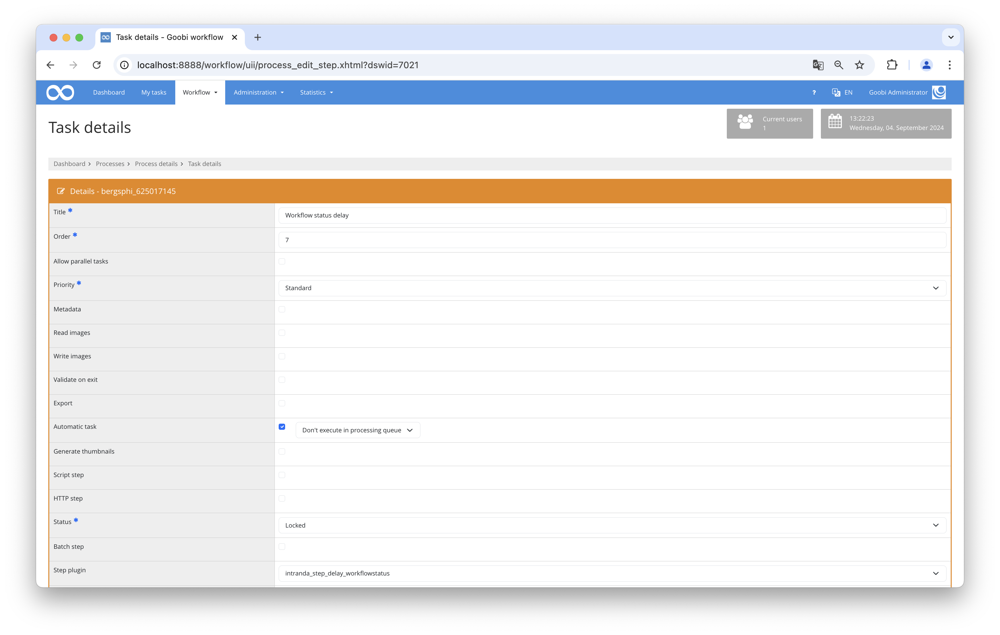

# Conditional workflow status delay  

## Overview

Name                     | Wert
-------------------------|-----------
Identifier               | intranda_step_delay_workflow_status  
Repository               | [https://github.com/intranda/goobi-plugin-step-delay-workflow-status](https://github.com/intranda/goobi-plugin-step-delay-workflow-status)
Licence              | GPL 2.0 or newer 
Last change    | 04.09.2024 09:02:52


## Introduction  
This documentation explains the installation, configuration, and use of the plugin. This plugin checks if a workflow has reached a specific status. Only if this is the case, a defined work step will be closed, and the next step will be opened.  
  
## Installation  
To use the plugin, the following files must be installed:  
  
```bash  
/opt/digiverso/goobi/plugins/step/plugin_intranda_step_delay_workflowstatus.jar  
/opt/digiverso/goobi/config/plugin_intranda_step_delay_workflowstatus.xml  
```  
  
To use the plugin, it must be selected in a workflow step with the following settings:  
  
| Parameter               | Configuration                                |  
|-------------------------|----------------------------------------------|  
| Automatic Task          | Yes                                          |  
| Plugin for Workflow Step| intranda_step_delay_workflowstatus           |  
| Plugin for Delay        | Yes                                          |  
  
  
  
  
## Overview and Functionality  
When the process reaches the configured step, a check is performed to see if the conditions are met. If this is the case, the step is closed immediately, and the next task can be processed. If not, the task remains in progress. The condition is checked again every night until it is fulfilled.  
  
The condition is only considered met if all configured rules have been fulfilled.  
  
## Configuration  
The plugin is configured in the file `plugin_intranda_step_delay_workflowstatus.xml` as shown here:  
  
```xml
<config_plugin>
    <!--
    	order of configuration is: 
	    1.) project name and step name matches 
	    2.) step name matches and project is * 
	    3.) project name matches and step name is * 
	    4.) project name and step name are * 
    -->
    
    <config>
        <!-- which projects to use for (can be more then one, otherwise use *) -->
        <project>*</project>
        <step>*</step>
        
        <condition>
	        <!-- name: name of t he property to check -->
	        <!-- value: expected value (can be blank too) -->
	        <!-- type: condition for value comparing, can be 'is' or 'not' or 'missing' or 'available' -->
            <property name="" value="" type=""/>
            
            <!-- name: name of the workflow step to check -->
            <!-- status: expected status, can be 'locked', 'open', 'inwork', 'done', 'deactivated' 'error'  -->
            <!-- type: condition, can be 'is' 'not' or 'atleast' -->
            <step name="" status="" type=""/>
        </condition>
    </config>
   
    <config>
        <!-- which projects to use for (can be more then one, otherwise use *) -->
        <project>Example</project>
        <step>Delay Test</step>
        
        <condition>
            <property name="Schrifttyp" value="Antiqua" type="is"/>
            <property name="TemplateID" value="1" type="not"/>

            <step name="Fileupload" status="done" type="is"/>
            <step name="teststep" status="open" type="atleast"/>
        </condition>
    </config>    
</config_plugin>
```  
  
### General parameters 
The `<config>` block can occur repeatedly for different projects or work steps in order to be able to perform different actions within different workflows. The other parameters within this configuration file have the following meanings: 

| Parameter | Explanation | 
| :-------- | :---------- | 
| `project` | This parameter defines which project the current block `<config>` should apply to. The name of the project is used here. This parameter can occur several times per `<config>` block. | 
| `step` | This parameter controls which work steps the `<config>` block should apply to. The name of the work step is used here. This parameter can occur several times per `<config>` block. | 


### Further parameters 
In addition to these general parameters, the following parameters are available for further configuration: 
  
  
The `<condition>` field contains the rules to be checked. Both properties and steps can be checked. The fields within are repeatable to define multiple rules. In this case, all rules must be met for the condition to be considered fulfilled.  
  
In the `<property>` field, the properties to be checked are defined. The `name` attribute specifies the property name, and `value` specifies the value to be checked. The type of check can be defined in `type`. There are four types available:  
  
| Parameter   | Explanation                                                               |  
|-------------|----------------------------------------------------------------------------|  
| `is`        | The status of the step must match the configured status                   |  
| `not`       | The step must not be in the configured status                             |  
| `atleast`   | The step must have at least reached the configured status. This option does not work with `deactivated` or `error`. |