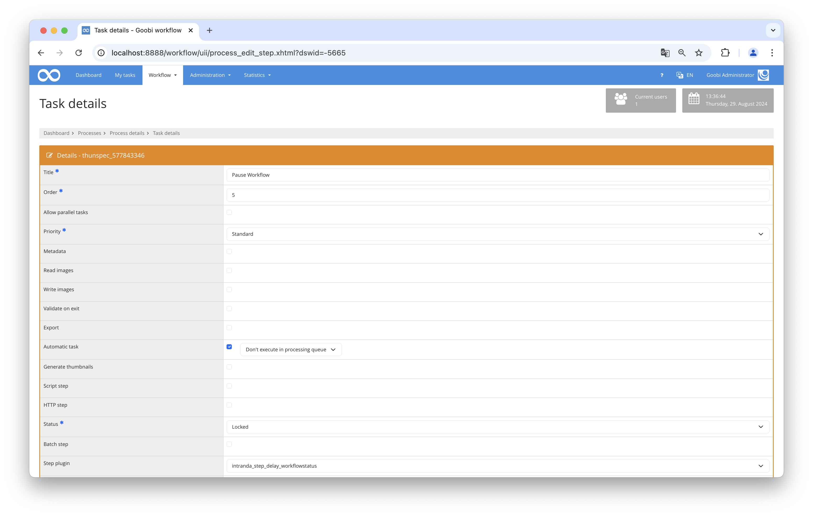

# Delay Workflow

## Overview

Name                     | Wert
-------------------------|-----------
Identifier               | intranda_step_delay
Repository               | [https://github.com/intranda/goobi-plugin-step-delay](https://github.com/intranda/goobi-plugin-step-delay)
Licence              | GPL 2.0 or newer 
Last change    | 07.09.2024 08:09:17


## Introduction
This documentation explains the plugin that allows a workflow to be paused for a certain period of time.

## Installation
To be able to use the plugin, the following files must be installed:

```bash
/opt/digiverso/goobi/plugins/step/plugin-step-delay-base.jar
/opt/digiverso/goobi/config/plugin_intranda_delay_configurable.xml
```

After installing the plugin, it can be selected within the workflow for the respective steps and will be executed automatically.

To use the plugin, it must be selected in a workflow step:




## Overview and functionality
This plugin pauses the workflow for as long as specified in the configuration file. Once the configured time has been reached, the relevant workflow step is automatically closed and the workflow continues.


## Configuration
The plugin is configured in the file `plugin_intranda_delay_configurable.xml` as shown here:

```xml
<?xml version="1.0" encoding="UTF-8"?>
<config_plugin>
    <!--
        order of configuration is:
          1.) project name and step name matches
          2.) step name matches and project is *
          3.) project name matches and step name is *
          4.) project name and step name are *
	-->
    
    <config>
        <!-- which projects to use for (can be more then one, otherwise use *) -->
        <project>*</project>
        <step>*</step>
        
        <!-- Delay in days -->
        <delayInDays>3</delayInDays>
    </config>

</config_plugin>
```

### General parameters 
The `<config>` block can occur repeatedly for different projects or work steps in order to be able to perform different actions within different workflows. The other parameters within this configuration file have the following meanings: 

| Parameter | Explanation | 
| :-------- | :---------- | 
| `project` | This parameter defines which project the current block `<config>` should apply to. The name of the project is used here. This parameter can occur several times per `<config>` block. | 
| `step` | This parameter controls which work steps the `<config>` block should apply to. The name of the work step is used here. This parameter can occur several times per `<config>` block. | 


### Further parameters 
In addition to these general parameters, the following parameters are available for further configuration: 


Parameter               | Explanation
------------------------|------------------------------------
`delayInDays`           | Pause the workflow for the specified days. |