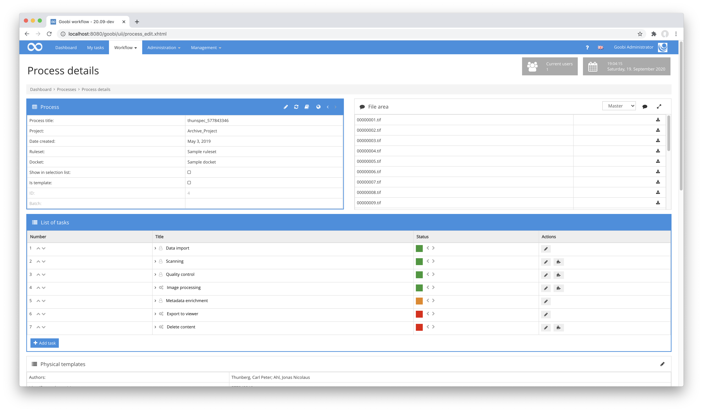

# Delete Content

## Overview

Name                     | Wert
-------------------------|-----------
Identifier               | intranda_step_deleteContent
Repository               | [https://github.com/intranda/goobi-plugin-step-delete-content](https://github.com/intranda/goobi-plugin-step-delete-content)
Licence              | GPL 2.0 or newer 
Last change    | 06.09.2024 11:40:45


## Introduction
The plugin is used to automatically delete data from a process. For this purpose, a configuration file can be used to define very granularly which data exactly should be deleted.


## Installation
To install the plugin, the following file must be installed:

```bash
/opt/digiverso/goobi/plugins/step/plugin_intranda_step_deleteContent-base.jar
```

To configure how the plugin should behave, various values can be adjusted in the configuration file. The configuration file is usually located here:

```bash
/opt/digiverso/goobi/config/plugin_intranda_step_deleteContent.xml
```


## Overview and functionality
To use the plugin, it must be activated for one or more desired tasks in the workflow. This is done as shown in the following screenshot by selecting the plugin `intranda_step_deleteContent` from the list of installed plugins.



Since this plugin is usually to be executed automatically, the step in the workflow should be configured as automatic.

Once the plugin is fully installed and set up, it is usually executed automatically within the workflow, so there is no manual interaction with the user. Instead, the workflow calls the plugin in the background and starts the deletion of the configured data. In doing so, the configured folders and data are deleted, if they exist. Data that does not exist will be skipped. If it has been configured that the process is to be deactivated, all workflow steps are run through and checked whether they have already been closed regularly within the workflow. If this is not the case, the steps are deactivated.

When the deletion is complete, a message is added to the process log to inform you that this plugin has been called and the data was deleted.


## Configuration 
The configuration of the plugin is structured as follows:

```xml
<config_plugin>
    <config>
        <project>*</project>
        <step>*</step>
        
        <!-- delete all data within the images/ folder -->
        <deleteAllContentFromImageDirectory>false</deleteAllContentFromImageDirectory>
        
        <!-- OR delete a single image folder - this is only used if deleteAllContentFromImageDirectory is set to false -->
        <deleteMediaDirectory>false</deleteMediaDirectory>
        <deleteMasterDirectory>false</deleteMasterDirectory>
        <deleteSourceDirectory>false</deleteSourceDirectory>
        <deleteFallbackDirectory>false</deleteFallbackDirectory>
        <!-- configure any additional folder. This folder gets deleted, if the folder name was configured in goobi_config.properties and does exist in current process -->
        <!-- 
        <additionalFolder>images.jpeg</additionalFolder>
        <additionalFolder>images.cropped</additionalFolder>
        -->
        <!-- delete all data within the thumbs/ folder -->
        <deleteAllContentFromThumbsDirectory>false</deleteAllContentFromThumbsDirectory>
        
        <!-- delete all data within the ocr/ folder -->
        <deleteAllContentFromOcrDirectory>false</deleteAllContentFromOcrDirectory>
        
        <!-- OR delete a single ocr folder - this is only used if deleteAllContentFromOcrDirectory is set to false -->
        <deleteAltoDirectory>false</deleteAltoDirectory>
        <deletePdfDirectory>false</deletePdfDirectory>
        <deleteTxtDirectory>false</deleteTxtDirectory>
        <deleteWcDirectory>false</deleteWcDirectory>
        <deleteXmlDirectory>false</deleteXmlDirectory>
        
        <!-- delete export folder -->
        <deleteExportDirectory>false</deleteExportDirectory>
        
        <!-- delete import folder -->
        <deleteImportDirectory>false</deleteImportDirectory>
        
        <!-- delete processlog folder -->
        <deleteProcesslogDirectory>false</deleteProcesslogDirectory>

        <!-- delete validation folder -->
        <deleteValidationDirectory>false</deleteValidationDirectory>
        
        <!-- delete metadata -->
        <deleteMetadataFiles>false</deleteMetadataFiles>
        
        <!-- deactivate all unfinished tasks -->
        <deactivateProcess>false</deactivateProcess>
        
        <!-- delete specific metadata in the structure main object (e.g. Monograph or Volume) 
             use the internal ruleset name here, e.g. singleDigCollection, DocLanguage etc. 
             this field is repeatable -->
        <deleteMetadata name="myMetadataType"/>

        <!-- delete specific process properties, e.g. Font type, Opening angle etc. 
             this field is repeatable -->
        <deleteProperty name="Opening angle"/>
        
        
        
    </config>
</config_plugin>
```

### General parameters 
The `<config>` block can occur repeatedly for different projects or work steps in order to be able to perform different actions within different workflows. The other parameters within this configuration file have the following meanings: 

| Parameter | Explanation | 
| :-------- | :---------- | 
| `project` | This parameter defines which project the current block `<config>` should apply to. The name of the project is used here. This parameter can occur several times per `<config>` block. | 
| `step` | This parameter controls which work steps the `<config>` block should apply to. The name of the work step is used here. This parameter can occur several times per `<config>` block. | 


### Further parameters 
In addition to these general parameters, the following parameters are available for further configuration: 


| Parameter | Explanation |
| :--- | :--- |
| `deleteAllContentFromImageDirectory` | Specify whether to delete all data from the `images` folder. |
| `deleteMediaDirectory` | Specify whether to delete the `media` folder. This option is not evaluated if `deleteAllContentFromImageDirectory` is enabled. |
| `deleteMasterDirectory` | Specify whether to delete the `master` folder. This option is not evaluated if `deleteAllContentFromImageDirectory` is enabled. |
| `deleteSourceDirectory` | Specify whether to delete the `source` folder. This option is not evaluated if `deleteAllContentFromImageDirectory` is enabled. |
| `deleteFallbackDirectory` | Specify whether to delete the configured fallback folder. This option is not evaluated if `deleteAllContentFromImageDirectory` is enabled. |
| `deleteAllContentFromThumbsDirectory` | Specify whether to delete all data from the `thumbs` folder. |
| `deleteAllContentFromOcrDirectory` | Specify whether to delete all data from the `ocr` folder. |
| `deleteAltoDirectory` | Specify whether to delete the `alto` folder. This option is not evaluated if `deleteAllContentFromOcrDirectory` is enabled. |
| `deletePdfDirectory` | Specify here whether the `pdf` folder is to be deleted. This option is not evaluated if `deleteAllContentFromOcrDirectory` is enabled. |
| `deleteTxtDirectory` | Specify whether to delete the `txt` folder. This option is not evaluated if `deleteAllContentFromOcrDirectory` is enabled. |
| `deleteWcDirectory` | Specify whether to delete the `wc` folder. This option is not evaluated if `deleteAllContentFromOcrDirectory` is enabled. |
| `deleteXmlDirectory` | Specify whether to delete the `xml` folder. This option is not evaluated if `deleteAllContentFromOcrDirectory` is enabled. |
| `deleteExportDirectory` | Specify whether to delete the `export` folder. |
| `deleteImportDirectory` | Specify whether to delete the `import` folder. |
| `deleteProcesslogDirectory` | Specify whether to delete the folder where the files uploaded in the operation log are managed. |
| `deleteMetadataFiles` | Specify here whether the metadata and associated backups should be deleted. |
| `deactivateProcess` | When this option is enabled, all steps of the process are disabled if they have not been completed previously. |
| `deleteMetadata` | Here a specific metadata can be deleted that is at the level of the work in the metadata file. The item is repeatable and must use a valid name for a metadata type from the rule set. |
| `deleteProperty` | Here a specific operation property can be deleted., The element is repeatable and must list the name of the property. |