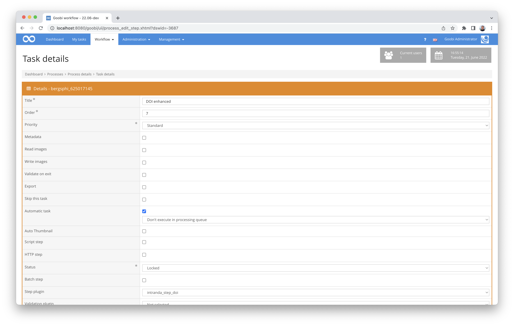

# Plugin for DOI registration

## Overview

Name                     | Wert
-------------------------|-----------
Identifier               | intranda_step_doi
Repository               | [https://github.com/intranda/goobi-plugin-step-doi](https://github.com/intranda/goobi-plugin-step-doi)
Licence              | GPL 2.0 or newer 
Last change    | 25.07.2024 11:59:52


## Introduction
This documentation describes the installation, configuration and use of a plugin for registering DOIs via the DataCite API.

**ATTENTION:** It should be noted that this plugin is a new implementation of the [datacite-doi plugin](https://docs.goobi.io/goobi-workflow-plugins-en/step/intranda_step_datacite_doi), which works using XSLT. This implementation has so far been limited to allowing DOIs to be registered for stand-alone works (e.g. monographs and journal volumes). Registering DOIs for structural elements (e.g. for journal articles) is not yet possible with this plugin.


## Installation
The plugin consists of the following files:

```bash
plugin_intranda_step_doi-base.jar
plugin_intranda_step_doi.xml
doi.xsl
```

The file `plugin_intranda_step_doi-base.jar` contains the programme logic. It must be installed under the following path:

```bash
/opt/digiverso/goobi/plugins/step/plugin_intranda_step_doi-base.jar
```

The file `doi.xsl` is the transformation file that represents the basic framework of the DataCite metadata, into which the plugin inserts the individual metadata of the respective transaction in order to subsequently register the DOIs with it. It must be installed under this path:

```bash
/opt/digiverso/goobi/xslt/doi.xsl
```

The file `plugin_intranda_step_doi.xml` is the main configuration file for the plugin. It must be installed under this path:

```bash
/opt/digiverso/goobi/config/plugin_intranda_step_doi.xml
```


## Overview and functionality
To put the plugin into operation, it must be activated for one or more desired tasks in the workflow. This is done as shown in the following screenshot by selecting the plugin `intranda_step_doi` from the list of installed plugins.



Since this plugin should usually be executed automatically, the workflow step should be configured as automatic in the workflow. Since the plugin writes the DOI to the metadata file of the operation, the checkbox for `Update metadata index when finishing` should also be activated.

This plugin first reads its configuration file and tries to fill the field variables with those contents of the METS file that were defined in the configuration. The field variables are run through from top to bottom. As soon as a value has been determined in a defined field, it is assigned to the variable. If no value was determined in any of the fields, the default value is used instead. If no default value is defined for a field variable, it remains empty.

After the creation of the field variables, they are transferred to the transformation file as an xml file. The transformation file uses the defined field variables to insert the contents from the METS file. The DataCite xml file generated in this way is then used for registering or updating the DOIs at DataCite, using the access data and URL information from the configuration file.


## Plugin configuration


### Main configuration
The configuration is done via the configuration file `plugin_intranda_step_doi.xml` and can be adjusted during operation. It is structured as follows:

```xml
<config_plugin>

    <config>
    		<!-- which projects to use for (can be more then one, otherwise use *) -->
    		<project>*</project>
    		<step>*</step>

    		<!-- use debug mode if the temporary xml shall be saved in the Goobi tmp folder -->
    		<debugMode>true</debugMode>

            <!-- use draft if the doi should only be registered in draft state -->
		    <draft>true</draft>

    		<!-- authentication and main information -->
    		<!-- For testing: https://mds.test.datacite.org/ -->
    		<!-- For production https://mds.datacite.org/ -->
    		<serviceAddress>https://mds.test.datacite.org/</serviceAddress>

    		<!-- authentication and main information -->
    		<base>10.12345678</base>
    		<viewer>https://viewer.example.org/resolver?field=MD_PI_DOI&amp;identifier=</viewer>
    		<username>USER</username>
    		<password>PASSWORD</password>

    		<!-- name parts for DOI composition -->
    		<prefix>go</prefix>
    		<name>goobi</name>
    		<separator>-</separator>

    		<!-- metadata field from ruleset where to store the DOI -->
    		<metadata>DOI</metadata>

    		<!-- Path to the xsl file that shall be used for the datacite xml generation
    		(file must be located inside of the central Goobi xslt folder) -->
    		<xslt>doi.xsl</xslt>

    		<field name="LANGUAGE" default="- UNKNOWN LANGUAGE -">
    			<data content="{meta.DocLanguage}"/>
    		</field>

    		<field name="TITLE" default="- UNKNOWN TITLE -">
    			<data content="{meta.TitleDocMain}"/>
    		</field>

    		<field name="ANCHORTITLE" default="- UNKNOWN ANCHOR TITLE -">
    			<data content="{meta.topstruct.TitleDocMain}"/>
    		</field>

    		<field name="ANCHORSUBTITLE" default="- UNKNOWN ANCHOR SUB TITLE -">
    			<data content="{meta.topstruct.TitleDocSub1}"/>
    		</field>

    		<field name="IDENTIFIER" default="- NO IDENTIFIER DEFINED -">
    			<data content="{meta.CatalogIDDigital}"/>
    		</field>

    		<field name="FORMAT" default="- NO FORMAT DEFINED -">
    			<data content="{meta.FormatSourcePrint}"/>
    		</field>

    		<field name="PUBLICATIONYEAR" default="- NO FORMAT DEFINED -">
    			<data content="{meta.PublicationYear}"/>
    		</field>

    		<field name="CREATOR" default="- NO CREATOR DEFINED -" repeatable="true">
    			<data content="{metas.Author}"/>
    		</field>

    		<field name="PUBLISHER" default="- NO PUBLISHER DEFINED -">
    			<data content="{meta.PublisherName}"/>
    		</field>

    		<field name="SERIES" default="- NO SERIES DEFINED -">
    			<data content="{meta.PublicationSeries}"/>
    		</field>

    		<field name="NUMBER">
    			<data content="{meta.CurrentNo}"/>
    			<data content="{meta.CurrentNoSorting}"/>
    		</field>

            <field name="SUBJECT" default="- UNKNOWN SUBJECT -" repeatable="true">
        	    <data content="{metas.SubjectTopic}"/>
            </field>
    </config>
</config_plugin>
```

The block `<config>` can occur several times for different projects or workflow steps in order to be able to perform different actions within different workflows. The other parameters within this configuration file have the following meaning:

| Value | Description |
| :--- | :--- |
| `project` | This parameter determines for which project the current block `<config>` should apply. The name of the project is used here. This parameter can occur several times per `<config>` block. |
| `step` | This parameter controls for which workflow steps the block `<config>` should apply. The name of the workflow step is used here. This parameter can occur several times per `<config>` block. |
| `serviceAddress` | This parameter defines the URL for the DataCite service. In the example above, it is the test server. |
| `debugMode` | With this parameter, the debug mode can be activated. This allows the XML file with the defined field variables (`doi_in.xml`) as well as the transformed DataCite XML file (`doi_out.xml`) to be stored within the `tmp` directory of Goobi workflow. This allows insight into the actual metadata used or customised for DOI registration. |
| `draft` | This parameter can be used to specify that the DOIs are reserved as drafts but not yet officially registered. They are therefore not yet publicly accessible and are not yet invoiced by DataCite. |
| `base` | This parameter defines the DOI base for the facility registered with DataCite. |
| `viewer` | The parameter `viewer` defines the prefix that each DOI link receives. A DOI "10.80831/goobi-1", for example, receives the hyperlink here "[https://viewer.goobi.io/idresolver?doi=10.80831/goobi-1](https://viewer.goobi.io/idresolver?doi=10.80831/goobi-1)" |
| `username` | This is the username used for DataCite registration. |
| `password` | This is the password used for DataCite registration. |
| `prefix` | This is the prefix to be given to the DOI before the name and ID of the document. |
| `name` | This is the name to be given to the DOI before the ID of the document. |
| `separator` | Define here a separator to be used between the different parts of the DOI. |
| `metadata` | This parameter specifies under which metadata name the DOI should be stored in the METS-MODS file. Default is `DOI`. |
| `xslt` | This parameter sets the transformation file to be used for DOI registration. |
| `field` - `name` | The parameter `name` can be used to name a field variable that is to be available for mapping. |
| `field` - `default` | This parameter can be used to specify a value that the field variable should receive if none of the listed metadata can be found from the elements `data`. |
| `field` - `repeatable` | This can be used to control that values that occur more than once (queried e.g. by using `{metas.SubjectTopic}` instead of `{meta.SubjectTopic}`) are separated by a semicolon and used as single values. |
| `field` - `data` - `content` | Within this element, metadata or even static texts can be defined that are to be assigned as values of the field variable. The order of the listed `data` elements is decisive here. As soon as a field with the content could be found, the following `data` elements are skipped. This is therefore a descending priority of the listed elements. |


### Configuration within the transformation file
The transformation file `doi.xsl` looks something like this:

```xml
<?xml version="1.0" encoding="UTF-8"?>
<xsl:stylesheet version="2.0" xmlns:xsl="http://www.w3.org/1999/XSL/Transform">
<xsl:output indent="yes"/>
<xsl:template match="/">
<resource xmlns="http://datacite.org/schema/kernel-4" xmlns:xsi="http://www.w3.org/2001/XMLSchema-instance" xsi:schemaLocation="http://datacite.org/schema/kernel-4 http://schema.datacite.org/meta/kernel-4.2/metadata.xsd">

  <identifier identifierType="DOI"><xsl:value-of select="//GOOBI-DOI"/></identifier>
  <titles>
      <title><xsl:value-of select="//TITLE"/></title>
  </titles>
  <publisher><xsl:value-of select="//PUBLISHER"/></publisher>
  <publicationYear><xsl:value-of select="//PUBLICATIONYEAR"/></publicationYear>
  <subjects>
      <xsl:for-each select="//SUBJECT">
          <subject xml:lang="de-DE"><xsl:value-of select="."/></subject>
      </xsl:for-each>
  </subjects>
  <resourceType resourceTypeGeneral="Text"><xsl:value-of select="//GOOBI-DOCTYPE"/></resourceType>
  <language><xsl:value-of select="//LANGUAGE"/></language>
  <creators>
      <xsl:for-each select="//CREATOR">
          <creator>
            <creatorName><xsl:value-of select="."/></creatorName>
            <givenName><xsl:value-of select="substring-before(., ', ')"/></givenName>
            <familyName><xsl:value-of select="substring-after(., ', ')"/></familyName>
          </creator>
      </xsl:for-each>
  </creators>
  <sizes>
      <size><xsl:value-of select="//FORMAT"/></size>
  </sizes>
  <alternateIdentifiers>
      <alternateIdentifier alternateIdentifierType="Goobi identifier"><xsl:value-of select="//IDENTIFIER"/></alternateIdentifier>
  </alternateIdentifiers>
  <contributors>
      <contributor contributorType="HostingInstitution">
          <contributorName>intranda GmbH</contributorName>
      </contributor>
  </contributors>

<!--
  <xsl:if test="//NUMBER != ''">
	  <relatedItem relatedItemType="Collection" relationType="IsPartOf">
      <title><xsl:value-of select="//ANCHORTITLE"/></title>
      <title titleType="Subtitle"><xsl:value-of select="//ANCHORSUBTITLE"/></title>
      <volume><xsl:value-of select="//SERIES"/></volume>
      <number><xsl:value-of select="//NUMBER"/></number>
    </relatedItem>
  </xsl:if>
-->

</resource>
</xsl:template>
</xsl:stylesheet>


<!--
========================== Available internal elements ==========================

- Publication type of anchor document (e.g. Periodical)
<xsl:value-of select="//GOOBI-ANCHOR-DOCTYPE"/>

- Publication type of document (e.g. Monograph or Volume)
<xsl:value-of select="//GOOBI-DOCTYPE"/>

- Generated DOI
<xsl:value-of select="//GOOBI-DOI"/>

========================== // Available internal elements ==========================
-->
```

Within this transformation file, the DataCite XML is listed as the basic framework. Contents of the individual xml elements are automatically inserted from the field variables defined in the main configuration file. Besides these usable definable field variables there are also some additional variables that can be used:

| Field Variable | Description |
| :--- | :--- |
| `//GOOBI-ANCHOR-DOCTYPE` | This variable contains the internal name of the publication type of the parent anchor element (e.g. Periodical). |
| `//GOOBI-DOCTYPE` | This variable contains the internal name of the publication type of the work (e.g. Monograph). |
| `//GOOBI-DOI` | This variable contains the DOI to be used. |


## Useful additional information
- DataCite documentation: https://support.datacite.org/docs/getting-started
- Metadata schema overview: https://schema.datacite.org/
- Metadata schema for version 4.4 with sample files: https://schema.datacite.org/meta/kernel-4.4/
- Admin area for DataCite customers: https://doi.datacite.org/
- Admin area in the test system for Datacite customers: https://doi.test.datacite.org/


## Example
- Example of a DataCite XML file from Goobi:

```xml
<?xml version="1.0" encoding="UTF-8"?>
<resource
    xmlns="http://datacite.org/schema/kernel-4"
    xmlns:xsi="http://www.w3.org/2001/XMLSchema-instance"
    xsi:schemaLocation="http://datacite.org/schema/kernel-4 http://schema.datacite.org/meta/kernel-4.2/metadata.xsd">
    <identifier identifierType="DOI">10.48644/1776214552</identifier>
    <titles>
        <title>Della forza de'corpi che chiamano viva libri tre</title>
    </titles>
    <publisher>Pisarri</publisher>
    <publicationYear>2022</publicationYear>
    <resourceType resourceTypeGeneral="Text">document</resourceType>
    <creators>
        <creator>
            <creatorName>Zanotti, Francesco Maria</creatorName>
            <givenName>Francesco Maria</givenName>
            <familyName>Zanotti</familyName>
        </creator>
    </creators>
    <dates>
        <date dateType="Created">1752</date>
    </dates>
    <alternateIdentifiers>
        <alternateIdentifier alternateIdentifierType="Goobi identifier">1776214552</alternateIdentifier>
    </alternateIdentifiers>
    <contributors>
        <contributor contributorType="HostingInstitution">
            <contributorName>Max-Planck-Institut für Wissenschaftsgeschichte</contributorName>
        </contributor>
    </contributors>
</resource>
```