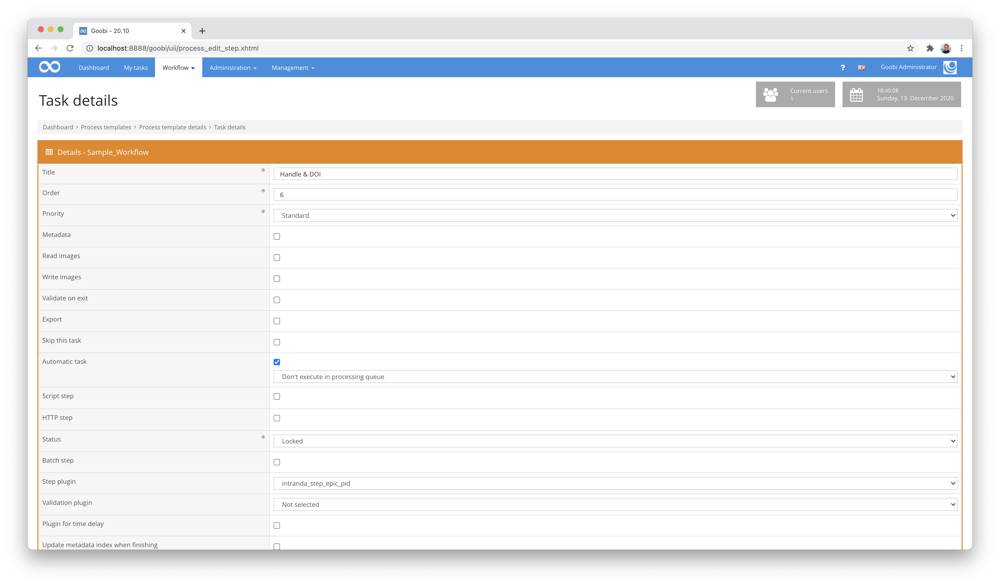

# ePIC PID Registration (Handle & DOI)

## Overview

Name                     | Wert
-------------------------|-----------
Identifier               | intranda_step_epic_pid
Repository               | [https://github.com/intranda/goobi-plugin-step-epic-pid](https://github.com/intranda/goobi-plugin-step-epic-pid)
Licence              | GPL 2.0 or newer 
Last change    | 25.07.2024 11:59:30


## Introduction
The plugin allows digital copies to be registered with the [ePIC Service of the GWDG](https://www.gwdg.de/de/application-services/persistent-identifier-pid). Both the generation of Handle IDs and the registration of DOIs are possible. The Handles can be generated for each logical and physical element of a METS file and stored as metadata in each case.


## Installation
To install the plugin, the following file must be installed:

```bash
/opt/digiverso/goobi/plugins/step/plugin_intranda_step_epic_pid-base.jar
```

In order to configure how the plugin should behave, the following two configuration files must also be installed:

```bash
/opt/digiverso/goobi/config/plugin_intranda_step_epic_pid.xml
/opt/digiverso/goobi/config/plugin_intranda_step_epic_pid_mapping.xml
```


## Overview and functionality
To put the plugin into operation, it must be activated for one or more desired tasks in the workflow. This is done as shown in the following screenshot by selecting the plugin `intranda_step_epic_pid` from the list of installed plugins.



Since this plugin is usually to be executed automatically, the work step should be configured as automatic in the workflow.

After the plugin has been fully installed and set up, it is usually executed automatically within the workflow, so there is no manual interaction with the user. Instead, the plugin is called by the workflow in the background and starts generating an identifier depending on the selected configuration. The plugin proceeds as follows:

The way the plugin works within the correctly configured workflow is as follows:

* First, the plugin opens the METS file of the operation.
* For each logical and physical element of this METS file, a handle in the form `PREFIX-CLIENT-OBJECTID` is created. If the planned `OBJECTID` is already assigned as a handle, an incrementing suffix (e.g.: `-1`, `-2`, etc.) is added at the end.
* Finally, the generated handle is stored within the METS file as a metadatum for the respective logical or physical structural element. The metadata type `_urn` is usually used for this purpose.
* If the registration of DOIs has been activated, a new DOI identifier is generated for each logical top-level element in addition to the handle generation and stored within the METS file.


## Configuration

### Main configuration
The configuration of the file `plugin_intranda_step_epic_pid.xml` is structured as follows:

```xml
<config_plugin>

    <config>
        <!-- which projects to use for (can be more then one, otherwise use *) -->
        <project>*</project>
        <step>*</step>

        <!-- authentication and main information -->
        <certificate>/opt/digiverso/goobi/config/certificate.pem</certificate>
        <user>USER</user>
        <base>BASE</base>
        <url>https://viewer.example.org/resolver?field=MD_PI_HANLDE&identifier=</url>

        <!-- configuration for Handles -->
        <prefix>go</prefix>
        <name>goobi</name>
        <separator>-</separator>

        <!-- configuration for DOIs -->
        <doiGenerate>true</doiGenerate>
        <doiMapping>/opt/digiverso/goobi/config/plugin_intranda_step_epic_pid_mapping.xml</doiMapping>
    </config>

</config_plugin>
```

The block `<config>` can occur repeatedly for different projects or workflow steps in order to be able to perform different actions within different workflows. The other parameters within this configuration file have the following meanings:

| Value | Description |
| :--- | :--- |
| `project` | This parameter determines for which project the current block `<config>` is to apply. The name of the project is used here. This parameter can occur several times per `<config>` block. |
| `step` | This parameter controls for which workflow steps the block `<config>` should apply. The name of the workflow step is used here. This parameter can occur several times per `<config>` block. |
| `certificate` | The `certificate` element defines the path to the private key used for authentication. |
| `user` | This parameter sets the user name for authentication. |
| `base` | This sets the base name for the generation of the handles. |
| `url` | This parameter defines the final URL for the handle resolver. The beginning of the URL is defined at this point. The subsequently formed handle ID is placed at the end, so that the final URL will be structured as follows: `url` + handle ID |
| `prefix` | The actual handle is composed of several parts and usually has this structure: `prefix` + `separator` + `name` + `separator` + `objectId`. The parameter `prefix` defines the prefix with which the handle should begin. This parameter is optional. |
| `name` | The parameter `name` defines the content of the handle to which the object IDs are subsequently appended. This parameter is optional. |
| `separator` | This parameter defines the separator to be used between the individual elements of the generated handle. |
| `doiGenerate` | This parameter determines whether a DOI identifier should also be generated in addition to the handle. |
| `doiMapping` | At this point a mapping file is named where the mappings of the metadata from the METS file to the DOI metadata are defined. |


### Configuration for the use of DOI
The configuration of the file `plugin_intranda_step_epic_pid_mapping.xml` is structured as follows:

```xml
<?xml version="1.0" encoding="UTF-8"?>
<Mapping>
    <map>
        <field>title</field>
        <metadata>TitleDocMain</metadata>
        <altMetadata>Title</altMetadata>
        <default>Fragment</default>
    </map>

    <map>
        <field>author</field>
        <metadata>Author</metadata>
        <default>intranda</default>
    </map>

    <map>
        <field>publisher</field>
        <metadata>Publisher</metadata>
        <altMetadata>Source</altMetadata>
        <default>intranda</default>
    </map>

    <map>
        <field>pubdate</field>
        <metadata>PublicationYear</metadata>
        <altMetadata>PublicationYearSort</altMetadata>
        <altMetadata>PublicationRun</altMetadata>
        <default>intranda</default>
    </map>

    <map>
        <field>inst</field>
        <default>intranda</default>
    </map>
</Mapping>
```

This configuration file defines how the available metadata from the METS file are to be used for registering the DOI. At least one metadata is defined for each field of the DOI that is to be used.

| Value | Description |
| :--- | :--- |
| `field` | This parameter defines the DOI metadatum to be generated. |
| `metadata` | This parameter names the metadatum to be read from the METS file in order to use its value for the creation of the defined DOI field. |
| `altMetadata` | If the metadata defined with the `metadata` parameter is not available, an alternative metadata can be defined here to be used instead. This parameter is optional and repeatable. |
| `default` | If the metadata defined by `metadata` and `altMetadata` cannot be found, a default value can be set here. |


## Example of a result
If a handle is registered, the following contents result from the communication with the ePIC service:

```bash
Handle Values for: BASE/go-goobi-1296243265-17
Index    Type    Timestamp    Data
1    URL    2020-04-21 12:02:30Z     https://viewer.goobi.io/idresolver?handle=
2    TITLE    2020-04-21 12:02:30Z     [Stammbuch Daniel Schelling]
3    AUTHORS    2020-04-21 12:02:30Z     Daniel Schelling
4    PUBLISHER    2020-04-21 12:02:30Z     Stadtarchiv Duderstadt
5    PUBDATE    2020-04-21 12:02:30Z     1617
6    INST    2020-04-21 12:02:30Z     intranda
100    HS_ADMIN    2020-04-21 12:02:30Z     handle=USER; index=300; [create hdl,delete hdl,read val,modify val,del val,add val,modify admin,del admin,add admin,list]
```

This information is then used by the GWDG's ePIC service to automatically generate a DOI identifier with the same ID: `BASE/go-goobi-1296243265-17`.