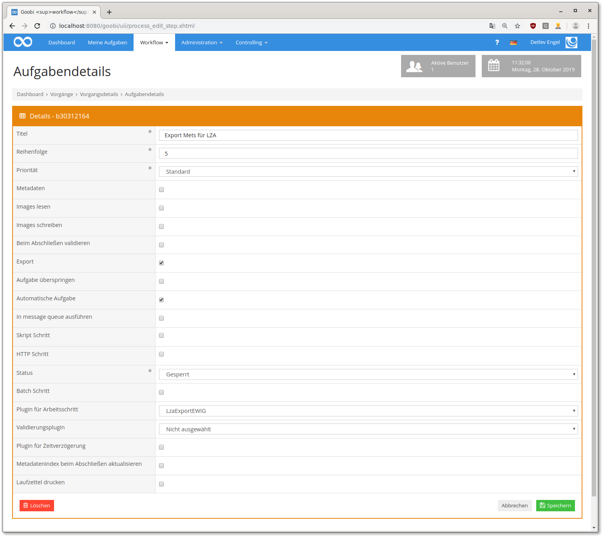

# EWIG Long term archiving

## Overview

Name                     | Wert
-------------------------|-----------
Identifier               | intranda_step_lza_ewig
Repository               | [https://github.com/intranda/goobi-plugin-step-ewig](https://github.com/intranda/goobi-plugin-step-ewig)
Licence              | GPL 2.0 or newer 
Last change    | 25.07.2024 11:50:43


## Introduction
This documentation describes the installation, configuration and use of a plugin for creating a METS file for long-term archiving EWIG.


## Installation
The plugin consists of two files:

```bash
plugin_intranda_step_LZA_EWIG-base.jar
plugin_intranda_step_lza_ewig.xml
```

The file `plugin_intranda_step_LZA_EWIG-base.jar` contains the program logic and must be installed in the following directory so that it is readable for the tomcat user:

```bash
/opt/digiverso/goobi/plugins/step/
```

The `plugin_intranda_step_lza_ewig.xml` file must also be readable by the tomcat user and installed in the following directory:

```bash
/opt/digiverso/goobi/config/
```


## Overview and functionality
After the plugin has been installed and configured, it can be used within one step. To do this, the `intranda_step_lza_ewig` plugin must be selected within the desired task. The Automatic Task checkbox must also be selected.



This step within Goobi workflow exports all the files required for EWIG Ingest. The upload itself is carried out via the intranda TaskManager. This is useful to avoid several upload processes running in parallel having conflicts with each other and slowing down the system. For uploads, see [chapter 4.17 ](https://docs.intranda.com/intranda-taskmanager-de/4/4.17-upload-von-dateien-in-das-ewig-langzeitarchiv)in the intranda TaskManager documentation.


## Configuration
The configuration file `plugin_intranda_step_lza_ewig.xml` must be structured as follows: ​

```xml
<?xml version="1.0" encoding="UTF-8"?>
<config_plugin>
    <config>
        <project>*</project>
        <step>*</step>
        <exportFolder>/opt/digiverso/</exportFolder>
        <exportXmlLog>true</exportXmlLog>
        <createManifest>true</createManifest>

        <manifestParameter
name="SubmissionManifestVersion">2.0</manifestParameter>
        <manifestParameter name="SubmittingOrganization">Example
organisation</manifestParameter>
        <manifestParameter
name="OrganizationIdentifier">DE-1</manifestParameter>
        <manifestParameter name="ContractNumber">1234567</manifestParameter>
        <manifestParameter name="Contact">Mustermann,
Max</manifestParameter>
        <manifestParameter name="ContactRole">Abteilungsleitung
Bibliothek</manifestParameter>
        <manifestParameter
name="ContactEmail">max.mustermann@example.com</manifestParameter>
        <manifestParameter name="TransferCurator">Doe,
John</manifestParameter>
        <manifestParameter
name="TransferCuratorEmail">john.doe@example.com</manifestParameter>
        <manifestParameter
name="SubmissionName">[Abteilungskürzel]_[eindeutiger
Name]</manifestParameter>
        <manifestParameter
name="SubmissionDescription">${meta.singleDigCollection};Digitalisierungsprojekt
der ZLB</manifestParameter>
        <manifestParameter
name="RightsHolder">${meta.rightsHolder};N/A</manifestParameter>
        <manifestParameter
name="Rights">http://id.loc.gov/vocabulary/preservation/copyrightStatus/pub</manifestParameter>
        <manifestParameter name="RightsDescription">''</manifestParameter>
        <manifestParameter
name="License">${meta.AccessLicense};${meta.AccessStatus};https://creativecommons.org/publicdomain/mark/1.0/</manifestParameter>
        <manifestParameter
name="AccessRights">${meta.AccessStatus};public</manifestParameter>
        <manifestParameter
name="MetadataFileFormat">http://www.loc.gov/METS/</manifestParameter>
        <manifestParameter
name="endpoint">https://goobi.example.com/api/endpoint/wi</manifestParameter>
    </config>
</config_plugin>
```

The `<config>` block is repeatable and can therefore define different parameters in different projects. The subelements `<project>` and `<step>` are used to check whether the present block should be used for the current step. First, the system checks whether there is an entry containing both the project name and the step name. If this is not the case, an entry for any project marked by the arbitrary project name and the step name used is searched for. If no entry is found, a search is performed for the project name and any steps, otherwise the default block is used, which contains both `<project>` and `<step>`.

The element `<exportFolder>` defines where in the file system the exported METS files are stored.

With `<exportXmlLog>` you can determine whether the XML log should also be exported and written to the METS file. The log contains information about the workflow.

The `<createManifest>` element controls whether a submission manifest should be created. If this is the case, the `<manifestParameter>` must also be configured.

Each `<manifestParameter>` consists of two parts, the `name` attribute, which contains the name of the parameter, and the text in which the desired field contents are configured. Both static texts and all variables known in Goobi can be used. Several parameters can be specified separated by semicolons. If the first value is not known because, for example, the configured metadata has not been filled in, the next value is then tried.