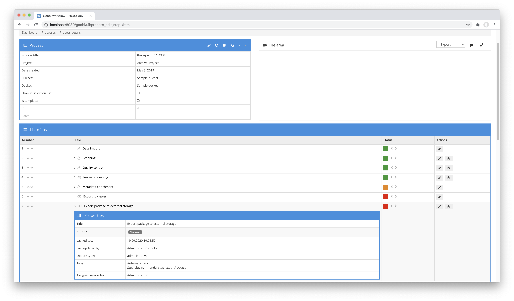

# Package Export

## Overview

Name                     | Wert
-------------------------|-----------
Identifier               | intranda_step_exportPackage
Repository               | [https://github.com/intranda/goobi-plugin-step-export-package](https://github.com/intranda/goobi-plugin-step-export-package)
Licence              | GPL 2.0 or newer 
Last change    | 25.07.2024 11:59:15


## Introduction
This plugin allows a flexible export of data of a process into a defined target directory. This plugin can be configured very granularly to include selected data in the export. In addition, a transformation of the internal and the export METS file via XSLT is also possible here and thus allows a wide range of usage scenarios.


## Installation
To install the plugin, the following file must be installed:

```bash
/opt/digiverso/goobi/plugins/step/plugin_intranda_step_exportPackage-base.jar
```

To configure how the plugin should behave, various values can be adjusted in the configuration file. The configuration file is usually located here:

```bash
/opt/digiverso/goobi/config/plugin_intranda_step_exportPackage.xml
```


## Overview and functionality
To use the plugin, it must be activated for one or more desired tasks in the workflow. This is done as shown in the following screenshot by selecting the plugin 'intranda_step_exportPackage' from the list of installed plugins.



Since this plugin is usually to be executed automatically, the step in the workflow should be configured as automatic.

Once the plugin is fully installed and set up, it is usually executed automatically within the workflow, so there is no manual interaction with the user. Instead, the workflow calls the plugin in the background and performs the configured export to the target directory. The specified contents are all copied into a subdirectory of the defined export path.

Depending on the configuration, an XSLT transformation of the internal or the export METS file can be carried out in addition to the export of the data in order to bring it into a desired format. Depending on this transformation as well as the name of the transformation file, it is finally also saved in the folder of the exported processes.


## Configuration
The configuration of the plugin is structured as follows:

```xml
<config_plugin>
    <!--
        order of configuration is:
          1.) project name and step name matches
          2.) step name matches and project is *
          3.) project name matches and step name is *
          4.) project name and step name are *
    -->

    <config>
        <!-- which projects to use for (can be more then one, otherwise use *) -->
        <project>*</project>
        <step>*</step>

        <!-- export path -->
        <target>/opt/digiverso/export/</target>
        <!-- use subfolder for each process -->
        <useSubFolderPerProcess>true</useSubFolderPerProcess>
        <!-- a zip file with the subfolder-name will be created -->
        <createZipPerProcess>true</createZipPerProcess>
        <!-- which image folders to use (master|media|jpeg|source|...) -->
        <imagefolder>master</imagefolder>
        <!-- use the attribute filegroup, if you want to add checksums to the files within the filegroup. The checksums are taken from the configured folder -->
        <imagefolder filegroup="PRESENTATION">media</imagefolder>

        <!-- which additional folders to use -->
        <ocr>false</ocr>
        <source>false</source>
        <import>false</import>
        <export>false</export>
        <itm>false</itm>
        <validation>false</validation>

        <!-- generate UUIDs for each mets:fileGrp and mets:file -->
        <uuid>false</uuid>
        <!-- add checksums to mets:files -->
        <checksum>false</checksum>
        <!-- command to use to validate the exported images -->
        <checksumValidationCommand>/usr/bin/sha1sum</checksumValidationCommand>        

        <!-- if the internal METS file shall get transformed into another file define the path of the xsl file here -->
        <copyInternalMetaFile>true</copyInternalMetaFile>
        <transformMetaFile>true</transformMetaFile>
        <transformMetaFileXsl>/opt/digiverso/goobi/xslt/export_meta.xsl</transformMetaFileXsl>
        <transformMetaFileResultFileName>xslt_result_meta.xml</transformMetaFileResultFileName>

        <!-- if the METS file shall get transformed into another file define the path of the xsl file here -->
        <transformMetsFile>true</transformMetsFile>
        <transformMetsFileXsl>/opt/digiverso/goobi/xslt/export_mets.xsl</transformMetsFileXsl>
        <transformMetsFileResultFileName>xslt_result_mets.xml</transformMetsFileResultFileName>
    </config>

</config_plugin>
```

The block `<config>` can occur repeatedly for different projects or workflow steps in order to be able to carry out different actions within different workflows. The other parameters within this configuration file have the following meanings:

| Value | Description |
| :--- | :--- |
| `project` | This parameter determines the project for which the current block `<config>` is to apply. The name of the project is used here. This parameter can occur several times per `<config>` block. |
| `step` | This parameter controls for which workflow steps the block `<config>` is to apply. The name of the step is used here. This parameter can occur several times per `<config>` block. |
| `target` | This parameter defines the main path where the export of the process as a subfolder with the process name should be exported to. |
| `useSubFolderPerProcess` | This parameter determines whether a subfolder is to be created for each process. |
| `createZipPerProcess` | This parameter can be used to determine whether a zip file is to be created for each process. |
| `imagefolder` | Several directories can be specified for the images or digital copies. This can include, for example, the master images and the derivatives. If the METS file is to contain checksums for the individual images, the attribute `filegroup` can be used here to specify for which `mets:fileGrp>` the checksums of the files from this folder are to be used. |
| `ocr` | This parameter specifies whether the OCR results are to be exported as well. |
| `source` | If the contents of the `source` folder should be included, this can be specified here. |
| `import` | If the contents of the `import` folder should be included, this can be defined here. |
| `export` | If the contents of the `export` folder are to be included, this can also be specified here. |
| `itm` | If the contents of the TaskManager directory `itm` are to be exported as well, this is defined here. |
| `validation` | With this parameter you can specify that the contents of the `validation` directory should also be exported. |
| `uuid` | If UUIDs (v4) are to be used for linking between `<mets:structMap>`, `<mets:fptr>` and `<mets:fileGrp>`, `<mets:file>`, this can be specified here. |
| `checksum` | When this option is enabled, the exported data is compared with previously generated checksums to verify successful export. If file groups were also configured when configuring the `image folders`, the checksums are also entered into the corresponding file groups. |
| `checksumValidationCommand` | Contains the command line tool used to perform the verification. |
| `transformMetaFile` | This parameter defines whether the Goobi workflow internal METS file should be copied to the target directory. |
| `transformMetaFileXsl` | This parameter can be used to specify whether the internal METS file should be processed using the XSLT transformation file defined here. |
| `transformMetaFileResultFileName` | If the internal METS file is to be transformed using XSLT, you can specify here what the name of the file to be generated should be. |
| `transformMetsFile` | This parameter defines whether the export METS file from Goobi workflow should be copied to the target directory. |
| `transformMetsFileXsl` | This parameter can be used to specify whether the export METS file should be processed using the XSLT transformation file defined here. |
| `transformMetsFileResultFileName` | If the export METS file is to be transformed using XSLT, you can specify here what the name of the file to be generated should be. |