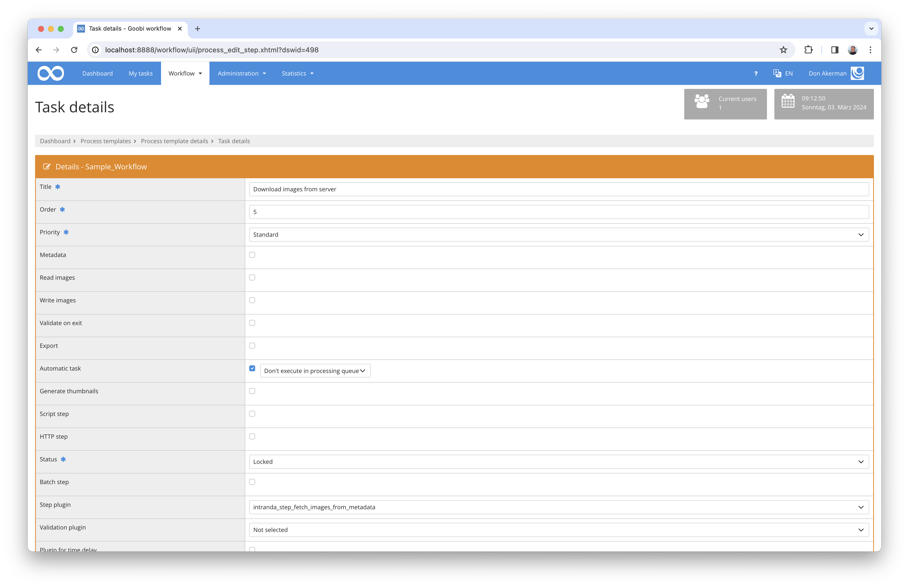

# Copying files from metadata fields

## Overview

Name                     | Wert
-------------------------|-----------
Identifier               | intranda-step-fetch-images-from-metadata
Repository               | [https://github.com/intranda/goobi-plugin-step-fetch-images-from-metadata](https://github.com/intranda/goobi-plugin-step-fetch-images-from-metadata)
Licence              | GPL 2.0 or newer 
Last change    | 30.01.2025 09:40:27


## Introduction
This documentation describes the installation, configuration and use of the plugin. This plugin can be used to copy or move images from a configured folder or from specific URLs to the desired folder in the process using the file name stored in the process. 


## Installation
The plugin consists of two files:

```bash
plugin_intranda_step_fetch_images_from_metadata-base.jar
plugin_intranda_step_fetch_images_from_metadata.xml
```

The file `plugin_intranda_step_fetch_images_from_metadata-base.jar` contains the programme logic and must be installed in the following directory so that it can be read by the `tomcat` user:

```bash
/opt/digiverso/goobi/plugins/step/
```

The configuration file `plugin_intranda_step_fetch_images_from_metadata.xml` must also be readable for the `tomcat` user and must be installed in the following directory:

```bash
/opt/digiverso/goobi/config/
```


## Overview and functionality
This plugin is integrated into the workflow so that it is executed automatically. Manual interaction with the plugin is not necessary. To use it within a workflow step, it should be configured as shown in the screenshot below.



The plugin is usually executed fully automatically within the workflow. It first determines whether the metadata specified in the configuration exists and then analyses it. The file specified in the metadata is then copied or moved to the media folder of the process based on its name and file extension. The plugin checks the existing images in the `media` folder of the process to see whether the desired image has already been imported, and if not:

In the following two cases, the order of the imported images is updated and saved in the Mets file:	
- if `useUrl` is set to `true`, the plugin will download the image from the specified URL 
- if `useUrl` is set to `false` or not at all, the name of each file is checked to determine whether it should be treated as the first file in the directory, while the other images are simply sorted by their names.


## Configuration
The plugin is configured via the configuration file `plugin_intranda_step_fetch_images_from_metadata.xml` and can be customised during operation. An example configuration file is listed below:

```xml
<?xml version="1.0" encoding="UTF-8"?>
<config_plugin>
    <!--
        order of configuration is:
          1.) project name and step name matches
          2.) step name matches and project is *
          3.) project name matches and step name is *
          4.) project name and step name are *
	-->
    
    <config>
        <!-- which projects to use for (can be more then one, otherwise use *) -->
        <project>*</project>
        <step>*</step>
        
        <!-- true if the images should be fetched from a url, false if the images should be fetched from the following configured folder. DEFAULT false -->
        <useUrl>false</useUrl>
        
        <!-- true if all existing images and pagination should be removed before a re-run -->
        <clearExistingData>false</clearExistingData>
        
        <!-- metadata containing the file name -->
        <filenameMetadata>SeparatedMaterial</filenameMetadata>

        <!-- mode="copy|move"   ignoreFileExtension="true|false"-->
        <fileHandling mode="copy" ignoreFileExtension="true" folder="/opt/digiverso/import/images/" />

        <!-- enabled= true|false exportImages=true|false -->
        <export enabled="true" exportImages="true" />
    </config>

</config_plugin>
```

The individual parameters have the following function:

| Parameter | Explanation |
| :--- | :--- |
| `project` | This parameter defines which project the current block `<config>` should apply to. The name of the project is used here. This parameter can occur several times per `<config>` block. |
| `step` | This parameter controls which work steps the `<config>` block should apply to. The name of the work step is used here. This parameter can occur several times per `<config>` block. |
| `useUrl` | This parameter determines the source location of the images to be retrieved. If it is set to `true`, the images are retrieved from the registered URLs in the mets file, if it is set to `false` or not set at all, the images are retrieved from the following configured folder. |
| `clearExistingData` | This parameter determines whether existing images should be deleted before a run. In addition to the images, the pagination and page assignment is also removed. |
| `filenameMetadata` | The name of the metadata field (usually from the METS file) that contains the file name of the file to be imported is specified here. |
| `fileHandling` | The `@mode` attribute defines whether the images are to be imported by copying or moving. The `@ignoreFileExtension` attribute controls whether the file extension should be ignored for the copying process or must be exactly correct. The `@folder` attribute specifies the folder in which the files to be imported are located. |
| `export` | The `@enabled` attribute defines whether the process is to be exported or not, while the `@exportImages` attribute defines whether the images are to be taken into account.  |