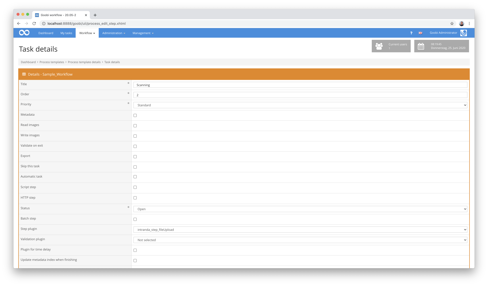
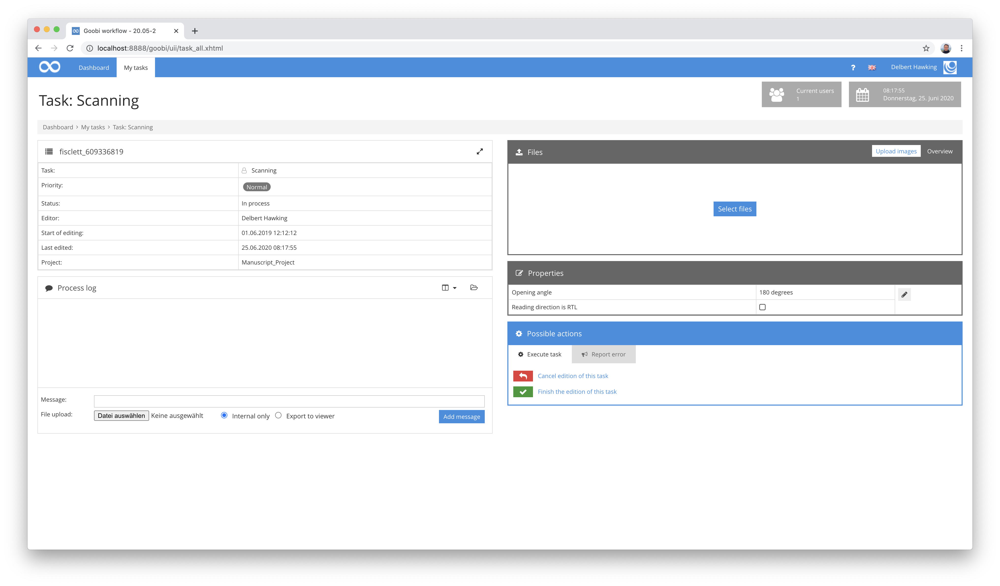
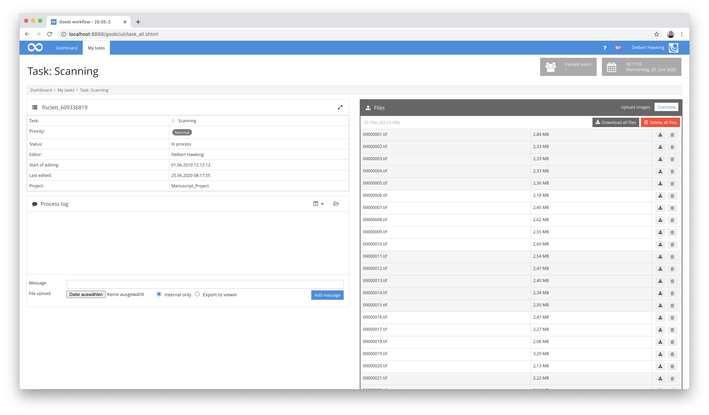

# Upload files

## Overview

Name                     | Wert
-------------------------|-----------
Identifier               | intranda_step_fileUpload
Repository               | [https://github.com/intranda/goobi-plugin-step-file-upload](https://github.com/intranda/goobi-plugin-step-file-upload)
Licence              | GPL 2.0 or newer 
Last change    | 25.07.2024 11:58:57


## Introduction
This plugin is used to upload files within the user interface of an accepted task in Goobi workflow.


## Installation
To install the plugin the following two files must be installed:

```bash
/opt/digiverso/goobi/plugins/step/plugin_intranda_step_fileUpload-base.jar
/opt/digiverso/goobi/plugins/GUI/plugin_intranda_step_fileUpload-gui.jar
```

To configure how the plugin should behave, different values can be adjusted in the configuration file. The configuration file is usually located here:

```bash
/opt/digiverso/goobi/config/plugin_intranda_step_fileUpload.xml
```


## Overview and functionality
To put the plugin into operation, it must be activated for one or more desired tasks in the workflow. This is done as shown in the following screenshot by selecting the `intranda_step_fileUpload` plugin from the list of installed plugins.



After the plugin has been completely installed and set up, it is available for the users of the corresponding tasks. After entering a task, it is now possible to upload files in the right area of the user interface.



Files can either be uploaded to this area by drag & drop or alternatively selected by clicking the button and thus uploaded.

If you want to check which files are already present in the folder after the upload, you can switch the display in the upper right area. This enables the user to list all files already existing in the folder, download individual files or delete them.




## Configuration
The configuration of the plugin is structured as follows:

```xml
<config_plugin>

    <config>
        <!-- which projects to use for (can be more than one, otherwise use *) -->
        <project>*</project>
        <step>*</step>
        <!-- which file types to allow -->
        <regex>/(\.|\/)(gif|jpe?g|png|tiff?|jp2|pdf)$/</regex>
        <!-- which folder to use (master|main|jpeg|source|...) -->
        <folder>master</folder>
    </config>

    <config>
        <!-- which projects to use for (can be more than one, otherwise use *) -->
        <project>My special project</project>
        <project>Archive_Project</project>
        <step>Upload derivatives</step>
        <!-- which file types to allow -->
        <regex>/(\.|\/)(gif|jpe?g|png|tiff?|jp2|pdf)$/</regex>
        <folder>media</folder>
        <folder>master</folder>
    </config>

</config_plugin>
```

The block `<config>` can occur repeatedly for different projects or workflow steps in order to be able to perform different actions within different workflows. The other parameters within this configuration file have the following meanings:

| Value | Description |
| :--- | :--- |
| `project` | This parameter determines the project for which the current block `<config>` is to apply. The name of the project is used here. This parameter can occur several times per `<config>` block. |
| `step` | This parameter controls for which workflow steps the block `<config>` is to apply. The name of the step is used here. This parameter can occur several times per `<config>` block. |
| `regex` | This parameter can be used to specify which file types should be allowed for upload. In the above example, multiple image formats as well as pdf files are allowed. |
| `folder` | With this parameter you can define where the upload of the files should take place. This parameter can occur repeatedly and thus allows an upload to several directories, between which the user can then choose. Possible values for this are e.g. `master`, `media` or also individual folders such as `photos` and `scans`. |