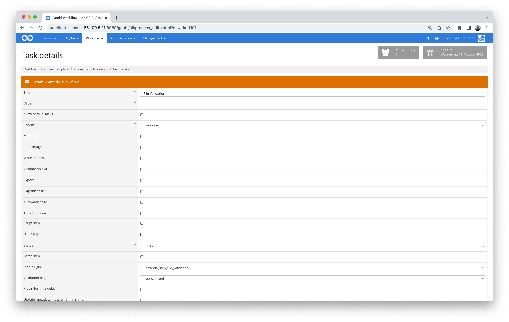

# File validation

## Overview

Name                     | Wert
-------------------------|-----------
Identifier               | intranda_step_file_validation
Repository               | [https://github.com/intranda/goobi-plugin-step-file-validation](https://github.com/intranda/goobi-plugin-step-file-validation)
Licence              | GPL 2.0 or newer 
Last change    | 25.07.2024 11:58:49


## Introduction
This documentation describes the installation, configuration and use of the Step Plugin for validation with configurable checking profiles.


## Installation
The plugin consists of the following file:

```bash
plugin_intranda_step_file_validation-base.jar
```

This file must be installed in the correct directory so that it is available at the following path after installation:

```bash
/opt/digiverso/goobi/plugins/step/plugin_intranda_step_file_validation-base.jar
```

In addition, there is a configuration file that must be located in the following place:

```bash
/opt/digiverso/goobi/config/plugin_intranda_step_file_validation.xml
```


## Overview and functionality
The plugin is usually executed fully automatically within the workflow. It starts the configured checking process and then outputs whether the required checking level has been reached. If one of the checked documents does not reach the required level, the plugin fails.

This plugin is integrated into the workflow in such a way that it is executed automatically. Manual interaction with the plugin is not necessary. For use within a workflow step, it should be configured as shown in the screenshot below.




## Configuration
The configuration of the plugin is done via the configuration file `plugin_intranda_step_file_validation.xml` and can be adjusted during operation. The following is an example configuration file:

```xml
<config_plugin>
	<!-- order of configuration is: 
		1.) project name and step name matches 
		2.) step name matches and project is * 
		3.) project name matches and step name is * 
		4.) project name and step name are * -->

	<config>
		<!-- which projects to use for (can be more then one, otherwise use *) -->
		<project>*</project>
		<!-- which stepss to use for (can be more then one, otherwise use *) -->
		<step>*</step>
		<!-- input folder where the documents are located, is only used in the STEP-Plugin -->
		<inputFolder>{processpath}/pdf</inputFolder>
		<!-- outputfolder where the folder with the tool reports will be created, is only used in the STEP-Plugin -->
		<outputFolder>{processpath}/validation</outputFolder>
		<!-- fileFilter: regex-Pattern that allows to filter by filename and fileextension -->
		<fileFilter>(?i).*\.pdf|.*\.epub</fileFilter>
		<!-- name of the profile that shall be used by this config blog -->
		<profileName>epubPdf</profileName>
		<!--targetLevel that must be reached for a successful plugin run -->
		<targetLevel>2</targetLevel>
	<config>
	</config>
		<!-- which institution to use for (can be more then one, otherwise use *) -->
		<institution>*</institution>
		<profileName>epubPdf</profileName>
		<targetLevel>0</targetLevel>

	</config>

	<!-- global has the child elements
		profile, namespaces and tools

		profile contains the definition of the ingest levels. It also has the attribute name,
		so you can refer to the profile in the config-blog element profileName
		the order of the levels defines their numbering, the first level element defines level zero and so on.

		a level element can contain check- and setValue- elements.

		a check element has following attributes
			name:		name of the check
			dependsOn:	name of the check that must have been successful, if this check shall be executed
					a check can only depend on a check that was defined before it.
					the parameter is optional
			tool:	name of the tool that must be executed to create the report
			group:  checks can be grouped. grouped checks are OR-operated which means, that the level won't fail if one check
				of the group is successful. ( i.e. check for isPDF-A and isPDFx in one level)
			code:	Errorcode or Errormessage that shall be displayed when the check fails /regex doesn't match node does not exist
			xpathSelector: xpathSelector to selct the node or attribute value
			regex:	regular expression that will be matched with the read value, if no regular expression is
				provided the check will only test if the node exists.
			namespace: (only needed if the specified check uses another namespace than the tool and if
					namespaces are used)

		a setValue element has following attributes
			name:		name of the check
			dependsOn:	name of the check that must have been successful if this setValue-Element shall be executed
					a setValue-Element can only depend on a check not on other setValue Elements. set value Elements will always be
					executed after the checks.
					the parameter is mandatory
			tool:	name of the tool that must have ben executed to create the report
			code:	Errorcode or Errormessage that shall be displayed when value retrival fails.
			xpathSelector: xpathSelector to selct an attribute value
			namespace: (only needed if the specified setValue-Element uses another namespace than the tool and if
					namespaces are used)

		a tools element contains multiple tool elements
		a tool element hast the attributes
			name:		name of the tool
			cmd:		the command that must be run to create the xml report. you can use the {pv.outputFile} variable to refer to
			stdout:		if stdout is true, the reportfile will be generated from the commandline output of the file. if it is set to false
					the plugins assumes the tool is able to create the file by itself
			xmlNamespace:	the name of the xml-namespace the generated report uses "jhove"

		a namespaces element can contain multiple namespace elements
		a namespace element has the attributes:
			name: 	the name of the xml namespace used in the xml and to address it in xmlNamespace attributes of tool-, check- and setValue-Elements
			uri:	the uri of the xml namespace
	-->
	<global>
		<profile name="epubPdf" >
			<level>
				<!-- 0 DI check Integrity of Document -->
				<!--checksum test should be done here -->
			</level>
			<level>
				<!-- 1 ID Document with File -->
				<check name="isPDF"
					tool="file"
					group="fileformat"
					code="This is not a PDF-File"
					xpathSelector="//format"
					regEx="(?i)^pdf document.*"
				/>

				<check name="isEPUB"
					tool="file"
					group="fileformat"
					code="This is not an EPUB-File"
					xpathSelector="//format"
					regEx="(?i)^epub document.*"
				/>
			</level>
			<level>
				<!-- 2 BF check for encryption or access restrictions -->
				<check name="checkEncryption"
					dependsOn="isPDF"
					tool="pdfinfo"
					code="The file is encrypted or has access restrictions"
					xpathSelector="//pdfinfo/Encrypted"
					regEx="^no$"
				/>

			</level>
			<level>
			<!-- 3 MD Extraction of Metadata -->

				<setValue name="PdfVersion"
					dependsOn="isPDF"
					tool="jhove_pdf"
					code="Could not read Version Information!"
					xpathSelector="//jhove:repInfo/jhove:version"
					processProperty="PDFVersion"
				/>
				<setValue name="FilesizePDF"
					dependsOn="isPDF"
					tool="jhove_pdf"
					code="Couldn't obtain Filesize"
					xpathSelector="//jhove:repInfo/jhove:size"
					processProperty="Filesize"
				/>
				<setValue name="EPUBVersion"
					dependsOn="isEPUB"
					tool="jhove_epub"
					code="Could not read Version Information!"
					xpathSelector="//jhove:repInfo/jhove:version"
					processProperty="EPUBVersion"
				/>
				<setValue name="FilesizeEPUB"
					dependsOn="isEPUB"
					tool="jhove_epub"
					code="Couldn't obtain Filesize"
					xpathSelector="//jhove:repInfo/jhove:size"
					processProperty="Filesize"
				/>
			</level>
			<level>
			<!-- 4 V Validity -->
				<check name="checkPDFVersion"
					dependsOn="isPDF"
					tool="jhove_pdf"
					code="The Version of the PDF-File is not supported by this Version of JHOVE"
					xpathSelector="//jhove:repInfo/jhove:version"
					regEx="^1\.[012456]$|^2\.0$"
				/>
				<check name="isValidPDF"
					dependsOn="checkPDFVersion"
					tool="jhove_pdf"
					code="PDF Validation failed"
					xpathSelector="//jhove:repInfo/jhove:status"
					regex="Well-Formed and valid"
				/>
				<check name="isValidEPUB"
					dependsOn="isEPUB"
					tool="jhove_epub"
					code="EPUB Validation failed"
					xpathSelector="//jhove:repInfo/jhove:status"
					regex="Well-Formed and valid"
				/>
			<!--
				<check name="pdf-a validation"
          dependsOn="isPDF"
					tool="verapdf"
					code="pdfa_validation_failed"
					xpathSelector="xpathSelector"
					regEx="regEx"
				/>
				-->
			</level>
		</profile>
		<namespaces>
			<namespace name="jhove" uri="http://hul.harvard.edu/ois/xml/ns/jhove" />
		</namespaces>
		<tools>
			<tool name="jhove_pdf"
				cmd="/usr/bin/jhove -m PDF-hul -h XML -o {pv.outputFile} {pv.inputFile}"
				stdout="false"
				xmlNamespace ="jhove"
			 />

			<tool name="jhove_epub"
				cmd="/usr/bin/jhove -m EPUB-ptc -h XML -o {pv.outputFile} {pv.inputFile}"
				stdout="false"
				xmlNamespace ="jhove"
			 />
			<tool name="verapdf"
				cmd="/opt/digiverso/verapdf/verapdf --format mrr {pv.inputFile}"
				stdout="true"
			 />
			<tool name="pdfinfo"
				cmd="/opt/digiverso/goobi/config/pdfinfogawk.sh {pv.inputFile}"
				stdout="true"
			 />
			 <tool name="file"
				cmd="/opt/digiverso/goobi/config/filegawk.sh {pv.inputFile}"
				stdout="true"
			 /> 					
		</tools>
	</global>
</config_plugin>
```

The `config_plugin` element can have two child element types: `config` and `global`. First, the functionality of the `config` element is described here.


### Structure of the config element
| Parameter | Explanation |
| :--- | :--- |
| `project` | This parameter determines for which project the current block `<config>` should apply. The name of the project is used here. This parameter can occur several times per `<config>` block. |
| `step` | This parameter controls for which work steps the block `<config>` should apply. The name of the work step is used here. This parameter can occur several times per `<config>` block. |
| `institution` | Within the scope of dashboard delivery, this parameter controls for which institution the <config> block is to apply. The name of the facility is used here. This parameter can occur several times per <config> block. |
| `inputFolder` | Here it must be specified where the documents to be checked are located. Goobi variables such as `{processpath}` can be used when specifying.  |
| `outputFolder` | Here it must be specified where the reports generated by the tools (`tools`) are to be stored. Goobi variables such as `{processpath}` can be used when specifying. |
| `fileFilter` | A regular expression can be formulated here to limit which files are to be checked based on the file name (usually the file extension). |
| `profileName` | Here you can specify the checking profile to be used for this institution or this `project`/`step` combination. |
| `targetLevel` | Here it must be specified which level of the verification process must be achieved by the document. |


### Structure of the global element
The `global` element can have 3 child element types: `profile`, `namespaces` and `tools`.


### Structure of the namespace element
The `namespace` element can have several children of the type `namespace`.
A `namespace` here describes an XML namespace and has the following attributes:


| Attribute | Explanation |
| :--- | :--- |
| `name` | Allows the name of the namespace to be specified. In the `tool`, `check` and `setValue` elements, the `namespace` can then be addressed by this name.  |
| `uri` | The URI of the XML namespace must be specified here. |


### Structure of the tools element
The `tools` element can have several children of the type `tool`.
The `tool` element can be used to describe the parameters needed to execute a tool/script from the plugin.

| Attribute | Explanation |
| :--- | :--- |
| `name` | Allows the name of the tool to be specified. In the `check` and `setValue` elements, the `tool` can then be referenced by this name.|
| `uri` | The URI of the XML namespace must be specified here.   |
| `cmd` | Here the command must be specified with which the tool (e.g. `jhove`) can be called. In the `cmd` attribute the plug-in specific variables `{pv.outputFile}` (path to the output file) and `{pv.inputFile}` (path to the document) can be used.  |
| `stdout` | Here you can specify whether the tool writes its output to stdout (`true`) or to a configuration file (`false`). |
| `xmlNamespace` | Here a `namespace` element can be referenced by its name.  |


### Structure of the profile element
The `profile` element can have several children of the type `tool`. It also has the attribute `name` with whose value it can be referenced in the 'config' element `profileName`.
A profile has several elements of type `level`. Each level can contain several `check` and `setValue` elements. The levels are numbered internally according to their order. The first `level` element is level `0`, the second level `1` and so on.

### Structure of check and setValue elements
A `check` makes it possible to check a value in one of the generated xml-reports. A regular expression is used to check the value. If no regular expression is specified, only the existence of the specified xml element is checked. If a check fails, the level is considered to have failed. Unless the failed check is in a group, then all other checks in the group must also fail for the level to be considered failed.

The attributes of the `check` element look like this:

| Attribute | Explanation |
| :--- | :--- |
| `name` | The name of the check must be specified here, e.g. `isPDF`. With the help of the name, the check can then be referenced by other `check`/`setValue` elements. The check name is also used in the generated report. |
| `group` | This attribute is optional. Checks in the same group are OR-linked, i.e. the level is not considered to have been reached until all checks in this group have failed. |
| `dependsOn` | This attribute is optional. If it is specified, the check listed in `dependsOn` must be successfully executed for this check to be executed. |
| `tool` | Here you must specify which tool generates the underlying XML report. |
| `code` | An error message must be specified here. |
| `xpathSelector` | Here the xpath selector must be specified, which selects the corresponding XML node in the XML document. |
| `regex` | This attribute is optional. If it is specified, it is checked whether the selected value matches the regular expression. If no regular expression is specified, only the existence of the XML element is checked. |
| `xmlNamespace` | This attribute is optional. This attribute can be used to specify a `namespace` that differs from the namespace of the `tool`. This may be necessary, for example, if different namespaces are used in a report. |

Ein `setValue`-Element ermöglicht es einen Wert aus einem der erzeugten Reports auszulesen und in den Prozesseigenschaften oder den Metadaten des obersten Strukturelements zu speichern. Die Attribute des `setValue`-Elements sehen wie folgt aus:

| Attribute | Explanation |
| :--- | :--- |
| `name` | The name of the `setValue` element must be specified here, e.g. `readPDFVersion`. The name is also used in the generated report. |
| `dependsOn` | This attribute is mandatory. A `setValue` element always depends on a check. The check listed in `dependsOn` must be successfully executed for this `setValue` element to be evaluated. |
| `tool`| Here you must specify which tool generates the underlying XML report. |
| `code`| An error message must be specified here. |
| `xpathSelector` | Here the xpath selector must be specified, which selects the corresponding XML node in the XML document. |
| `xmlNamespace` | This attribute is optional. This attribute can be used to specify a namespace that differs from the namespace of the `tool'. This may be necessary, for example, if different namespaces are used in a report. |
| `processProperty` | This attribute is optional. Here you can specify in which process property the read-in value is to be saved. |
| `mets` | This attribute is optional. Here you can specify in which metadatum of the uppermost structure element the read-in value is to be saved. For this, it must be ensured that the specified values match the rule set. |


## Solution for programmes that do not generate XML output
A basic requirement of this plugin is that the tools used generate XML output. However, it often happens that the desired tool does not generate XML output. In this case we advise you to transform the output to XML with a GAWK script.
The output of the `file` command serves as an example here:

```bash
LoremIpsum-a3b.pdf: PDF document, version 1.6
```

Instead of calling the tool directly, one would now create a shell script with the following content and store it in the `cmd` attribute of the tool:

```bash
file $1 | gawk -f {absoluter pfad zum awk-script} | xmllint --format -
```

If we only need the second parameter from the output of the `file` command, the (g)awk script could look like this:

```bash
BEGIN {
   FS="|";
   printf("<?xml version=\"1.0\" ?>\n<file>\n");
}
{
   split($1, a, ":");
   # remove whitespace
   gsub(/^[ \t]+/,"",a[2]);
   # remove unwanted Version Information
   sub(/,.*/,"",a[2])
   # ignore key value and only print second value
   printf("<format>%s</format>\n",a[2]);   
}
END {
   printf("</file>\n");
}
```

The result would then be the following XML output:

```xml
<?xml version="1.0"?>
<file>
  <format>PDF document</format>
</file>
```


## Configuration examples


### Plugin configuration
Complete example of plugin configuration within the file `plugin_intranda_step_file_validation.xml`:

```xml
<config_plugin>
	<!-- order of configuration is: 1.) project name and step name matches 2.) 
		step name matches and project is * 3.) project name matches and step name 
		is * 4.) project name and step name are * -->
		
	<config>
		<!-- which projects to use for (can be more then one, otherwise use *) -->
		<project>*</project>
		<!-- which stepss to use for (can be more then one, otherwise use *) -->
		<step>*</step>
		<!-- input folder where the documents are located, is only used in the STEP-Plugin -->
		<inputFolder>/opt/digiverso/pdf</inputFolder>
		<!-- outputfolder where the folder with the tool reports will be created, is only used in the STEP-Plugin --> 
		<outputFolder>{processpath}/validation</outputFolder>
		<!-- fileFilter: regex-Pattern that allows to filter by filename and fileextension -->
		<fileFilter>(?i).*\.pdf|.*\.epub</fileFilter>
		<!-- name of the profile that shall be used by this config blog -->
		<profileName>epubPdf</profileName>
		<!--targetLevel that must be reached for a successful plugin run -->
		<targetLevel>4</targetLevel>
	<config>
	</config>
		<!-- which institution to use for (can be more then one, otherwise use *) -->
		<institution>*</institution>
		<profileName>epubPdf</profileName>
		<targetLevel>0</targetLevel>
	</config>
	
	<!-- global has the child elements
		profile, namespaces and tools
		
		profile contains the definition of the ingest levels. It also has the attribute name, 
		so you can refer to the profile in the config-blog element profileName 
		the order of the levels defines their numbering, the first level element defines level zero and so on.
		
		a level element can contain check- and setValue- elements.
		
		a check element has following attributes
			name:		name of the check
			dependsOn:	name of the check that must have been successful, if this check shall be executed
					a check can only depend on a check that was defined before it.
					the parameter is optional
			tool:	name of the tool that must be executed to create the report
			group:  checks can be grouped. grouped checks are OR-operated which means, that the level won't fail if one check
				of the group is successful. ( i.e. check for isPDF-A and isPDFx in one level)
			code:	Errorcode or Errormessage that shall be displayed when the check fails /regex doesn't match node does not exist
			xpathSelector: xpathSelector to selct the node or attribute value
			regex:	regular expression that will be matched with the read value, if no regular expression is
				provided the check will only test if the node exists.
			namespace: (only needed if the specified check uses another namespace than the tool and if 
					namespaces are used)
					
		a setValue element has following attributes
			name:		name of the check
			dependsOn:	name of the check that must have been successful if this setValue-Element shall be executed
					a setValue-Element can only depend on a check not on other setValue Elements. set value Elements will always be 
					executed after the checks.
					the parameter is mandatory
			tool:	name of the tool that must have ben executed to create the report
			code:	Errorcode or Errormessage that shall be displayed when value retrival fails.
			xpathSelector: xpathSelector to selct an attribute value
			namespace: (only needed if the specified setValue-Element uses another namespace than the tool and if 
					namespaces are used)
					
		a tools element contains multiple tool elements
		a tool element hast the attributes
			name:		name of the tool
			cmd:		the command that must be run to create the xml report. you can use the {pv.outputFile} variable to refer to 
			stdout:		if stdout is true, the reportfile will be generated from the commandline output of the file. if it is set to false 
					the plugins assumes the tool is able to create the file by itself
			xmlNamespace:	the name of the xml-namespace the generated report uses "jhove"
		
		a namespaces element can contain multiple namespace elements
		a namespace element has the attributes:
			name: 	the name of the xml namespace used in the xml and to address it in xmlNamespace attributes of tool-, check- and setValue-Elements 
			uri:	the uri of the xml namespace
	-->
	<global>
		<profile name="epubPdf" >
			<level>
				<!-- 0 DI check Integrity of Document -->
				<!--checksum test should be done here -->
			</level>
			<level>
				<!-- 1 ID Document with JHOVE -->
				<check name="isPDF"
					tool="jhove"
					group="fileformat"
					code="This is not a PDF-File" 
					xpathSelector="//jhove:repInfo/jhove:format"
					regEx="(?i)pdf$" 
				/>
				
				<check name="isEPUB"
					tool="jhove" 
					group="fileformat"
					code="This is not an EPUB-File" 
					xpathSelector="//jhove:repInfo/jhove:format"
					regEx="(?i)epub$" 
				/>
			
			</level>
			<level>	
				<!-- 2 BF check for encryption or access restrictions -->
				<check name="checkEncryption"
					dependsOn="isPDF"
					tool="pdfinfo" 
					code="The file is encrypted or has access restrictions" 
					xpathSelector="//pdfinfo/Encrypted"
					regEx="^no$" 
				/>
				
			</level>
			<level>
			<!-- 3 MD Extraction of Metadata -->
				<setValue name="PdfVersion"
					dependsOn="isPDF"
					tool="jhove"
					code="Could not read Version Information!"
					xpathSelector="//jhove:repInfo/jhove:version"
					processProperty="PDFVersion"
				/>
				<setValue name="FilesizePDF"
					dependsOn="isPDF"
					tool="jhove"
					code="Couldn't obtain Filesize"
					xpathSelector="//jhove:repInfo/jhove:size"
					processProperty="Filesize"
				/>
				<setValue name="FilesizeEPUB"
					dependsOn="isEPUB"
					tool="jhove"
					code="Couldn't obtain Filesize"
					xpathSelector="//jhove:repInfo/jhove:version"
					processProperty="EPUBVersion"
				/>		
			</level>
			<level>
			<!-- 4 V Validity -->
				<check name="checkPDFVersion"
					dependsOn="isPDF"
					tool="jhove" 
					code="The Version of the PDF-File is not supported by this Version of JHOVE" 
					xpathSelector="//jhove:repInfo/jhove:version"
					regEx="^1\.[012456]$|^2\.0$" 
				/>
				<check name="isValidPDF"
					dependsOn="checkPDFVersion"
					tool="jhove" 
					code="PDF Validation failed" 
					xpathSelector="//jhove:repInfo/jhove:status"
					regex="Well-Formed and valid"
				/>
				<check name="isValidEPUB"
					dependsOn="isEPUB"
					tool="jhove" 
					code="EPUB Validation failed" 
					xpathSelector="//jhove:repInfo/jhove:status"
					regex="Well-Formed and valid"
				/>
			<!--
				<check name="pdf-a validation"
					tool="verapdf" 
					code="pdfa_validation_failed" 
					xpathSelector="xpathSelector"
					regEx="regEx" 
				/>
				-->
			</level>
		</profile>
		<namespaces>
			<namespace name="jhove" uri="http://schema.openpreservation.org/ois/xml/ns/jhove" />
		</namespaces>
		<tools>
			<tool name="jhove" 
				cmd="/opt/digiverso/tools/jhove/jhove -h XML -m PDF-hul -o {pv.outputFile} {pv.inputFile}"
				stdout="false"
				xmlNamespace ="jhove"
			 />
			<tool name="verapdf" 
				cmd="/home/michael/verapdf/verapdf --format mrr {pv.inputFile}"
				stdout="true"
			 />
			<tool name="pdfinfo" 
				cmd="/opt/digiverso/tools/pdfinfogawk.sh {pv.inputFile}"
				stdout="true"
			 /> 			
		</tools>
	</global>
</config_plugin>
```


### Example for PDF validation
Example for PDF validation call using `pdfinfogawk.sh`:

```bash
pdfinfo $1 | gawk -f /opt/digiverso/tools/namedKeys.awk | xmllint --format -
````

Example file `namedKeys.awk`:

```bash
BEGIN { 
   FS="|";
   printf("<?xml version=\"1.0\" ?>\n<pdfinfo>\n");
}
NF==1 {
   sub(/:/,"^",$1); 
   split($1, a, "^"); for (i in a) {
    if (i == 1) {
    	gsub(/[ \t]+/,"",a[1]);
        printf("<%s>", a[1]);
        }
    if (i == 2) {
    	gsub(/^[ \t]+/,"",a[2]);
        printf("%s", a[2]);
        printf("</%s>\n", a[1]);
        }
   } 
}
END {
   printf("</pdfinfo>\n");
}
```


### Example for file validation
Example of validation using file command via `filegawk.sh`:

```bash
file $1 | gawk -f /opt/digiverso/tools/fileFormat.awk | xmllint --format -
```

Example file `fileFormat.awk`:

```bash
BEGIN { 
   FS="|";
   printf("<?xml version=\"1.0\" ?>\n<file>\n");
}
NF==1 {
   sub(/:/,"^",$1); 
   split($1, a, "^"); for (i in a) {
      if (i == 2) {
    	gsub(/^[ \t]+/,"",a[2]);
        printf("<format>%s</format>\n", a[2]);
      } 
   }
}
END {
   printf("</file>\n");
}
```