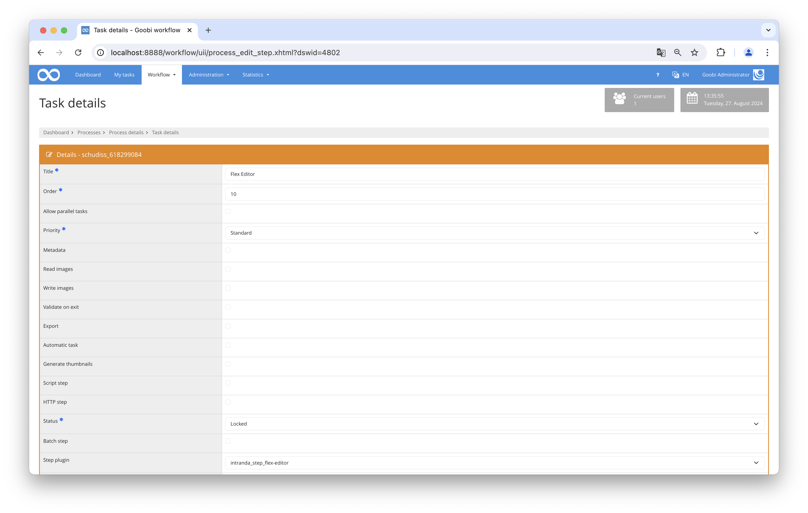

# Flex Editor

## Overview

Name                     | Wert
-------------------------|-----------
Identifier               | intranda_step_flex_editor
Repository               | [https://github.com/intranda/goobi-plugin-step-flex-editor](https://github.com/intranda/goobi-plugin-step-flex-editor)
Licence              | GPL 2.0 or newer 
Last change    | 04.09.2024 09:22:13


## Introduction
This plugin enables dynamic customization of the user interface, allowing specific metadata management requirements to be efficiently implemented.

## Installation
This plugin is delivered as a tar archive. To install it, the archive `plugin_intranda_step_flex-editor.tar` must be extracted into the Goobi directory:

```bash
tar -C /opt/digiverso/goobi/ -xf plugin_intranda_step_flex-editor.tar --exclude="pom.xml"
```

This plugin also comes with a configuration file named `plugin_intranda_step_flex-editor.xml`. It must be placed in the following path:

```bash
/opt/digiverso/goobi/config/plugin_intranda_step_flex-editor.xml
```

To use the plugin, it must be selected in a workflow step:



## Overview and Functionality
The Flex Editor for Goobi Workflow allows flexible customization of the metadata input interface. Through an XML configuration file, you can define how metadata fields are organized and displayed in columns and boxes. Various field types, such as text fields, checkboxes, and dropdowns, provide different input options.


## Configuration

The plugin is configured using the file `plugin_intranda_step_flex-editor.xml` as shown here:

```xml
<config>
    <column>
        <box name="bla 1">
            <field type="MULTISELECT" defaultDisplay="true">
                <metadatatype>unknown</metadatatype>
                <name>My multi select field</name>
                <sourceVocabulary>testVocabforDropdown</sourceVocabulary>
            </field>
            <field type="INPUT">
                <metadatatype>unknown</metadatatype>
                <name>My input field</name>
            </field>
        </box>
    </column>
    <column>
        <box name="bla 2">
            <field type="TEXTAREA">
                <metadatatype>unknown</metadatatype>
                <name>My textarea</name>
            </field>
        </box>
    </column>
    <column>
        <box name="bla 3">
            <field type="BOOLEAN">
                <metadatatype>unknown</metadatatype>
                <name>My checkbox</name>
            </field>
            <field type="TEXTAREA">
                <metadatatype>unknown</metadatatype>
                <name>My textarea</name>
            </field>
            <field type="DROPDOWN">
                <metadatatype>unknown</metadatatype>
                <name>My dropdown</name>
                <sourceVocabulary>testVocabforDropdown</sourceVocabulary>
            </field>
        </box>
        <box name="bla 5">
            <field type="TEXTAREA">
                <metadatatype>unknown</metadatatype>
                <name>My textarea</name>
            </field>
        </box>
    </column>
</config>

```

### General parameters 
The `<config>` block can occur repeatedly for different projects or work steps in order to be able to perform different actions within different workflows. The other parameters within this configuration file have the following meanings: 

| Parameter | Explanation | 
| :-------- | :---------- | 
| `project` | This parameter defines which project the current block `<config>` should apply to. The name of the project is used here. This parameter can occur several times per `<config>` block. | 
| `step` | This parameter controls which work steps the `<config>` block should apply to. The name of the work step is used here. This parameter can occur several times per `<config>` block. | 


### Further parameters 
In addition to these general parameters, the following parameters are available for further configuration: 


The configuration file describes the structure of the user interface as seen in Goobi. The configuration consists of multiple `<column>` elements, each representing a column in the interface. Within the `<column>` elements, there are `<box>` elements that group multiple metadata fields into a box within the interface. Inside the `<box>` elements are `<field>` elements, representing a metadata field in the process. The `<field>` elements can have different types, giving them specific functionality in the user interface:

| Parameter          | Explanation                                                                                     |
|--------------------|-------------------------------------------------------------------------------------------------|
| `INPUT`            | A single-line input field used for capturing simple text inputs. A metadata type must also be specified. |
| `TEXTAREA`         | A multi-line input field. Specifying a metadata type is also required.                           |
| `BOOLEAN`          | A checkbox used for yes/no decisions or binary options. A metadata type must also be specified.  |
| `DROPDOWN`         | A dropdown menu with values sourced from the predefined vocabulary. In addition to the metadata type, the name of the vocabulary to be used must be specified. |
| `MODAL_PROVENANCE` | Creates a metadata group that includes multiple fields. These fields can also be sourced from vocabularies. The field is repeatable and can use multiple vocabularies. |