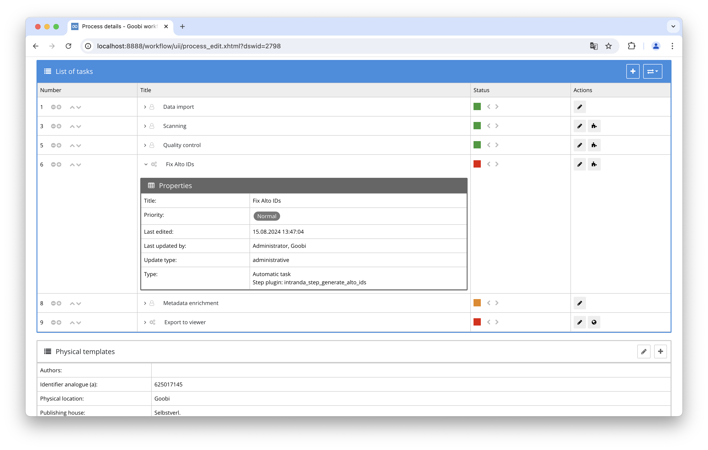
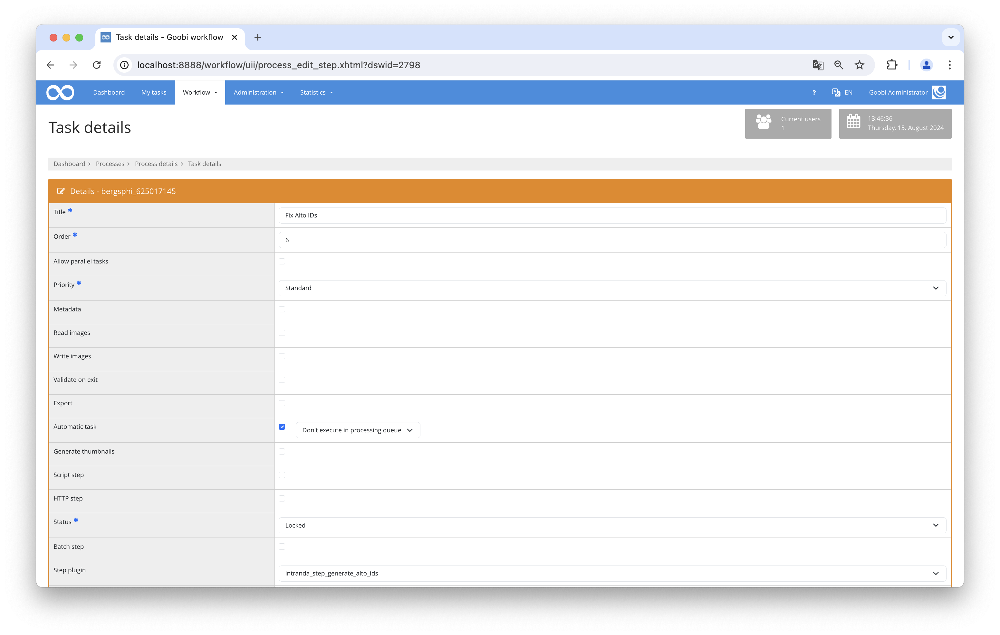

# Generate ALTO IDs

## Overview

Name                     | Wert
-------------------------|-----------
Identifier               | intranda_step_generate_alto_ids
Repository               | [https://github.com/intranda/goobi-plugin-step-generate-alto-ids](https://github.com/intranda/goobi-plugin-step-generate-alto-ids)
Licence              | GPL 2.0 or newer 
Last change    | 07.09.2024 14:15:03


## Introduction
This documentation explains the plugin for generating missing ALTO IDs. This is required for the ALTO editor to work properly. Some external OCR tools don't provide these ALTO IDs. This plugin can then be used to generate them afterwards.


## Installation
To be able to use the plugin, the following files must be installed:

```bash
/opt/digiverso/goobi/plugins/step/plugin-step-generate-alto-ids-base.jar
```

Once the plugin has been installed, it can be selected within the workflow for the respective work steps and thus executed automatically. A workflow could look like the following example:



To use the plugin, it must be selected in a workflow step:




## Overview and functionality
When the plugin is started, all ALTO files are checked for missing IDs.
If missing IDs are found, a backup of all OCR results including the ALTO files is created first.
The missing ALTO IDs are then added to all files.


## Configuration
This plugin requires no configuration.