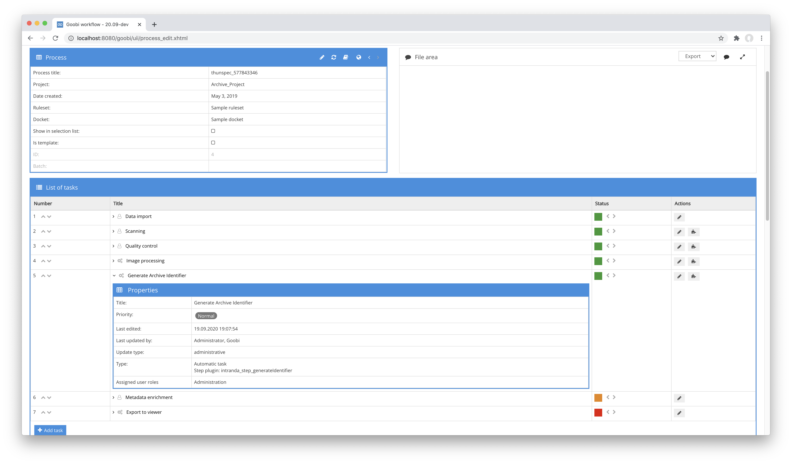

# Generate Identifier

## Overview

Name                     | Wert
-------------------------|-----------
Identifier               | intranda_step_generateIdentifier
Repository               | [https://github.com/intranda/goobi-plugin-step-generate-identifier](https://github.com/intranda/goobi-plugin-step-generate-identifier)
Licence              | GPL 2.0 or newer 
Last change    | 25.07.2024 11:58:41


## Introduction
The plugin allows the automatic generation of identifiers and the saving within a metadata in the METS file of the corresponding processes.


## Installation
To install the plugin, the following file must be installed:

```bash
/opt/digiverso/goobi/plugins/step/plugin_intranda_step_generateIdentifier-base.jar
```

To configure how the plugin should behave, various values can be adjusted in the configuration file. The configuration file is usually located here:

```bash
/opt/digiverso/goobi/config/plugin_intranda_step_generateIdentifier.xml
```


## Overview and functionality
To use the plugin, it must be activated for one or more desired tasks in the workflow. This is done as shown in the following screenshot by selecting the plugin `intranda_step_generateIdentifier` from the list of installed plugins.



Since this plugin is usually to be executed automatically, the step in the workflow should be configured as automatic.

Once the plugin is fully installed and set up, it is usually executed automatically within the workflow, so there is no manual interaction with the user. Instead, the workflow calls the plugin in the background and starts the generation of an identifier depending on the selected configuration.


## Configuration
The configuration of the plugin is structured as follows:

```xml
<config_plugin>

    <config>
        <!-- which projects to use for (can be more then one, otherwise use *) -->
        <project>*</project>
        <step>*</step>

        <!-- into which field shall the new identifier be written -->
        <field>CatalogIDDigital</field>
        <!-- which type of identifier shall be created? Possible values are random, timestamp, uuid -->
        <type>uuid</type>
        <!-- how long shall the new identifier be if it is a numeric one (just in case the type is set to 'random' -->
        <length>9</length>
        <!-- overwrite existing value if it exists already -->
        <overwrite>true</overwrite>
    </config>

</config_plugin>
```

The block `<config>` can occur repeatedly for different projects or workflow steps in order to be able to carry out different actions within different workflows. The other parameters within this configuration file have the following meanings:

| Value | Description |
| :--- | :--- |
| `project` | This parameter determines the project for which the current block `<config>` is to apply. The name of the project is used here. This parameter can occur several times per `<config>` block. |
| `step` | This parameter controls for which workflow steps the block `<config>` is to apply. The name of the step is used here. This parameter can occur several times per `<config>` block. |
| `field` | This parameter can be used to specify in which metadata field the generated identifier is to be written. |
| `type` | This parameter allows you to choose between different types for generating the identifier. Available are random numbers (`random`), time stamps (`timestamp`) and UUIDs (`uuid`). |
| `length` | If a random number was selected as the type, the number of digits can be specified here. |
| `overwrite` | If this parameter is set to `true`, a new identifier will always be created when the plugin is run again, thus overwriting any existing identifier again. Otherwise (`false`) a new identifier would only be created if the configured field (`field`) is still empty or does not exist. |