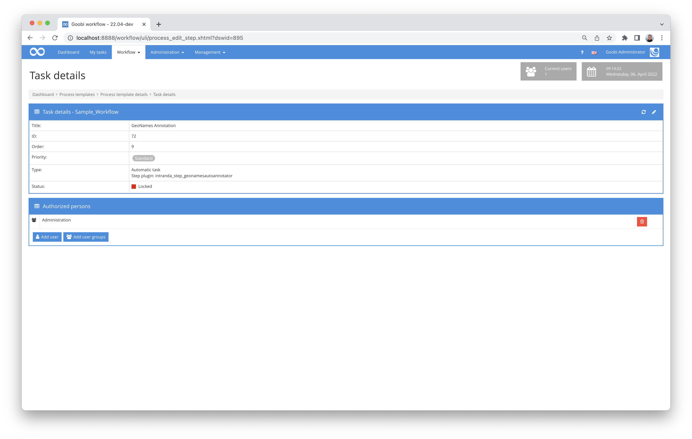

# Geonames Annotation

## Overview

Name                     | Wert
-------------------------|-----------
Identifier               | intranda_step_geonamesautoannotator
Repository               | [https://github.com/intranda/goobi-plugin-step-geonames-auto-annotator](https://github.com/intranda/goobi-plugin-step-geonames-auto-annotator)
Licence              | GPL 2.0 or newer 
Last change    | 25.07.2024 11:58:33


## Introduction
This step plugin for Goobi workflow automatically annotates existing "location" NER tags in ALTO files with GeoNames URLs. The first hit of the search query is always taken. It is therefore recommended to check and correct the results again.


## Installation
The plugin consists of the following files:

```bash
goobi_plugin_step_geonamesautoannotator-base.jar
plugin_intranda_step_geonamesautoannotator.xml
```

The file `goobi_plugin_step_geonamesautoannotator-base.jar` must be installed in the correct directory so that it is available at the following path after installation:

```bash
/opt/digiverso/goobi/plugins/step/plugin_intranda_step_geonamesautoannotator-base.jar
```

In addition, there is a configuration file that must be located in the following place:

```bash
/opt/digiverso/goobi/config/plugin_intranda_step_geonamesautoannotator.xml
```


## Overview and functionality
This plugin is integrated into the workflow in such a way that it is executed automatically. Manual interaction with the plugin is not necessary. For use within a workflow step, it should be configured as shown in the screenshot below.



The plugin searches the GeoNames database for all `location` NER tags. If one or more search hits are returned, the first search hit in the list is transferred to the ALTO.


## Configuration
The configuration of the plugin is done via the configuration file `plugin_intranda_step_geonamesautoannotator.xml` and can be adjusted during operation. The following is an example configuration file:

```xml
<?xml version="1.0" encoding="UTF-8"?>
<config_plugin>
    <!--
        order of configuration is:
          1.) project name and step name matches
          2.) step name matches and project is *
          3.) project name matches and step name is *
          4.) project name and step name are *
	-->

    <config>
        <!-- which projects to use for (can be more then one, otherwise use *) -->
        <project>*</project>
        <step>*</step>

        <!-- geonames account -->
        <geonamesAccount>testuser</geonamesAccount>
        <!-- geonames API URL - if you have a paid plan, use http://ws.geonames.net here -->
        <geonamesApiUrl>http://api.geonames.org</geonamesApiUrl>
    </config>

</config_plugin>
```

| Parameter | Explanation |
| :--- | :--- |
| `project` | This parameter determines the project for which the current block `<config>` is to apply. The name of the project is used here. This parameter can occur several times per `<config>` block. |
| `step` | This parameter controls for which workflow steps the block `<config>` is to apply. The name of the step is used here. This parameter can occur several times per `<config>` block. |
| `geonamesAccount` | This parameter defines the account name for GeoNames access.  |
| `geonamesApiUrl` | The URL for accessing the GeoNames API is set here.  |

It is recommended to purchase a higher quota from geonames for the operation of the plugin. If this has been done, the `geonamesApiUrl` must be changed to `http://ws.geonames.net`.