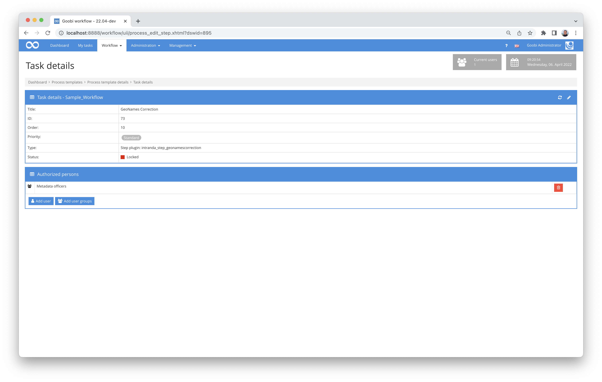

# GeoNames Correction

## Overview

Name                     | Wert
-------------------------|-----------
Identifier               | intranda_step_geonamescorrection
Repository               | [https://github.com/intranda/goobi-plugin-step-geonames-correction](https://github.com/intranda/goobi-plugin-step-geonames-correction)
Licence              | GPL 2.0 or newer 
Last change    | 25.07.2024 11:58:21


## Introduction
This Step Plugin for Goobi workflow allows the annotation with - respectively correction of - previously automatically created GeoNames identifiers in ALTO OCR results. For this purpose, the NER results annotated within ALTO with the type 'location' are displayed in a table. If automatically generated GeoNames identifiers are already present in the ALTO file, they are visualised on a map.


## Installation
Das Plugin besteht aus folgenden Dateien:

```bash
goobi_plugin_step_geonamescorrection-base.jar
goobi_plugin_step_geonamescorrection_GUI-base.jar
plugin_intranda_step_geonamescorrection.xml
```

These jar files must be installed in the correct directories so that they are available at the following path after installation:

```bash
/opt/digiverso/goobi/plugins/step/plugin_intranda_step_geonamescorrection-base.jar
/opt/digiverso/goobi/plugins/GUI/plugin_intranda_step_geonamescorrection-gui.jar
```

In addition, there is a configuration file that must be located in the following place:

```bash
/opt/digiverso/goobi/config/plugin_intranda_step_geonamescorrection.xml
```


## Overview and functionality
To put the plugin into operation, it must be activated for one or more desired tasks in the workflow. This is done as shown in the following screenshot by selecting the plugin `intranda_step_geonamescorrection` from the list of installed plugins.



After entering the plug-in, all named entities of the type `location` found are displayed in a table on the left. If GeoNames URLs with NER tags are already stored in the OCR results, they are visualised on a map on the right half of the screen.


By clicking on one of the markers in the map, the corresponding entry in the table can be marked and by clicking on an entry in the table, it is zoomed in on the map. A click outside the table and the map zooms out again and all markers are displayed.

Entries can be deleted by clicking on the delete icon and edited by clicking on the edit icon. This opens a new input mask on the left.


The search results for the term are displayed in a new table. The user can also change the search term in the input slot at the very top and initiate a new search by clicking on `Search`.  
To adopt a GeoNames identifier, the corresponding icon (one tick) must be clicked. The button with two ticks, on the other hand, adopts this identifier for all identical terms in the entire work.

By clicking on `Save` or `Save and exit` at the bottom right, the adapted GeoNames identifiers are written into the ALTO files. `Save and exit` also exits the plugin.


## Configuration
The configuration of the plug-in is done via the configuration file `plugin_intranda_step_ark.xml` and can be adjusted during operation. The following is an example configuration file:

```xml
<?xml version="1.0" encoding="UTF-8"?>
<config_plugin>
    <!--
        order of configuration is:
          1.) project name and step name matches
          2.) step name matches and project is *
          3.) project name matches and step name is *
          4.) project name and step name are *
	-->

    <config>
        <!-- which projects to use for (can be more then one, otherwise use *) -->
        <project>*</project>
        <step>*</step>

        <!-- geonames account -->
        <geonamesAccount>testuser</geonamesAccount>
        <!-- geonames API URL - if you have a paid plan, use http://ws.geonames.net here -->
        <geonamesApiUrl>http://api.geonames.org</geonamesApiUrl>
    </config>

</config_plugin>
```

| Parameter | Explanation |
| :--- | :--- |
| `project` | This parameter determines the project for which the current block `<config>` is to apply. The name of the project is used here. This parameter can occur several times per `<config>` block. |
| `step` | This parameter controls for which workflow steps the block `<config>` is to apply. The name of the step is used here. This parameter can occur several times per `<config>` block. |
| `geonamesAccount` | This parameter defines the account name for GeoNames access.  |
| `geonamesApiUrl` | The URL for accessing the GeoNames API is set here.  |

It is recommended to purchase a higher quota from geonames for the operation of the plugin. If this has been done, the `geonamesApiUrl` must be changed to `http://ws.geonames.net`.