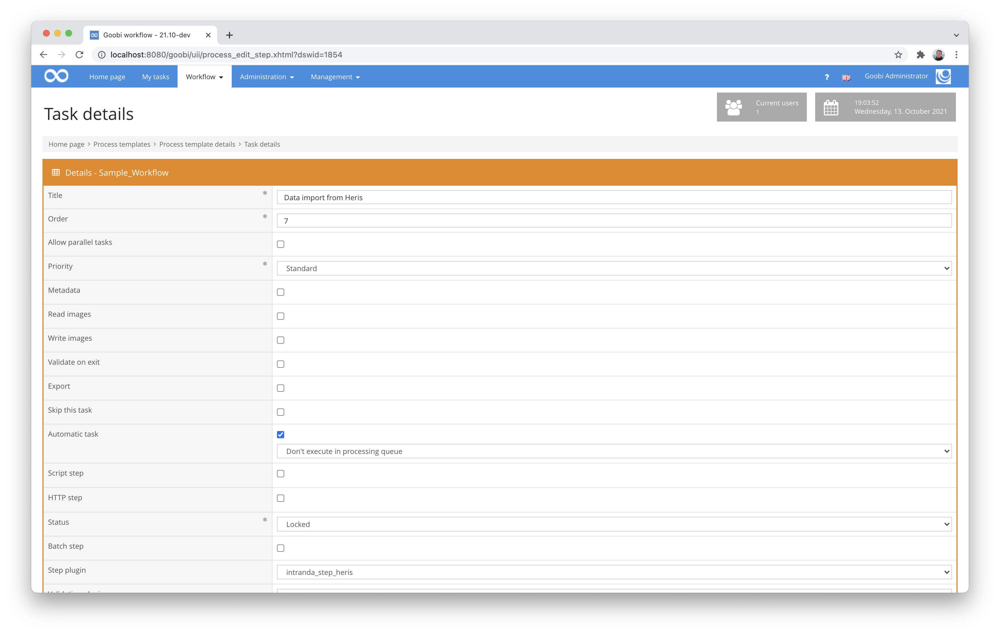

# Heris data import

## Overview

Name                     | Wert
-------------------------|-----------
Identifier               | intranda_step_herisimport
Repository               | [https://github.com/intranda/goobi-plugin-step-heris](https://github.com/intranda/goobi-plugin-step-heris)
Licence              | GPL 2.0 or newer 
Last change    | 07.09.2024 14:17:33


## Introduction
This plugin allows the data transfer of multiple metadata from a vocabulary into METS files. It was developed specifically for the Federal Monuments Office in Austria, so the metadata of the vocabulary are very individual and hard-coded. They originally come from the so-called HERIS database, which was imported within Goobi workflow as its own vocabulary.


## Installation
The plugin consists in total of the following files to be installed:

```bash
goobi_plugin_step_herisimport-base.jar
```

This file must be installed in the following directory:

```bash
/opt/digiverso/goobi/plugins/step/goobi_plugin_step_herisimport-base.jar
```


## Overview and functionality
To put the plugin into operation, it must be activated for one or more desired tasks in the workflow. This is done as shown in the following screenshot by selecting the plugin `intranda_step_herisimport` from the list of installed plugins.



Since this plugin should usually be executed automatically, the workflow step should be configured as `automatic`.

Once the plugin has been fully installed and set up, it is usually run automatically within the workflow, so there is no manual interaction with the user. Instead, calling the plugin through the workflow in the background does the following: 

The plugin searches the METS file for a metadata with the name `HerisID` and subsequently imports a list of various metadata from the Heris vocabulary. The mapping of the metadata includes the following list:

Metadata Heris                                 | Metadata METS
-----------------------------------------------|------------------------
`Alte Objekt-ID`                               | `DMDBID`
`Gehört zu alter Objekt-ID`                    | `ParentElement`
`Katalogtitel`                                 | `TitleDocMain`
`Typ`                                          | `HerisType`
`Hauptkategorie grob`                          | `MainCategory1`
`Hauptkategorie mittel`                        | `MainCategory2`
`Hauptkategorie fein`                          | `MainCategory3`
`Gemeinden politisch (lt. Katastralgemeinden)` | `PoliticalCommunity`
`Katastralgemeinde`                            | `CadastralCommune`
`Bezirk`                                       | `PoliticalDistrict`
`Bundesland`                                   | `FederalState`
`Grundstücksnummern`                           | `PropertyNumber`
`Bauzeit von`                                  | `ConstructionTimeFrom`
`Bauzeit bis`                                  | `ConstructionTimeTo`
`Publiziert`                                   | `Published`
`Straße`                                       | `Street`
`Hausnummer`                                   | `StreetNumber`
`PLZ`                                          | `ZIPCode`
`Zusatztext aus Adresse`                       | `AdditionalAddressText`
`Weitere Adressen`                             | `OtherAddress`
`Gehört zu HERIS-ID`                           | `ParentElement`
`Ort`                                          | `Community`
`Staat`                                        | `Country`


## Configuration
There is no independent configuration of the plugin, as the metadata to be imported has been hard-coded.