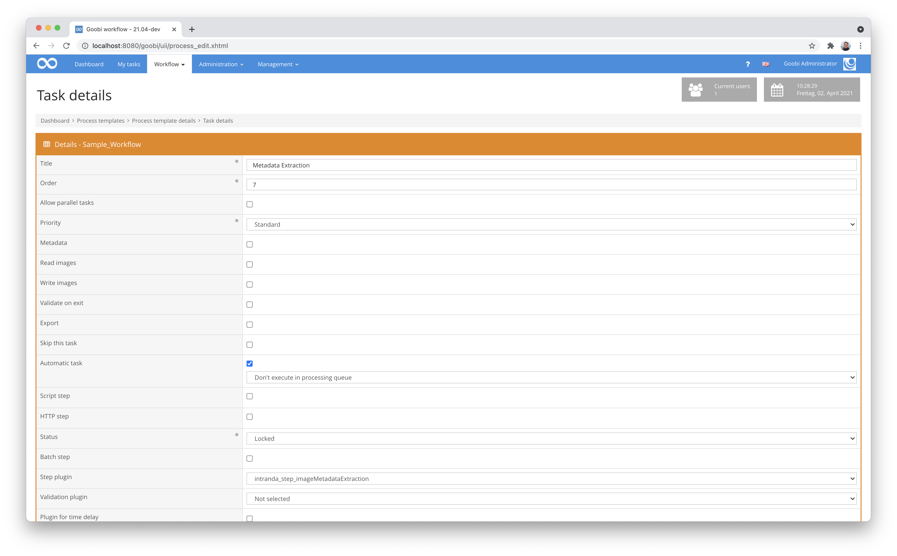

# Extraction of image metadata

## Overview

Name                     | Wert
-------------------------|-----------
Identifier               | intranda_step_imageMetadataExtraction
Repository               | [https://github.com/intranda/goobi-plugin-step-image-metadata-extraction](https://github.com/intranda/goobi-plugin-step-image-metadata-extraction)
Licence              | GPL 2.0 or newer 
Last change    | 25.07.2024 11:58:06


## Introduction
With the help of this plugin, metadata can be extracted from image files and stored within Goobi's METS files. Here, a use of the Linux programme ExifTool takes place in the background in order to transfer its read image metadata according to individual configuration.


## Installation
To install the plugin, the following file must be installed:

```xml
/opt/digiverso/goobi/plugins/step/plugin_intranda_step_imageMetadataExtraction-base.jar
```

To configure how the plugin should behave, various parameters can be adjusted within the configuration file. The configuration file is usually located under the following path:

```xml
/opt/digiverso/goobi/config/plugin_intranda_step_imageMetadataExtraction.xml
```

## Overview and functionality
To put the plugin into operation, it must be activated in a task in the workflow. This is done by selecting the plugin `intranda_step_imageMetadataExtraction` from the list of installed plugins. Since the plugin relies on a METS/MODS file, the step should take place after the metadata edition.



Once the plugin has been fully installed and set up, it is usually run automatically within the workflow, so there is no manual interaction with the user. Instead, the workflow calls the plugin in the background and automatically performs the extraction of the image metadata. This is done by opening the first image file from the media directory of the Goobi process, reading its metadata and storing it on the top logical level of the METS file as the configured metadata.


## Configuration 
The configuration of the plugin is structured as follows:

```xml
<config_plugin>

    <config>
        <!-- which projects to use for (can be more then one, otherwise use *) -->
        <project>*</project>
        <step>*</step>

        <command>/usr/bin/exiftool</command>
        <field line="Object Name" metadata="TitleDocMain" />
        <field line="Keywords" metadata="SubjectTopic" />
        <field line="Special Instructions" metadata="Footnote" />
        <field line="City" metadata="PlaceOfPublication" />
        <field line="Source" metadata="singleDigCollection" />
        <field line="Copyright Notice" metadata="AccessCondition" />
        <field line="Caption-Abstract" metadata="Abstract" />
    </config>

</config_plugin>
```

The block `<config>` can occur repeatedly for different projects or workflow steps in order to be able to perform different actions within different workflows. The other parameters within this configuration file have the following meanings:

| Value | Description |
| :--- | :--- |
| `project` | This parameter determines for which project the current block `<config>` should apply. The name of the project is used here. This parameter can occur several times per `<config>` block. |
| `step` | This parameter controls for which workflow steps the block `<config>` should apply. The name of the work step is used here. This parameter can occur several times per `<config>` block. |
| `command` | Within this parameter, the path to the programme 'ExifTool' is specified. This is a programme installed on the server that can read the metadata from image files. |
| `field` | For each desired metadata to be read out per image, a `field` can be given in each case, consisting of the attributes `line` and `metadata`. |

The definition of fields is done with the following parameters:

| Value | Description |
| :--- | :--- |
| `line` | This parameter defines the name of the metadata within the result of ExifTool. Enter here accordingly the name how the metadata is present within the image. |
| `metadata` | This parameter determines under which metadata type the content of the read metatum is stored in the METS file. The internal name of the metadata type as defined in the corresponding rule set is used. It should be noted here that the metadata are always stored at the level of the highest logical structural element (e.g. a monograph) and not at subordinate logical or physical elements. |