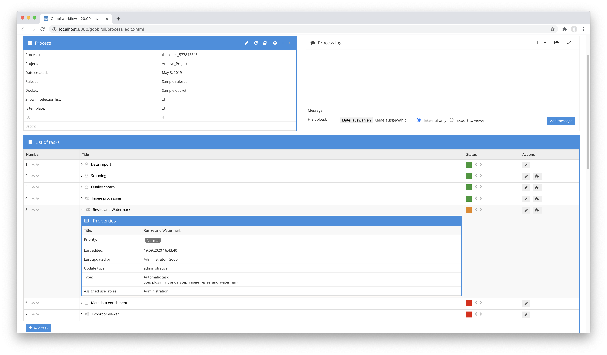

# Image scaling and watermarking

## Overview

Name                     | Wert
-------------------------|-----------
Identifier               | intranda_step_image_resize_and_watermark
Repository               | [https://github.com/intranda/goobi-plugin-step-image-resize-and-watermark](https://github.com/intranda/goobi-plugin-step-image-resize-and-watermark)
Licence              | GPL 2.0 or newer 
Last change    | 25.07.2024 11:57:55


## Introduction
This plugin allows you to scale images to a maximum size and then render watermarks into the previously scaled images. The maximum size and the watermark to be rendered can be configured flexibly.


## Installation
To install the plugin, the following file must be installed:

```bash
/opt/digiverso/goobi/plugins/step/plugin_intranda_step_image_resize_and_watermark-base.jar
```

A configuration file is also required to run the plugin correctly:

```bash
/opt/digiverso/goobi/config/plugin_intranda_step_image_resize_and_watermark.xml
```

Furthermore, a successful installation of the following two packages is also required on the system:

```bash
ImageMagick
GraphicsMagick
```

Both packages are included in common package managers and can be easily installed from them.


## Overview and functionality
To use the plug-in, it must be activated for one or more desired tasks in the workflow. This is done by selecting the plugin `intranda_step_image_resize_and_watermark` from the list of installed plugins.



After running the plugin the images have the expected size and have the configured watermark.


## Configuration
The configuration of the plugin allows you to define the maximum size of the images and the watermark (images and text watermarks are supported). Also the positioning of the watermark can be defined individually. Several configurations are possible for this purpose, which are differentiated by the project, the name for the work step within the workflow, the digital collection as well as a media type (special metadata within the METS file of the respective process). When the plugin is executed, the first configuration that matches the currently processed task is used.

Please note that the correct paths for GraphicMagick and ImageMagick must also be specified at the top of the configuration.

An example configuration for the file `plugin_intranda_step_image_resize_and_watermark.xml` looks like this:

```xml
<config_plugin>
    <!-- path to GraphicsMagick -->
    <gmPath>/usr/bin/gm</gmPath>
    <!-- path to ImageMagick -->
    <convertPath>/usr/bin/convert</convertPath>
    <!--
        order of configuration is:
          1.) project name and step name matches
          2.) step name matches and project is *
          3.) project name matches and step name is *
          4.) project name and step name are *
    -->
    <config>
        <!-- which projects to use for (can be more than one, otherwise use *) -->
        <project>*</project>
        <step>*</step>

        <!-- the source directory from which the images will be taken -->
        <sourceDir>cropped</sourceDir>
        <!-- the destination directory where the scaled and watermarked images will reside -->
        <destDir>media</destDir>

        <!-- only use this block with processes in collection "mycollection"
             and with mediaType "book" -->
        <imageConfig collection="mycollection" mediaType="book">
            <!-- The maximum size of the longest side of an image -->
            <resizeTo>1500</resizeTo>
            <!-- The watermark configuration -->
            <watermark>
                <!-- the image to use for watermarking -->
                <image>/opt/digiverso/goobi/xslt/logo.png</image>
                <!-- define the shade size here -->
                <shadeSize>240x40</shadeSize>
                <!-- the location of the watermark. Possible values: north,
                     northeast, east, southeast, south, southwest,
                     west, northwest -->
                <location>southeast</location>
                <!-- these are the distances to the edges on the x- resp. y-axis -->
                <xDistance>100</xDistance>
                <yDistance>100</yDistance>
            </watermark>
        </imageConfig>

        <!-- use this block with processes in collection "myothercollection"
             and any mediaType -->
        <imageConfig collection="myothercollection" mediaType="*">
            <resizeTo>1500</resizeTo>
            <watermark>
                <!-- you can also use a text-only watermark. -->
                <text>My watermark text</text>
                <!-- define the shade size here -->
                <shadeSize>240x40</shadeSize>
                <!-- define the size of the box for the text -->
                <boxSize>450x200</boxSize>
                <!-- font to use for the text rendering -->
                <font>Open-Sans</font>
                <location>southeast</location>
                <xDistance>600</xDistance>
                <yDistance>100</yDistance>
            </watermark>
        </imageConfig>

    </config>
</config_plugin>
```

The block `<config>` can occur repeatedly for different projects or workflow steps in order to be able to carry out different actions within different workflows. The other parameters within this configuration file have the following meanings:

| Value | Description |
| :--- | :--- |
| `gmPath` | Path to install GraphicsMagick |
| `convertPath` | Path to install ImageMagick |
| `project` | This parameter defines the project for which the current block `<config>` is to apply. The name of the project is used here. This parameter can occur several times per `<config>` block. |
| `step` | This parameter controls for which work steps the block `<config>` is to apply. The name of the work step is used here. This parameter can occur several times per `<config>` block. |
| `sourceDir` | Path to the directory to be used as the source directory. |
| `destDir` | Path to the directory in which the scaled and watermarked images are to be saved. |
| `mediaType` | Restriction to operations whose metadata of type `Type` corresponds to the configured value. Alternatively, `*` can be used to make no restriction. |
| `collection` | Restriction to the operations that belong to a selected digital collection. |
| `resizeTo` | Maximum size of the image on the longest side. Specified in pixels. |
| `watermark/image` | Path to an image to be used within the watermark. |
| `watermark/shadeSize` | Define here which size specification should be used as shade. |
| `watermark/text` | Text to be used within the watermark. |
| `watermark/font` | Specify here which font should be used for the text. This font must be installed on the system. |
| `watermark/boxSize` | Define here what dimensions the box should have within which the text is to be rendered. This thus determines the size of the displayed font. |
| `watermark/location` | Determines where within the image the watermark should be rendered. Possible specifications are `north`, `northeast`, `east`, `southeast`, `south`, `southwest`, `west`, `northwest` |
| `watermark/xDistance` | Lateral distance of the watermark |
| `watermark/yDistance` | Distance of the watermark up or down |