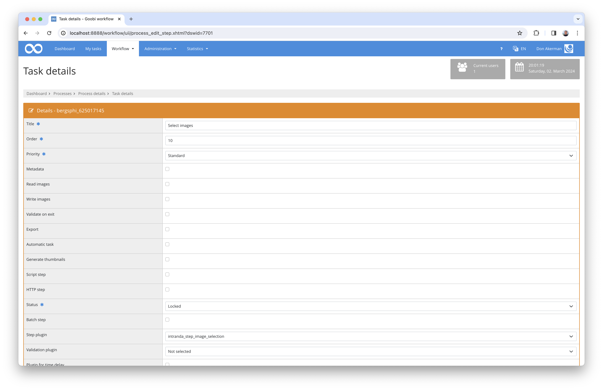

# Selection of images

## Overview

Name                     | Wert
-------------------------|-----------
Identifier               | intranda_step_image_selection
Repository               | [https://github.com/intranda/goobi-plugin-step-image-selection](https://github.com/intranda/goobi-plugin-step-image-selection)
Licence              | GPL 2.0 or newer 
Last change    | 25.07.2024 11:57:45


## Introduction
This plugin is used for the visual selection of images. It allows you to select, deselect and sort the selected images using drag & drop.


## Installation
To use the plugin, these two files must be copied to the following locations: ​

```bash
/opt/digiverso/goobi/plugins/step/plugin_intranda_step_image_selection-base.jar
/opt/digiverso/goobi/plugins/GUI/plugin_intranda_step_image_selection-gui.jar
```

​The configuration of the plugin takes place within its configuration file `plugin_intranda_step_image_selection.xml`. It is expected to be located under the following path: ​

```bash
/opt/digiverso/goobi/config/plugin_intranda_step_image_selection.xml
```

## Overview and functionality
​To put the plugin into operation, it must be configured for one or more desired tasks in the workflow. This is done as shown in the following screenshot by selecting the `intranda_step_image_selection` plugin from the list of installed plugins. ​​



The plugin displays some images from the configured folder in the left-hand area. If you scroll down within the area, more images are loaded if there are more images available. If the mouse pointer is positioned over an image, an enlarged view of the image is displayed, which can be used to check the details of the image.

Images can be selected from the left-hand area using drag & drop. If the relative position for dropping is detected correctly, the newly selected image is inserted there, otherwise it is appended at the end. The selected images can be reorganised using drag & drop.

If the configured maximum number of selected images is reached or if an attempt is made to select the same image multiple times, the selection will not work.

Selected images can be deselected again using drag & drop. Simply drag the image from the right-hand box and drop it in the left-hand box. 

The relative position of a selected image can be swapped with its neighbour by clicking on the top or bottom half of the image. There are two exceptions without swapping: if you click on the top half of the first selected image, it will be appended to the end of the list; if you click on the bottom half of the last image, it will be moved to the beginning of the list. To move a selected image to the top of the list, you can also right-click on this image.

Please note that the save button must be clicked in order to save the information of the selected images within the process properties. 


## Configuration 
The configuration of the plugin is structured as follows: ​

```xml
<config_plugin>
    <!--
        order of configuration is:
          1.) project name and step name matches
          2.) step name matches and project is *
          3.) project name matches and step name is *
          4.) project name and step name are *
    -->
    
    <config>
        <!-- which projects to use for (can be more then one, otherwise use *) -->
        <project>*</project>
        <step>*</step>
        
        <!-- define how many images shall be loaded in the beginning, DEFAULT 20 -->
        <defaultNumberToLoad>20</defaultNumberToLoad>
        
        <!-- define how many more images shall be loaded when the window is scrolled to the bottom, DEFAULT 10 -->
        <defaultNumberToAdd>10</defaultNumberToAdd>
        
        <!-- define which folder shall be used to display the thumbnails, possible values are master | main | jpeg | source | ... -->
        <folder>main</folder>
        
        <!-- define how many images shall be selected as maximum, DEFAULT 5 -->
        <!-- if smaller than min, then no selection is permitted -->
        <max>5</max>
        
        <!-- define how many images shall be selected as minimum, DEFAULT 1 -->
        <!-- if greater than max, then no selection is permitted -->
        <min>0</min>
        
        <!-- display button to finish the task directly from within the entered plugin -->
        <allowTaskFinishButtons>true</allowTaskFinishButtons>
    </config>

</config_plugin>
```

The parameters within this configuration file have the following meanings: ​

| Value | Description |
| :--- | :--- |
| `defaultNumberToLoad` | With this parameter you can define how many images shall be loaded in the beginning. Default `20`. |
| `defaultNumberToAdd` | With this parameter you can define how many more images shall be loaded when scrolled to the bottom. Default `10`. |
| `folder` | Specify here the configured name of the folder from which the images are to be displayed. Possible values are `master`, `main`, `jpeg`, `source` etc. as long as they are correctly configured. |
| `max` | Here you can define the maximum number of thumbnails that could be selected. |
| `min` | Here you can define the minimum number of thumbnails that should be selected in order to save as a process property. |
| `allowTaskFinishButtons` | With this parameter you can define whether or not to enable the button to finish the task directly. |