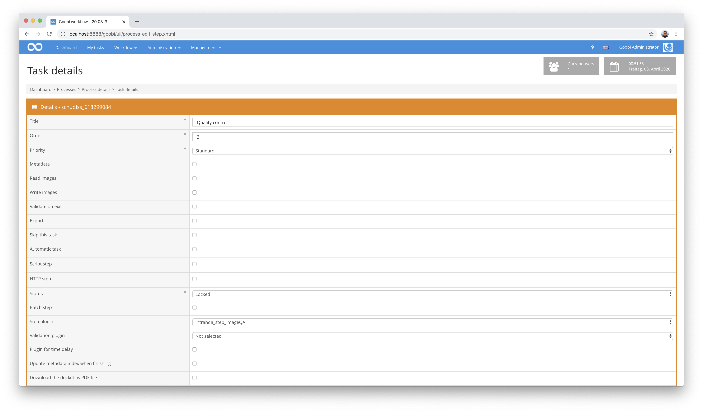
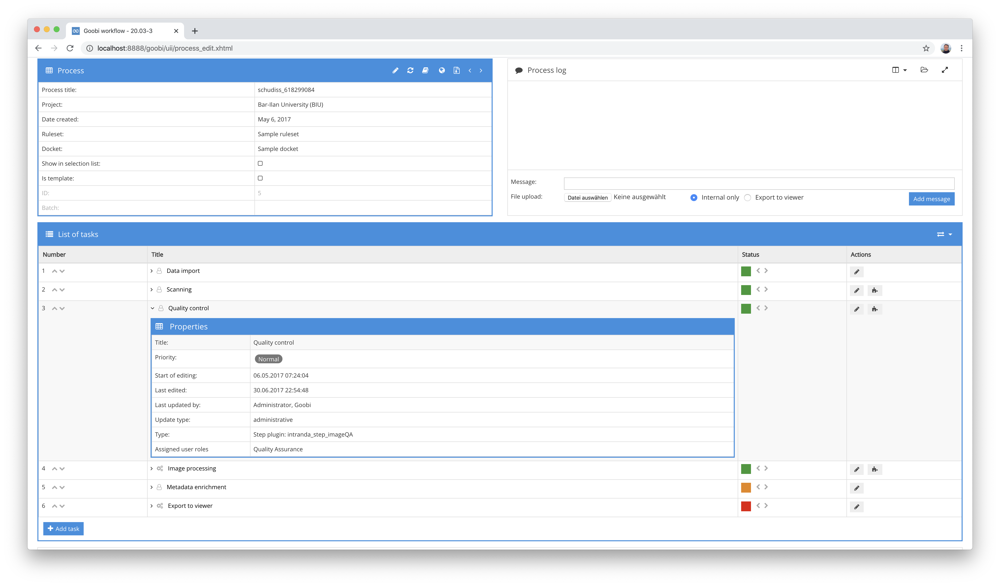
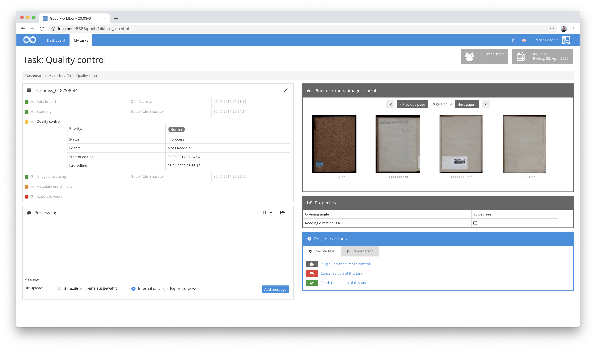

# Quality control of images

## Overview

Name                     | Wert
-------------------------|-----------
Identifier               | intranda_step_imageQA
Repository               | [https://github.com/intranda/goobi-plugin-step-imageqa](https://github.com/intranda/goobi-plugin-step-imageqa)
Licence              | GPL 2.0 or newer 
Last change    | 25.07.2024 11:57:29


## Introduction
This plugin is used to visually check the quality of images. It allows different views of images as thumbnails, in large display or even in full screen mode. In addition, the full text of the image can be displayed and various functions for download or image manipulation can be activated. ​


## Installation
To use the plugin, these two files must be copied to the following locations: ​

```bash
/opt/digiverso/goobi/plugins/step/plugin_intranda_step_imageQA-base.jar
/opt/digiverso/goobi/plugins/GUI/plugin_intranda_step_imageQA-gui.jar
```

The configuration of the plugin takes place within its configuration file `plugin_intranda_step_imageQA.xml`. It is expected to be located under the following path: ​

```bash
/opt/digiverso/goobi/config/plugin_intranda_step_imageQA.xml
```

## Overview and functionality
​To put the plugin into operation, it must be activated for one or more desired tasks in the workflow. This is done as shown in the following screenshot by selecting the `intranda_step_imageQA` plugin from the list of installed plugins. ​​





After the plugin has been completely installed and set up, it will be available for the users of the corresponding tasks. After entering a task, depending on the configuration, some images may be displayed immediately. ​



If you now enter the plugin by clicking on `Plugin: intranda image control`, you will see the full display, which includes both thumbnails and a large image display. 


Here you can select the desired images to be viewed in higher quality. The large image on the right can be zoomed and rotated for display. You can navigate between the images using the same shortcut keys as in the METS editor in Goobi workflow. ​

Images can also be displayed in a full-screen view for a larger view. In both the regular image display and the full-screen display, the associated full text can also be shown, provided that this has been generated in advance using OCR. ​


Besides the pure image display, the plugin can also handle other object types. For example, it is possible to display 3D objects, which can also be rotated and enlarged for display using additional navigation buttons. ​
Depending on the individual configuration, the plugin allows many more functions, which are mostly visible within the thumbnail display. If these functions have been configured in the configuration file described above, they can be used, for example, for downloading PDF files, image files, rotations, flippings, deletions and other operations. ​


## Configuration
The configuration of the plugin is structured as follows: ​
```xml
<config_plugin>
    <!--
        order of configuration is:
          1.) project name and step name matches
          2.) step name matches and project is *
          3.) project name matches and step name is *
          4.) project name and step name are *
-->
    <config>
        <!-- define plugin type in which screen the plugin is displayed, allowed values are 'part', 'full' (default) or 'both' -->
        <guiType>full</guiType>
        <!-- which projects to use for (can be more then one, otherwise use *) -->
        <project>*</project>
        <step>*</step>
        <!-- which images to use , possible values are master|main|jpeg|source|... -->
        <foldername>master</foldername>
        <!-- how to display the thumbnails -->
        <numberOfImagesPerPage>12</numberOfImagesPerPage>
        <thumbnailsize>200</thumbnailsize>
        <!-- number of thumbnails in preview area, default value is 8 -->
        <numberOfImagesInPartGUI>8</numberOfImagesInPartGUI>
        <!-- which image sizes to use for the big image -->
        <thumbnailFormat>jpg</thumbnailFormat>
        <mainImageFormat>jpg</mainImageFormat>
        <!-- use the high speed JavaScript fullscreen view -->
        <useJSFullscreen>false</useJSFullscreen>
​
        <imagesize>800</imagesize>
        <imagesize>1800</imagesize>
        <imagesize>3000</imagesize>
        <tileSize>256</tileSize>
        <scaleFactors>1</scaleFactors>
        <scaleFactors>32</scaleFactors>
        <useTiles>false</useTiles>
        <useTilesFullscreen>true</useTilesFullscreen>
        <noShortcutPrefix>false</noShortcutPrefix>
        <thumbnailsOnly>false</thumbnailsOnly>
​
        <!-- allow deletion of images -->
        <allowDeletion>false</allowDeletion>
        <deletion command="/opt/digiverso/goobi/scripts/deleteImage.sh|IMAGE_FOLDER|IMAGE_FILE"/>
        <!-- allow rotation of images -->
        <allowRotation>false</allowRotation>
        <rotationCommands>
            <left command="/usr/bin/mogrify|-rotate|-90|IMAGE_FILE" />
            <right command="/usr/bin/mogrify|-rotate|90|IMAGE_FILE" />
        </rotationCommands>
        <!-- allow flipping of images -->
        <allowFlipping>true</allowFlipping>
        <flippingCommands>
            <horizontal command="/usr/bin/mogrify|-flop|IMAGE_FILE" />
            <vertical command="/usr/bin/mogrify|-flip|IMAGE_FILE" />
        </flippingCommands>
        <!-- allow renaming of images -->
        <allowRenaming>false</allowRenaming>
        <!-- allow selection of images -->
        <allowSelection>false</allowSelection>
        <allowSelectionPage>false</allowSelectionPage>
        <allowSelectionAll>false</allowSelectionAll>
        <allowDownload>false</allowDownload>
        <allowDownloadAsPdf>false</allowDownloadAsPdf>
        <!-- allow the user to finish the task directly out of the plugin -->
        <allowTaskFinishButtons>true</allowTaskFinishButtons>
        <!-- configure button to display ocr -->
        <displayocr>true</displayocr>
    </config>
​
    <config>
        <!-- which projects to use for (can be more then one, otherwise use *) -->
        <project>My special project</project>
        <project>Archive_Project</project>
        <step>MasterQA</step>
        <step>DerivateQA</step>
        <!-- which images to use -->
        <foldername>master</foldername>
        <foldername>main</foldername>
        <!-- how to display the thumbnails -->
        <numberOfImagesPerPage>12</numberOfImagesPerPage>
        <thumbnailsize>200</thumbnailsize>
        <!-- which image sizes to use for the big image -->
        <imagesize>800</imagesize>
        <imagesize>3000</imagesize>
        <!-- allow deletion of images -->
        <allowDeletion>false</allowDeletion>
        <deletion command="/opt/digiverso/goobi/scripts/deleteImage.sh|IMAGE_FOLDER|IMAGE_FILE"/>
        <!-- allow rotation of images -->
        <allowRotation>false</allowRotation>
        <rotationCommands>
            <left command="/usr/bin/mogrify|-rotate|-90|IMAGE_FILE" />
            <right command="/usr/bin/mogrify|-rotate|90|IMAGE_FILE" />
        </rotationCommands>
        <!-- allow flipping of images -->
        <allowFlipping>true</allowFlipping>
        <flippingCommands>
            <horizontal command="/usr/bin/mogrify|-flop|IMAGE_FILE" />
            <vertical command="/usr/bin/mogrify|-flip|IMAGE_FILE" />
        </flippingCommands>
        <!-- allow renaming of images -->
        <allowRenaming>false</allowRenaming>
        <!-- allow selection of images -->
        <allowSelection>false</allowSelection>
        <allowDownload>false</allowDownload>
        <allowDownloadAsPdf>false</allowDownloadAsPdf>
        <!-- allow the user to finish the task directly out of the plugin -->
        <allowTaskFinishButtons>false</allowTaskFinishButtons>
        <displayocr>true</displayocr>
    </config>
​
    <config>
        <project>*</project>
        <step>ImageQA</step>
        <foldername>master</foldername>
        <!-- how to display the thumbnails -->
        <numberOfImagesPerPage>12</numberOfImagesPerPage>
        <thumbnailsize>200</thumbnailsize>
        <!-- which image sizes to use for the big image -->
        <imagesize>800</imagesize>
        <imagesize>3000</imagesize>
​
        <!-- allow renaming of images -->
        <allowRenaming>false</allowRenaming>
        <renamingPattern>
            <field defaultValue="${process:Archive}"></field>
            <field defaultValue="${process:Object}"></field>
            <field defaultValue="1" number="true" format="0000"></field>
        </renamingPattern>
        <displayocr>true</displayocr>
​
    </config>
​
</config_plugin>
```

The parameters within this configuration file have the following meanings: ​

| Value | Description |
| :--- | :--- |
| `guiType` | With this parameter you can define how the user interface should behave. Possible values are `part`, `full` and `both`. |
| `project` | This parameter determines for which project the current block `<config>` is to apply. The name of the project is used here. This parameter can occur several times per `<config>` block. |
| `step` | This parameter controls for which work steps the block &lt;config&gt; should apply. The name of the work step is used here. This parameter can occur several times per `<config>` block. |
| `foldername` | Specify here the directory from which the images are to be displayed. If several directories are used in the repeatable parameter, the user can choose between these directories. Possible values for this are e.g. `master`, `media` or also individual folders such as `photos` and `scans`. |
| `numberOfImagesPerPage` | Here you can define how many thumbnails should be displayed simultaneously in the regular display. |
| `thumbnailsize` | This allows you to specify the size of the thumbnails to be displayed. |
| `numberOfImagesInPartGUI` | With this parameter you can define how many thumbnails should be displayed within the accepted task. |
| `thumbnailFormat` | Here you define the file format for displaying the thumbnails. |
| `mainImageFormat` | Define the file format for displaying the large image here. |
| `imagesize` | With this parameter, which can be repeated, the individual zoom levels of the images can be defined. The more levels are defined, the more often a higher resolution version of the image is generated and loaded when zooming the image. |
| `tileSize` | This parameter defines the size of the tiles for a tiled display of the images. |
| `useTilesFullscreen` | Specify here whether a display based on tiles should also be shown within the full screen display. |
| `allowDeletion` | This parameter can be used to allow deletion of individual images. |
| `deletionCommand` | This sets the command for the delete operation. This can, among other things, allow images to be moved to other directories instead of actually being deleted. |
| `allowRotation` | When this function is activated, the displayed images may be rotated in 90 degree increments. |
| `rotationCommands` | This allows you to specify which command line calls should be used to rotate the images. |
| `allowRenaming` | With this parameter a functionality for the specific naming of image files can be activated. |
| `allowSelection` | With this parameter one checkbox per image can be activated, which allows an individual selection of each image. |
| `allowSelectionPage` | This parameter allows you to specify whether a button for selecting all images on the current page should be displayed. |
| `allowSelectionAll` | This parameter allows you to specify whether a button for selecting all images should be displayed. |
| `allowDownload` | Here you can determine whether a download of the selected pages within a zip file should be allowed. |
| `allowDownloadAsPdf` | Here you can determine whether a download of the selected pages as one large PDF file should be allowed. |
| `allowTaskFinishButtons` | This parameter can be used to enable buttons to complete the task to be displayed in the regular plugin interface, so that the plugin does not have to be exited first. |
| `displayocr` | Here you can determine whether the button for displaying full text results should be activated. |
| `useJSFullscreen` | This parameter can be used to specify that the full screen display is to be done using JavaScript alone. This display is much more performant, but does not allow the full text to be displayed parallel to the image. |
| `allowFlipping` | If this function is activated, the displayed images may be mirrored horizontally and vertically
| `flippingCommands` | This allows you to specify which command line calls should be used to mirror the images.