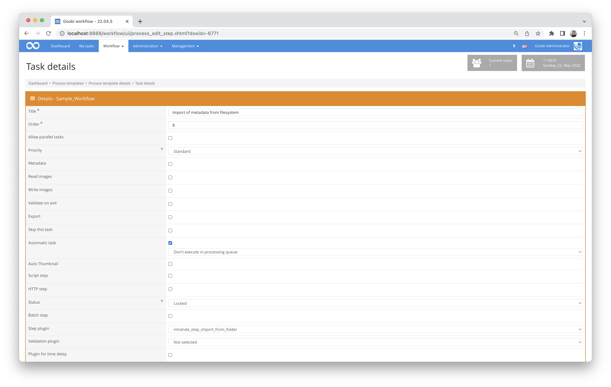

# Metadata transfer from a directory

## Overview

Name                     | Wert
-------------------------|-----------
Identifier               | intranda_step_folderimport
Repository               | [https://github.com/intranda/goobi-plugin-step-import-from-folder](https://github.com/intranda/goobi-plugin-step-import-from-folder)
Licence              | GPL 2.0 or newer 
Last change    | 25.07.2024 11:57:21


## Introduction
This plugin allows an automatic import of image files, as well as the creation of a structure and pagination based on existing files of a directory.


## Installation
To install the plug-in, the following file must be installed:

```bash
/opt/digiverso/goobi/plugins/step/plugin_intranda_step_folderimport-base.jar
```

Um zu konfigurieren, wie sich das Plugin verhalten soll, können verschiedene Werte in der Konfigurationsdatei angepasst werden. Die Konfigurationsdatei befindet sich üblicherweise hier:

```bash
/opt/digiverso/goobi/config/plugin_intranda_step_folderimport.xml
```


## Overview and functionality
 To put the plugin into operation, it must be activated for a task in the workflow. This is done as shown in the following screenshot by selecting the plugin `intranda_step_folderimport` from the list of installed plugins.



Since this plugin should usually be executed automatically, the work step should be configured as automatic in the workflow.

First, the METS file is opened and the main title is searched for. This is used for matching in the import folder. The following structure is expected within the folder to be imported:

```xml
/path/to/folder
└── Konsulatsprotokolle 1636-01-21 - 1638-04-17
    ├── 1636-01-05; 1637-10-23
    │   ├── 0001.tif
    │   └── Thumbs.db
    ├── 1636-01-12
    │   └── 0001.tif
    ├── 1636-01-16; 1636-02-09
    │   └── 0001.tif
    ├── 1636-01-21
    │   ├── 0001.tif
    │   ├── 0002.tif    
    │   └── Thumbs.db
    ...
    ├── Buchrücken
    │   └── 0001.tif
    ├── Titelblatt
    │   └── 0001.tif
    └── Vorderdeckel
        └── 0001.tif
  ```

  There is one folder per process, in this example it is `Consular Protocols 1636-01-21 - 1638-04-17`. However, as the main imported title is `Consulate Protocols 1636-1638`, the system does not search for an exact match, but only up to and including the first year.

  Within the folder to be imported, there are subfolders for each structural element to be created and images within them. Other files are ignored.

  The folders found are listed and sorted, first the folders configured in `<prefixType>` in the order from the configuration file, then all undefined folders sorted alphanumerically and last the folders defined in `<suffixType>`, again in the order from the configuration file.

  The configured structure element is now created for each folder, the folder name is used as the title. If this involves one or more dates, these are again separately marked as dates.

  Then the images of the folder are imported and renamed so that there are no duplicates.


## Configuration
The configuration of the plugin is structured as follows:

```xml
<config_plugin>
    <!--
        order of configuration is:
        1.) project name and step name matches
        2.) step name matches and project is *
        3.) project name matches and step name is *
        4.) project name and step name are *
    -->
    <config>

         <!-- which projects to use for (can be more then one, otherwise use *) -->
        <project>*</project>
        <step>*</step>
        <!-- main image folder -->
        <imageFolder>/path/to/folder</imageFolder>

        <prefixType foldername="Vorderdeckel" doctype="Cover"/>
        <prefixType foldername="Titelblatt" doctype="TitlePage"/>

        <mainType>Sequence</mainType>

        <suffixType foldername="Rückendeckel" doctype="Cover"/>        
        <suffixType foldername="Buchrücken" doctype="Spine"/>
    </config>
</config_plugin>
 ```

 The block `<config>` can occur repeatedly for different projects or work steps in order to be able to perform different actions within different workflows. The field `<imageFolder>` specifies the path where the data to be imported is located.

 The field `<mainType>` contains the name of the structure element that is used for all folders found that have not been defined separately.
 By means of `<prefixType>` and `<suffixType>` special folders can be distinguished. PrefixType contains the folders that are placed in front of the regular folders and suffixType contains the folders that are imported after the regular folders. The import takes place in the configured order. The attribute `foldername` contains the folder name and `doctype` the structure element to be created.