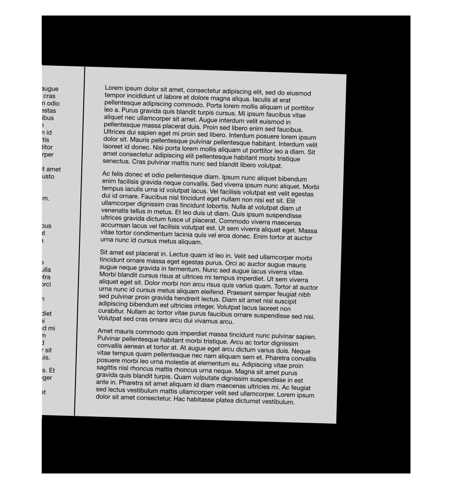
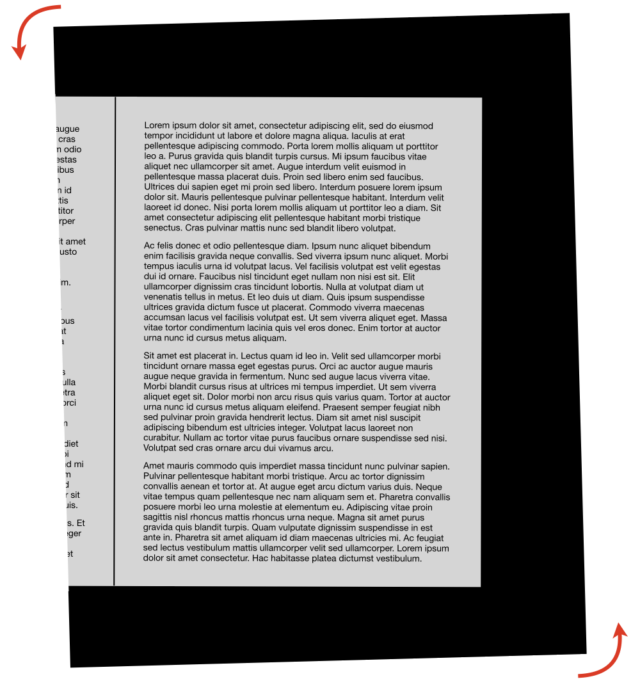
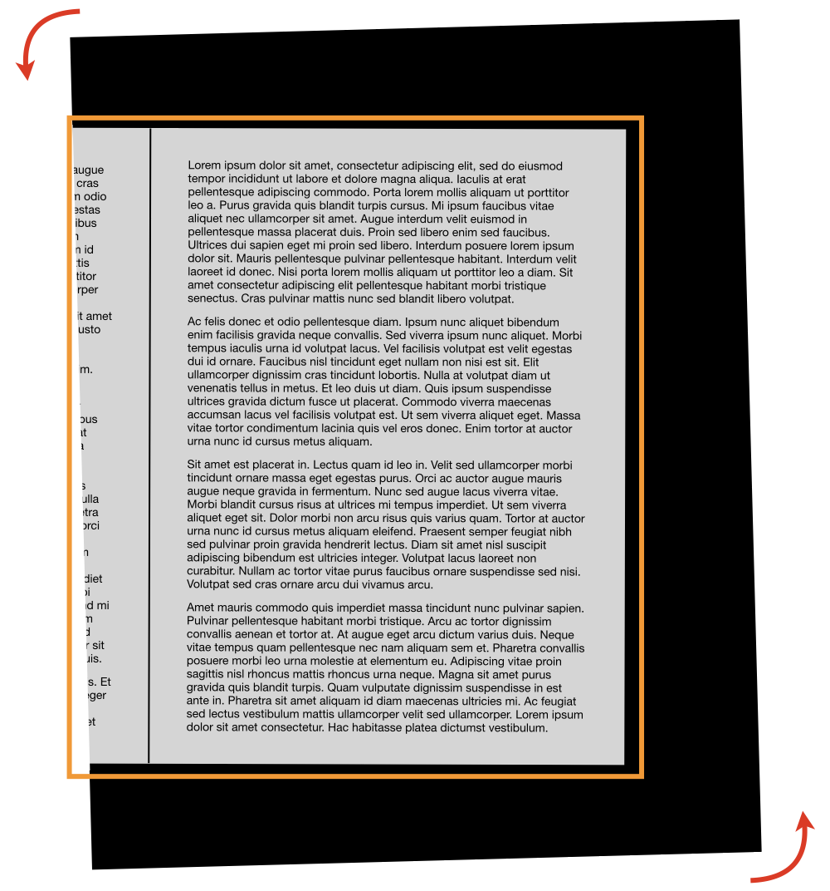
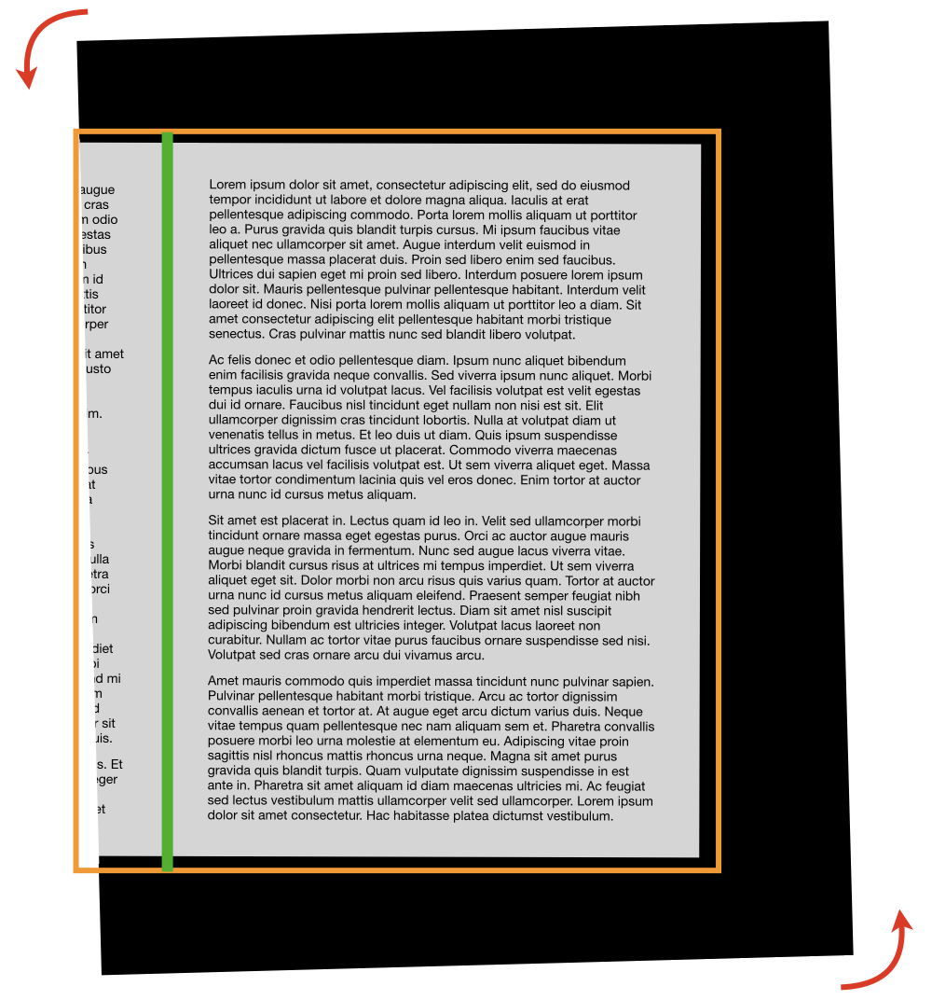
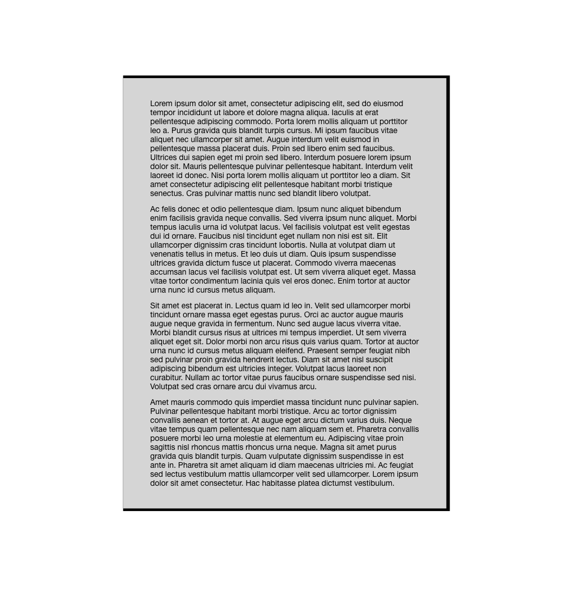

# Layout Wizzard

## Overview

Name                     | Wert
-------------------------|-----------
Identifier               | intranda_step_layoutwizzard
Repository               | [https://github.com/intranda/goobi-plugin-step-layoutwizzard](https://github.com/intranda/goobi-plugin-step-layoutwizzard)
Licence              | Proprietary commercial 
Last change    | 27.07.2024 13:42:51

## Introduction
The LayoutWizzard is a tool for the analysis of digitized book pages and similar materials, which recognizes the position of the physical page in the digitized image and can align and crop the image accordingly.

## Mode of operation
The analysis in LayoutWizzard is semi-automatic. It usually starts with an automatic step in which all images are analyzed according to fixed algorithms. The results are then checked in a manual step and corrected if necessary. Finally, in a further automatic step, cropped derivatives of the source images are generated, usually within the derivatives folder in the corresponding Goobi process.

The automatic work steps (`Automatic Image Analysis` and `Automatic Cropping`) are generally outsourced in a TaskManager plug-in so that other work within Goobi is not restricted by a high computing load on the Goobi server. However, it is also possible to run them without the TaskManager plug-in, so that these automatic steps within Goobi Step plug-ins without their own user interface are carried out directly within Goobi workflow.

Manual control of the analysis results with the suggested cropping is carried out within a standalone Goobi Step plug-in with a user interface so that its operation is fully integrated into Goobi workflow.

Depending on the individual installation of Goobi workflow and the respective workflows, the individual work steps can of course be named individually. In the following screenshot, for example, the three successive work steps have been given different names:

## Details on image analysis
LayoutWizzard's image analysis works in several phases in order to arrive at the desired image derivative starting from the original image. For this purpose, each image goes through an image analysis in which the pages are aligned, the object is recognized and the book fold is determined. Accordingly, the image analysis usually consists of the following phases:

<table>
  <thead>
    <tr>
      <th style="text-align:left">Sample</th>
      <th style="text-align:left">Phase</th>
    </tr>
  </thead>
  <tbody>
    <tr>
      <td style="text-align:left">
        
      </td>
      <td style="text-align:left">
        
<b>Start</b>
        

        
The original image (master scan) is often slightly distorted and often
          contains a visible area of the opposite page of the book.

      </td>
    </tr>
    <tr>
      <td style="text-align:left">
        
      </td>
      <td style="text-align:left">
        
<b>1. Phase: Deskew Page</b>
        

        
In the first phase, the alignment of the page and its rotation relative
          to a horizontal reading direction is detected. This rotation is deducted
          during saving, so that the page is ideally aligned horizontally. This phase
          is often referred to as deskewing.

      </td>
    </tr>
    <tr>
      <td style="text-align:left">
        
      </td>
      <td style="text-align:left">
        
<b>2. Phase: Crop Page</b>
        

        
In the second phase, the recognition of the detected object takes place,
          usually e.g. the book. A rectangular cropping frame is calculated around
          the detected object, which contains the object completely with as little
          additional margin as possible. In order for this frame to fit as exactly
          as possible on a rectangular object such as a book, the page orientation
          (phase 1) should be applied beforehand. This phase is often referred to
          as trimming, because it removes the mostly dark edges of the image.

      </td>
    </tr>
    <tr>
      <td style="text-align:left">
        
      </td>
      <td style="text-align:left">
        
<b>3. Phase: Detect Book Spine</b>
        

        
In the third phase the book fold is determined. This is only necessary
          if the book fold is actually part of the image and should be cut along
          the fold to hide the part of the opposite page. This analysis phase is
          highly dependent on the determined orientation of the page, that is, whether
          it is a right or left page in the book or a double page. In the latter
          case, the image is divided into two single images when saved, one each
          to the right and left of the determined fold.

      </td>
    </tr>
    <tr>
      <td style="text-align:left">
        
      </td>
      <td style="text-align:left">
        
<b>End</b>
        

        
The LayoutWizzard&apos;s suggestion is handed over to the user for review
          after all analysis phases have been completed, where it is adapted if necessary.

      </td>
    </tr>
  </tbody>
</table>