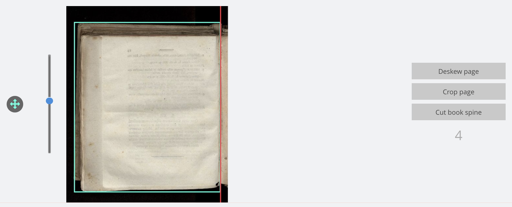
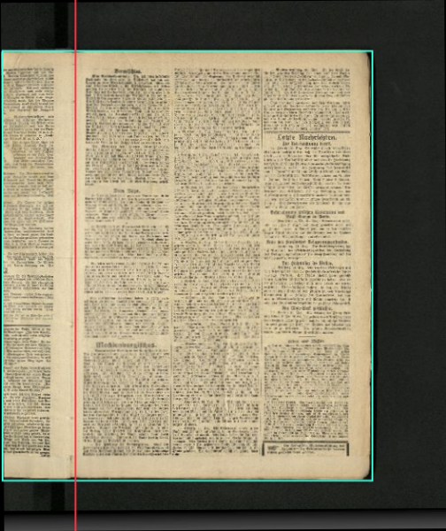
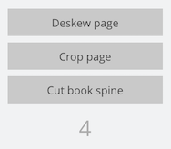

# Image area

## Overview

Name                     | Wert
-------------------------|-----------
Identifier               | intranda_step_layoutwizzard
Repository               | [https://github.com/intranda/goobi-plugin-step-layoutwizzard](https://github.com/intranda/goobi-plugin-step-layoutwizzard)
Licence              | GPL 2.0 or newer 
Last change    | 25.07.2024 14:16:33

The preview view includes an image area like the following for each image file. It consists of the actual image display, the controls for rotation and cropping frame, and several buttons to enter the detail view for a specific analysis phase.

## Image display

The image display contains the actual image. The image is rotated according to the analysis results and contains markers for the fold position (red) and the cutting frame (turquoise). Both markers can be touched and moved with the mouse to correct the analysis data. Clicking, holding and dragging the mouse within the cropping frame moves the entire frame.

**Tip:** If you hold down the `Shift key` during one of these actions, the change is applied to all subsequent images of the same orientation on the current page. Relative coordinates are used. Thus, if one moves the fold of a right image to a position 10% from the left image edge while holding down the `Shift-key`, the fold will be positioned 10% from the left image edge for all following right images on the page; independent of the absolute size of the images.

Additionally, by double-clicking on the image, a rotation mode is opened, in which the rotation of the image can be changed by moving the mouse up and down. This rotation is not proportional to the mouse movement, but the further away the mouse is from the origin, the stronger the rotation. A double click again will end the rotation mode.

## Rotation control element

With the slider next to the image display, the rotation of the image can be changed. Simply click and drag the button up or down to change the rotation of the selected image.

## Move control element

In addition to the image display, there is a control element for moving the cropping frame. This button can be moved with the mouse in all directions and thus moves the position of the cropping frame. Please note that the displacement of the frame is not proportional. The further the button is dragged after clicking, the faster the frame is moved.

## Buttons to enter the detail view

The three buttons next to the image display allow you to enter the single page view for the selected analysis phase in order to adjust individual analysis parameters there. If you click on the Open Preview button in the detail view again, you will be taken back to the same image in the `preview view`.

Below the buttons for the detail view is the image number within the input folder. This is not the file name of the image file but a simple counter that in case of many similarly displayed images should give an orientation at which position within the image files one is currently located.

Depending on the configuration of the LayoutWizard, a drop-down menu may also appear in this area. This allows you to change the orientation for the respective page. Please note that the change made here is only applied to the currently selected image and does not affect subsequent images.