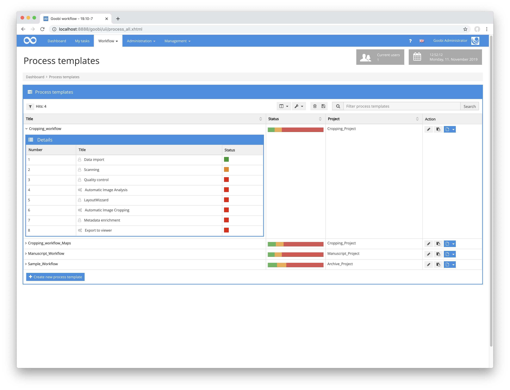

# Workflow

## Overview

Name                     | Wert
-------------------------|-----------
Identifier               | intranda_step_layoutwizzard
Repository               | [https://github.com/intranda/goobi-plugin-step-layoutwizzard](https://github.com/intranda/goobi-plugin-step-layoutwizzard)
Licence              | GPL 2.0 or newer 
Last change    | 25.07.2024 14:16:57


The LayoutWizzard workflow in Goobi generally consists of several Goobi workflow steps that work together. A typical LayoutWizzard workflow as part of a Goobi workflow might look like the following:



In the first step (in this example `Automatic Image Analysis`) an automatic layout analysis of the images is performed to check the rotation, the content area and the position of the book fold. This is usually done in an external TaskManager to relieve the strain on Goobi's system resources. In the second step (`LayoutWizzard` in this example), the results of the analysis are then checked manually and, if necessary, corrected. This is done within a separate user interface that has been installed as a Goobi plug-in. As soon as this manual check has been completed, the automatic saving (referred to here as `Automatic image cropping`) of the cropped derivatives takes place, based on the data previously analyzed and possibly adjusted. This saving also usually takes place within the TaskManager.

## Data management

Since the individual workflow steps of the LayoutWizzard work on a common database of configuration and analysis data, the data must be kept persistent at least for the duration of the LayoutWizard workflow. This is done in the `imageData.xml` file in the Goobi operations folder. As an example, such a complete path to this file would read accordingly:

```bash
/opt/digiverso/goobi/metadata/1234/imageData.xml
```

This file contains all configuration settings for the corresponding process as well as the analysis data for each image, from which the derivatives are created in the final saving step.