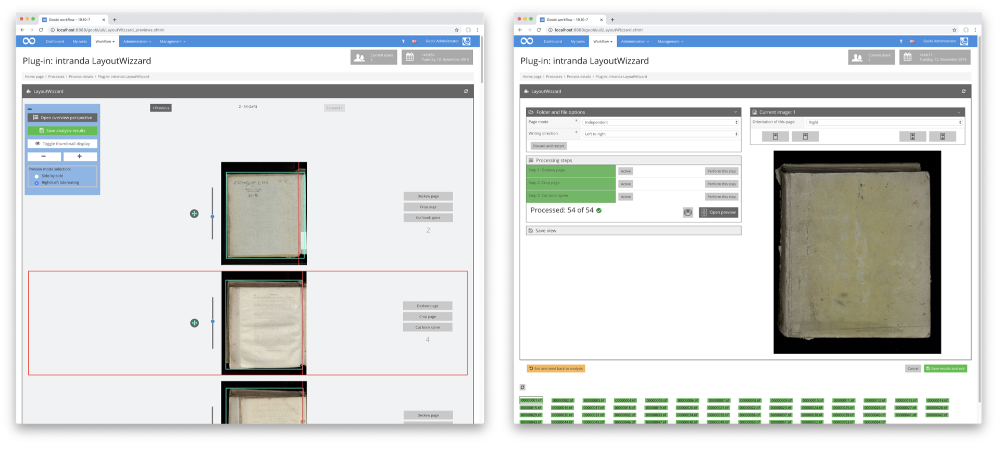

Most of the work in the LayoutWizzard generally takes place in the background of Goobi. This involves automatic image analysis and the final cropping of the images after a user has checked the cropping suggestion from the image analysis in the meantime.

However, checking these cropping suggestions is the most important point of interaction between Goobi users and LayoutWizzard. Here, the user can see for each image how it has been analyzed and how LayoutWizzard would crop it. For each individual image, the user can now decide whether cropping should be carried out differently. Accordingly, the plugin provides a user interface that allows to rotate the images, to change the position of the book fold and also to edit the cropping frame in its size and position. To perform this processing, LayoutWizzard offers two different views: the `preview view` for viewing and directly correcting all images of an operation and the `single page view` for detailed processing of individual images.

All general settings for configuration and analysis workflow are located in the `Single page view`. However, the actual checking and correction will in most cases only take place in the `Preview view`. For this reason, LayoutWizzard should be configured so that the entry into the plugin from an accepted task is as direct as possible to the preview view.

[Preview view](goobi-plugin-step-layoutwizzard_page_01_01_00_en.md)

[Single page view](goobi-plugin-step-layoutwizzard_page_01_02_00_en.md)