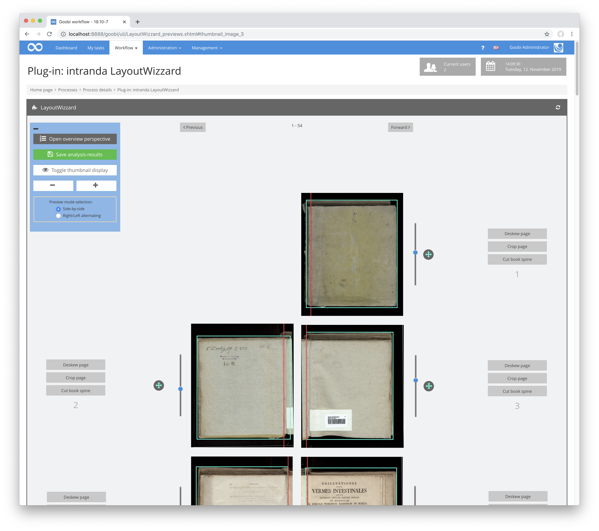
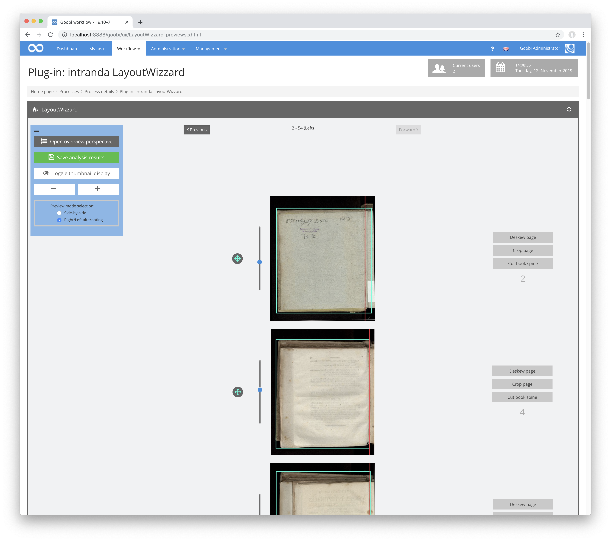

The preview view contains a list of all images in the input folder. However, these are usually spread over several pages to keep the loading times of the images to be displayed as short as possible. Depending on the selected setting, opposite right and left book pages are displayed next to each other, or alternately only right and only left images are displayed, so that they can be compared quickly.

Within the preview view you can define how large the images should be displayed and whether the cropping frame should be displayed above the original image or a preview of the later cropped image instead.

Corrections can be made to each individual image directly from this display. Thus, by means of the slider beside the image, the rotation can be changed, with the mouse pointer the book fold can be positioned differently and by means of clicking and dragging, the size and position of the cropping frame can be changed.

**Tip:** Note that you can also adjust an image (rotation, book fold or frame) by holding down the `Shift key.` In this case, your correction will be applied not only to the currently selected image, but also to all subsequent images displayed. This may save a lot of time for manual correction work.

Besides the possibility to change each image directly from the preview view, the three buttons next to each image allow direct access to the detailed view of the image analysis for the corresponding image within the single page view.

Using the `Forward` and `Backward` buttons above and below the preview list, the user can scroll through the pages of the displayed images.