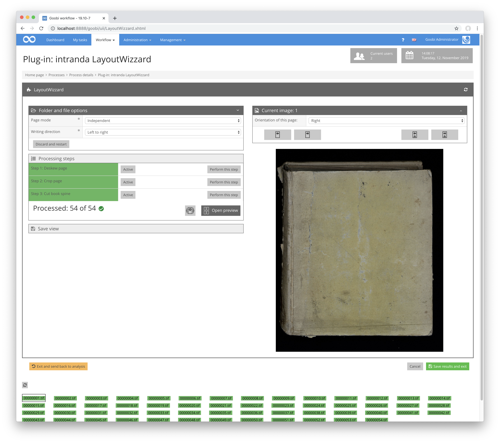

# Single page view

## Overview

Name                     | Wert
-------------------------|-----------
Identifier               | intranda_step_layoutwizzard
Repository               | [https://github.com/intranda/goobi-plugin-step-layoutwizzard](https://github.com/intranda/goobi-plugin-step-layoutwizzard)
Licence              | GPL 2.0 or newer 
Last change    | 25.07.2024 14:15:06

The Single Page View, sometimes also called `Overview Page`, contains global settings of the LayoutWizard as well as all settings for the currently viewed page. This view is divided into several sections, with the details of some of these sections only visible when the corresponding sections are active. Switching between the areas is possible by clicking on the title bar of an area. The title bar also contains a button on the right side of some areas to switch the `extended mode` for this area on and off. In `extended mode`, additional options are available that are not usually needed in normal operation. The subareas are described individually below.

