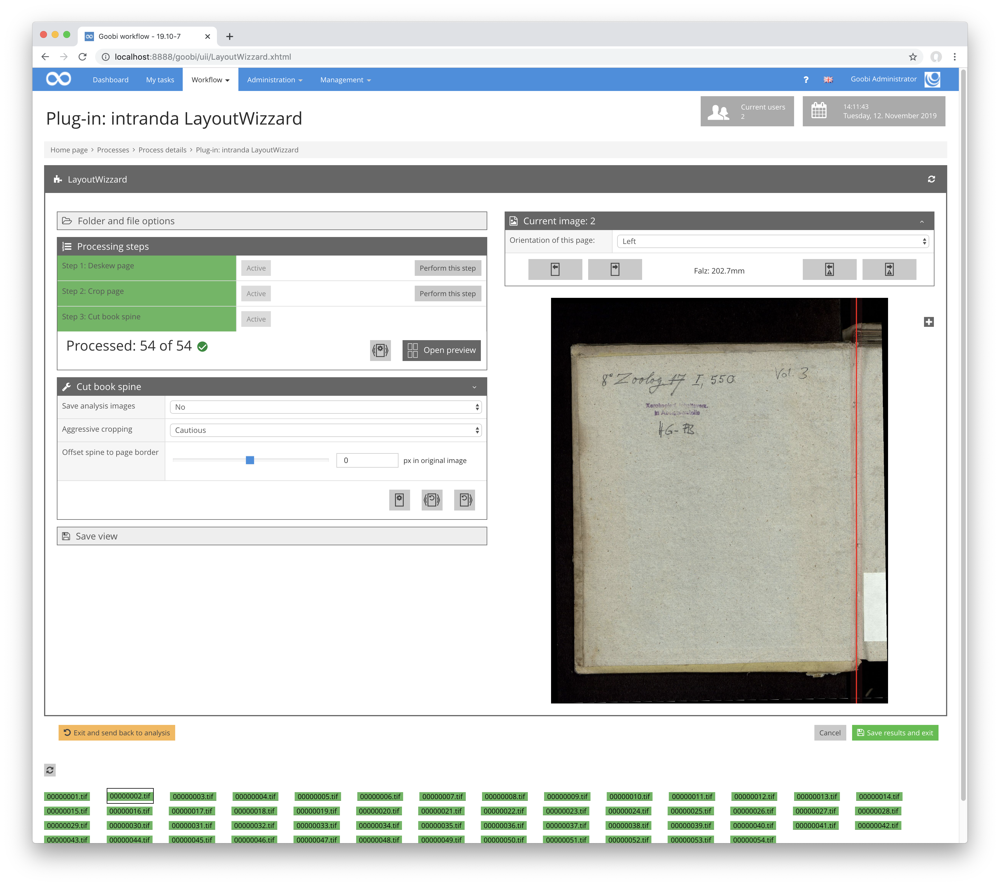

# Current image

## Overview

Name                     | Wert
-------------------------|-----------
Identifier               | intranda_step_layoutwizzard
Repository               | [https://github.com/intranda/goobi-plugin-step-layoutwizzard](https://github.com/intranda/goobi-plugin-step-layoutwizzard)
Licence              | GPL 2.0 or newer 
Last change    | 25.07.2024 14:15:18

The right area includes the display of the current image and a header area with some information about the image file. Most important here is the drop-down menu for selecting the orientation of the current page. Please note that changing the orientation also changes the orientation of all subsequent pages, according to the rules selected in the `page mode`.

In the header, you can also switch to the next and previous image, as well as the next or previous outlier.

In the actual image display, when one of the analysis steps is selected, the analysis result of the selected step is visible and can be edited directly with the mouse.