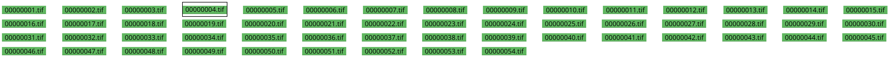

In the file list in the lower area, all image files in the input folder are listed with their file name. A click on one of the file names opens the respective image in the single page view.

The file name is completely or partially highlighted in green if analysis steps for the image have already been completed. If no analysis steps have been completed at all, the file name is completely highlighted in white. For each completed analysis step, the background fills green and is completely green when all analysis steps have been completed.

Please note that automatic saving can only be successful if all images are completely green. In the file list, you can quickly identify those images that still need to be processed before the current workflow step can be completed.