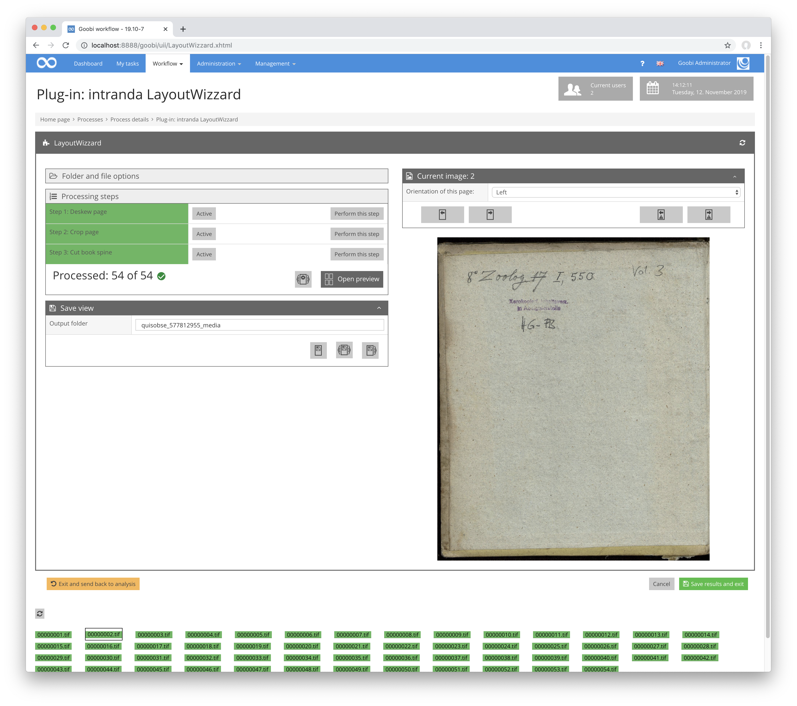

# Save view

## Overview

Name                     | Wert
-------------------------|-----------
Identifier               | intranda_step_layoutwizzard
Repository               | [https://github.com/intranda/goobi-plugin-step-layoutwizzard](https://github.com/intranda/goobi-plugin-step-layoutwizzard)
Licence              | GPL 2.0 or newer 
Last change    | 25.07.2024 14:15:32

The Save view usually shows the image as the cropped derivative is saved. An exception to this are images with double page orientation. These are displayed as a single image, i.e. without any division at the fold line.

In advanced mode, you can specify the folder where the images are saved. The path you specify here is always a subfolder of the `images` folder in the Goobi operation. There are also several options for saving images directly:

| Icon | Description |
| :--- | :--- |
|  | This button saves the current image cropped into the output folder. |
|  | This button saves the current and all following images cropped into the output folder. |
|  | This button saves all the images of the operation cropped into the output folder. |